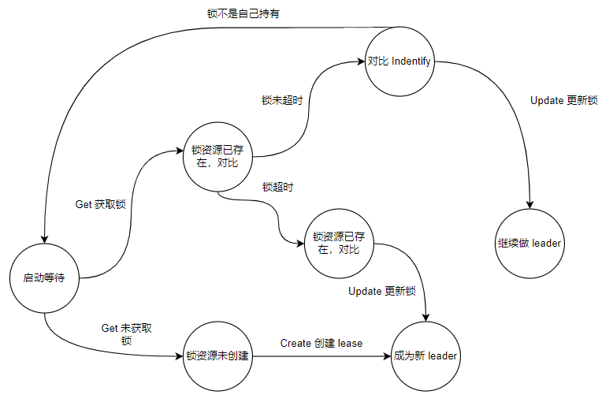

# 0. 前言

[Kubernetes:kube-scheduler 源码分析](https://www.cnblogs.com/xingzheanan/p/18000774) 介绍了 `kube-scheduler` 调度 Pod 的逻辑。文中有一点未提的是，在 `Kubernetes` 集群中，`kube-scheduler` 组件是多副本，单实例运行。仅有一个副本作为 leader 运行，当发生故障时，其它副本会抢占为 leader 继续运行。这种机制通过 leader election 实现，本文将从源码角度分析 leader election 选举的实现。并且，在此基础上，在回头看 `kube-scheduler` 是怎么结合 `leader elction` 实现多副本，单实例运行的。

# 1. leader election

leader election 通过多个副本抢占资源锁的方式实现单实例运行。在 Kubernetes 中，[Configmap|Lease|Endpoint] 可以作为资源锁的实现。

## 1.1 示例

直接看 leader election 代码容易晕，这里从示例入手，看 leader election 是怎么运行的。
  
```
// lease.go
/*
package main

func buildConfig(kubeconfig string) (*rest.Config, error) {
	...
}

func main() {
	klog.InitFlags(nil)
	var kubeconfig string
	var leaseLockName string
	var leaseLockNamespace string
	var id string

	flag.StringVar(&kubeconfig, "kubeconfig", "", "absolute path to the kubeconfig file")
	flag.StringVar(&id, "id", uuid.New().String(), "the holder identity name")
	flag.StringVar(&leaseLockName, "lease-lock-name", "kube-scheduler", "the lease lock resource name")
	flag.StringVar(&leaseLockNamespace, "lease-lock-namespace", "kube-system", "the lease lock resource namespace")
	flag.Parse()

	if leaseLockName == "" {
		klog.Fatal("unable to get lease lock resource name (missing lease-lock-name flag).")
	}
	if leaseLockNamespace == "" {
		klog.Fatal("unable to get lease lock resource namespace (missing lease-lock-namespace flag).")
	}

	config, err := buildConfig(kubeconfig)
	if err != nil {
		klog.Fatal(err)
	}
	client := clientset.NewForConfigOrDie(config)

	run := func(ctx context.Context) {
		klog.Info("Controller loop...")
	}

	ctx, cancel := context.WithCancel(context.Background())
	defer cancel()

	ch := make(chan os.Signal, 1)
	signal.Notify(ch, os.Interrupt, syscall.SIGTERM)
	go func() {
		<-ch
		klog.Info("Received termination, signaling shutdown")
		cancel()
	}()

	lock := &resourcelock.LeaseLock{
		LeaseMeta: metav1.ObjectMeta{
			Name:      leaseLockName,
			Namespace: leaseLockNamespace,
		},
		Client: client.CoordinationV1(),
		LockConfig: resourcelock.ResourceLockConfig{
			Identity: id,
		},
	}

	leaderelection.RunOrDie(ctx, leaderelection.LeaderElectionConfig{
		Lock: lock,
		ReleaseOnCancel: true,
		LeaseDuration:   60 * time.Second,
		RenewDeadline:   15 * time.Second,
		RetryPeriod:     5 * time.Second,
		Callbacks: leaderelection.LeaderCallbacks{
			OnStartedLeading: func(ctx context.Context) {
				// we're notified when we start - this is where you would
				// usually put your code
				run(ctx)
			},
			OnStoppedLeading: func() {
				// we can do cleanup here
				klog.Infof("leader lost: %s", id)
				os.Exit(0)
			},
			OnNewLeader: func(identity string) {
				// we're notified when new leader elected
				if identity == id {
					// I just got the lock
					return
				}
				klog.Infof("new leader elected: %s", identity)
			},
		},
	})
}
```
*详细代码戳 [这里](https://github.com/hxia043/go-by-example/blob/main/kubernetes/lease/lease.go)*

运行 id 为 1 的进程抢占 lease：
```
# go run lease.go --kubeconfig=/root/.kube/config -id=1 -lease-lock-name=example -lease-lock-namespace=default 
I0222 09:44:40.389093 4054932 leaderelection.go:250] attempting to acquire leader lease default/example...
I0222 09:44:40.400607 4054932 leaderelection.go:260] successfully acquired lease default/example
I0222 09:44:40.402998 4054932 lease.go:87] Controller loop...
```

可以看到，id 为 1 的进程（简称进程 1）抢占到 lease，接着进入进程的运行逻辑。

继续运行 id 为 2 的进程（简称进程 2）抢占 lease：
```
# go run lease.go --kubeconfig=/root/.kube/config -id=2 -lease-lock-name=example -lease-lock-namespace=default
I0222 10:26:53.162990 4070458 leaderelection.go:250] attempting to acquire leader lease default/example...
I0222 10:26:53.170046 4070458 lease.go:151] new leader elected: 1
```

进程 2 抢占不到 lease，因为此时进程 1 是 leader，且 lease 未被释放或者过期。

kill 掉进程 1（注：此 id 不是进程的 PID），查看进程 2 能否抢占到 lease：
```
# go run lease.go --kubeconfig=/root/.kube/config -id=2 -lease-lock-name=example -lease-lock-namespace=default
I0222 10:26:53.162990 4070458 leaderelection.go:250] attempting to acquire leader lease default/example...
I0222 10:26:53.170046 4070458 lease.go:151] new leader elected: 1
I0222 10:31:54.704714 4070458 leaderelection.go:260] successfully acquired lease default/example
I0222 10:31:54.704931 4070458 lease.go:87] Controller loop...
```

可以看到，进程 2 成功抢占 lease。

## 1.2 源码分析

### 1.2.1 lease 资源
lease 作为 leader election 的资源锁存在，多副本抢占 lease 实际是对 lease 进行 [Get|Create|Update] 操作的过程。我们看 lease 在 Kubernetes 的资源表示：
```
# kubectl describe lease example -n default
Name:         example
Namespace:    default
Labels:       <none>
Annotations:  <none>
API Version:  coordination.k8s.io/v1
Kind:         Lease
Metadata:
  ...
Spec:
  Acquire Time:            2024-02-22T08:31:54.696415Z
  Holder Identity:         2
  Lease Duration Seconds:  60
  Lease Transitions:       5
  Renew Time:              2024-02-22T08:51:47.060020Z
Events:                    <none>
```

在 `Spec` 域中有五个字段，分别介绍如下：
- Acquire Time: 首次获取 lease 的时间。
- Holder Identity: 当前持有 lease 的用户身份。
- Lease Duration Seconds: lease 过期时间。
- Lease Transitions: lease 被多少 Holder 持有过。
- Renew Time: Holder 刷新 lease 的时间。lease 的持有者需要 renew lease，否则其它副本将抢占过期的 lease。

多副本抢占 lease 的信息将被记录到这几个字段中。lease 存储在 etcd 中，通过 Raft 算法实现 lease 资源的唯一性和原子性，以保证多副本仅可抢占唯一的 lease。

### 1.2.2 抢占状态图

多副本抢占 lease 的状态图如下，结合状态图看源码会更加清晰。



### 1.2.3 创建 lease

我们从创建 lease 开始分析。

首先，删掉 lease 资源。
```
# kubectl get lease
NAME      HOLDER   AGE
example   2        23h
# kubectl delete lease example
lease.coordination.k8s.io "example" deleted
```

然后，调式模式下运行 lease.go，进入 `leaderelection.RunOrDie` 查看函数做了什么。
```
// k8s.io/client-go/tools/leaderelection/leaderelection.go
func RunOrDie(ctx context.Context, lec LeaderElectionConfig) {
	// 创建 leader elector 实例 le
	le, err := NewLeaderElector(lec)
	if err != nil {
		panic(err)
	}
	...

	// 运行 leader elector 实例
	le.Run(ctx)
}
```

进入 `LeaderElector.Run`：
```
// k8s.io/client-go/tools/leaderelection/leaderelection.go
func (le *LeaderElector) Run(ctx context.Context) {
	...

	if !le.acquire(ctx) {
		return // ctx signalled done
	}
	
	...

	le.renew(ctx)
}
```

`LeaderElector.Run` 中有两个重要的函数 `LeaderElector.acquire` 和 `LeaderElector.renew`。`LeaderElector.acquire` 负责获取（抢占）锁资源。`LeaderElector.renew` 负责更新锁资源，从而一直持有锁。

进入 `LeaderElector.acquire`：
```
// k8s.io/client-go/tools/leaderelection/leaderelection.go
func (le *LeaderElector) acquire(ctx context.Context) bool {
	...
	succeeded := false
	desc := le.config.Lock.Describe()
	klog.Infof("attempting to acquire leader lease %v...", desc)

	wait.JitterUntil(func() {
		// 重点是这里，tryAcquireOrRenew 负责获取锁，或者更新已经获取锁的信息
		succeeded = le.tryAcquireOrRenew(ctx)
		le.maybeReportTransition()
		if !succeeded {
			klog.V(4).Infof("failed to acquire lease %v", desc)
			return
		}
		le.config.Lock.RecordEvent("became leader")
		le.metrics.leaderOn(le.config.Name)
		klog.Infof("successfully acquired lease %v", desc)
		cancel()
	}, le.config.RetryPeriod, JitterFactor, true, ctx.Done())
	return succeeded
}
```

`LeaderElector.acquire` 函数的重点是 `LeaderElector.tryAcquireOrRenew`：
```
// k8s.io/client-go/tools/leaderelection/leaderelection.go
func (le *LeaderElector) tryAcquireOrRenew(ctx context.Context) bool {
	now := metav1.NewTime(le.clock.Now())
	leaderElectionRecord := rl.LeaderElectionRecord{
		HolderIdentity:       le.config.Lock.Identity(),
		LeaseDurationSeconds: int(le.config.LeaseDuration / time.Second),
		RenewTime:            now,
		AcquireTime:          now,
	}

	// 1. obtain or create the ElectionRecord
	oldLeaderElectionRecord, oldLeaderElectionRawRecord, err := le.config.Lock.Get(ctx)
	if err != nil {
		if !errors.IsNotFound(err) {
			klog.Errorf("error retrieving resource lock %v: %v", le.config.Lock.Describe(), err)
			return false
		}
		if err = le.config.Lock.Create(ctx, leaderElectionRecord); err != nil {
			klog.Errorf("error initially creating leader election record: %v", err)
			return false
		}

		le.setObservedRecord(&leaderElectionRecord)

		return true
	}

	...
	return true
}
```

`LeaderElector.tryAcquireOrRenew` 实现的就是状态转移图中的逻辑，这里我们仅关注创建锁这一流程。

首先，`LeaderElector.config.Lock.Get` 通过 `client-go` 获取 etcd 中锁的信息。
```
// k8s.io/client-go/tools/leaderelection/resourcelock/leaselock.go
func (ll *LeaseLock) Get(ctx context.Context) (*LeaderElectionRecord, []byte, error) {
	// 获取锁（lease）
	lease, err := ll.Client.Leases(ll.LeaseMeta.Namespace).Get(ctx, ll.LeaseMeta.Name, metav1.GetOptions{})
	if err != nil {
		return nil, nil, err
	}

	...
	return record, recordByte, nil
}
```

没有找到锁，进入 `LeaderElector.config.Lock.Create` 创建锁。
```
// k8s.io/client-go/tools/leaderelection/resourcelock/leaselock.go
func (ll *LeaseLock) Create(ctx context.Context, ler LeaderElectionRecord) error {
	var err error
	ll.lease, err = ll.Client.Leases(ll.LeaseMeta.Namespace).Create(ctx, &coordinationv1.Lease{
		ObjectMeta: metav1.ObjectMeta{
			Name:      ll.LeaseMeta.Name,
			Namespace: ll.LeaseMeta.Namespace,
		},
		Spec: LeaderElectionRecordToLeaseSpec(&ler),
	}, metav1.CreateOptions{})
	return err
}
```

查看创建锁的信息：
```
# kubectl describe lease example -n default
Name:         example
Namespace:    default
Labels:       <none>
Annotations:  <none>
API Version:  coordination.k8s.io/v1
Kind:         Lease
Metadata:
  ...
Spec:
  Acquire Time:            2024-02-23T05:42:07.781552Z
  Holder Identity:         1
  Lease Duration Seconds:  60
  Lease Transitions:       0
  Renew Time:              2024-02-23T05:42:07.781552Z
```

### 1.2.4 更新 lease

接着看状态转移图中的更新 lease 的流程，场景是 lease 资源已存在并过期，holder 是 id 为 1 的进程。

进入 `LeaderElector.tryAcquireOrRenew`：
```
func (le *LeaderElector) tryAcquireOrRenew(ctx context.Context) bool {
	...
	// 1. obtain or create the ElectionRecord
	oldLeaderElectionRecord, oldLeaderElectionRawRecord, err := le.config.Lock.Get(ctx)
	if err != nil {
		...
	}

	// 2. Record obtained, check the Identity & Time
	if !bytes.Equal(le.observedRawRecord, oldLeaderElectionRawRecord) {
		le.setObservedRecord(oldLeaderElectionRecord)

		le.observedRawRecord = oldLeaderElectionRawRecord
	}
	if len(oldLeaderElectionRecord.HolderIdentity) > 0 &&
		le.observedTime.Add(time.Second*time.Duration(oldLeaderElectionRecord.LeaseDurationSeconds)).After(now.Time) &&
		!le.IsLeader() {
		klog.V(4).Infof("lock is held by %v and has not yet expired", oldLeaderElectionRecord.HolderIdentity)
		return false
	}

	// 3. We're going to try to update. The leaderElectionRecord is set to it's default
	// here. Let's correct it before updating.
	if le.IsLeader() {
		leaderElectionRecord.AcquireTime = oldLeaderElectionRecord.AcquireTime
		leaderElectionRecord.LeaderTransitions = oldLeaderElectionRecord.LeaderTransitions
	} else {
		leaderElectionRecord.LeaderTransitions = oldLeaderElectionRecord.LeaderTransitions + 1
	}

	// update the lock itself
	if err = le.config.Lock.Update(ctx, leaderElectionRecord); err != nil {
		klog.Errorf("Failed to update lock: %v", err)
		return false
	}
}
```

在 `LeaderElector.tryAcquireOrRenew` 中获取锁，记录锁信息，比较锁 holder 是否是当前请求的 holder。如果是，记录锁的 `AcquireTime` 和 `LeaderTransitions`。最后，进入 `LeaderElector.config.Lock.Update` 更新锁：
```
func (ll *LeaseLock) Update(ctx context.Context, ler LeaderElectionRecord) error {
	...

	lease, err := ll.Client.Leases(ll.LeaseMeta.Namespace).Update(ctx, ll.lease, metav1.UpdateOptions{})
	if err != nil {
		return err
	}

	ll.lease = lease
	return nil
}
```

查看更新的 lease 信息：
```
# kubectl describe lease example -n default
Name:         example
Namespace:    default
Labels:       <none>
Annotations:  <none>
API Version:  coordination.k8s.io/v1
Kind:         Lease
Metadata:
  ...
Spec:
  Acquire Time:            2024-02-23T05:42:07.781552Z
  Holder Identity:         1
  Lease Duration Seconds:  60
  Lease Transitions:       0
  Renew Time:              2024-02-23T06:00:52.802923Z
```

可以看到，holder 更新了 Renew Time，并且这里的 Lease Transitions 未更新。

### 1.2.5 renew lease

当 holder 拿到 lease 后需要 renew lease，以一直持有 lease。renew 是在获取锁之后，实现如下：
```
func (le *LeaderElector) Run(ctx context.Context) {
	...

	if !le.acquire(ctx) {
		return // ctx signalled done
	}

	...
	le.renew(ctx)
}

func (le *LeaderElector) renew(ctx context.Context) {
	...
	wait.Until(func() {
		...
		err := wait.PollImmediateUntil(le.config.RetryPeriod, func() (bool, error) {
			// 获取并且 renew lease
			return le.tryAcquireOrRenew(timeoutCtx), nil
		}, timeoutCtx.Done())

		le.maybeReportTransition()
		desc := le.config.Lock.Describe()
		if err == nil {
			klog.V(5).Infof("successfully renewed lease %v", desc)
			return
		}
		le.metrics.leaderOff(le.config.Name)
		klog.Infof("failed to renew lease %v: %v", desc, err)
		cancel()
	}, le.config.RetryPeriod, ctx.Done())

	// if we hold the lease, give it up
	if le.config.ReleaseOnCancel {
		le.release()
	}
}
```

renew lease 也是通过 `LeaderElector.tryAcquireOrRenew` 更新 lease 信息实现的，这里就不多赘述了。

# 2. kube-scheduler 和 leader election

kube-scheduler 中调度和 leader election 结合的部分在 kube-schduler 的 `Run` 函数：
```
func Run(ctx context.Context, cc *schedulerserverconfig.CompletedConfig, sched *scheduler.Scheduler) error {
	...
	// If leader election is enabled, runCommand via LeaderElector until done and exit.
	// 配置 leader election
	if cc.LeaderElection != nil {
		cc.LeaderElection.Callbacks = leaderelection.LeaderCallbacks{
			// OnStartedLeading 回调函数，当抢占到 lease 时回调
			OnStartedLeading: func(ctx context.Context) {
				...
				// 作为 leader 运行调度器的调度逻辑
				sched.Run(ctx)
			},
			OnStoppedLeading: func() {
				...
				}
			},
		}

		leaderElector, err := leaderelection.NewLeaderElector(*cc.LeaderElection)
		if err != nil {
			return fmt.Errorf("couldn't create leader elector: %v", err)
		}

		// 运行 leader election 抢占 lease
		leaderElector.Run(ctx)

		return fmt.Errorf("lost lease")
	}

	// Leader election is disabled, so runCommand inline until done.
	close(waitingForLeader)
	sched.Run(ctx)
	return fmt.Errorf("finished without leader elect")
}
```

## 3. 小结

本文从源码角度分析 leader election 的实现，并且介绍了 leader election 和 kube-scheduler 结合实现是怎么实现多副本，单实例运行的。
