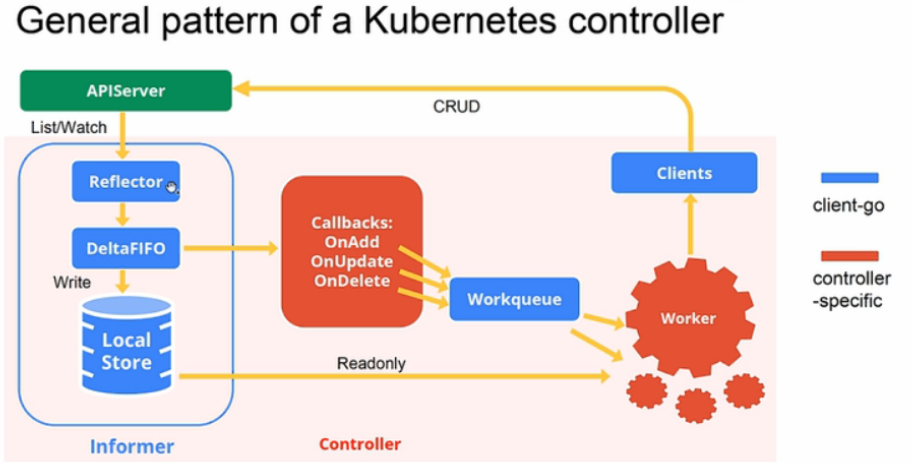

# 0. 前言

在 `Kubernetes` 架构中，[controller manager](https://kubernetes.io/zh-cn/docs/reference/command-line-tools-reference/kube-controller-manager/) 是一个永不休止的控制回路组件，其负责控制集群资源的状态。通过监控 `kube-apiserver` 的资源状态，比较当前资源状态和期望状态，如果不一致，更新 `kube-apiserver` 的资源状态以保持当前资源状态和期望状态一致。


# 1. kube-controller-manager

下面从源码角度分析 `kube-controller-manager` 的工作方式。

`kube-controller-manager` 使用 [Cobra](https://github.com/spf13/cobra) 作为应用命令行框架，和 `kube-scheduler`，`kube-apiserver` 初始化过程类似，其流程如下：


这里，简要给出初始化代码示例：  
```
# kubernetes/cmd/kube-controller-manager/app/controllermanager.go
func NewControllerManagerCommand() *cobra.Command {
    // 创建选项
    s, err := options.NewKubeControllerManagerOptions()
    ...
    cmd := &cobra.Command{
        ...
        RunE: func(cmd *cobra.Command, args []string) error {
            ...
            // 根据选项，创建配置
            c, err := s.Config(KnownControllers(), ControllersDisabledByDefault(), ControllerAliases())
			if err != nil {
				return err
			}
            ...
            return Run(context.Background(), c.Complete())
        },
        ...
    }
    ...
}
```

进入 `Run` 函数，看 `kube-controller-manager` 是怎么运行的。  
```
# kubernetes/cmd/kube-controller-manager/app/controllermanager.go
func Run(ctx context.Context, c *config.CompletedConfig) error {
    ...
    run := func(ctx context.Context, controllerDescriptors map[string]*ControllerDescriptor) {
        // 创建上下文
		controllerContext, err := CreateControllerContext(logger, c, rootClientBuilder, clientBuilder, ctx.Done())
		if err != nil {
			logger.Error(err, "Error building controller context")
			klog.FlushAndExit(klog.ExitFlushTimeout, 1)
		}

        // 开始控制器，这是主运行逻辑
		if err := StartControllers(ctx, controllerContext, controllerDescriptors, unsecuredMux, healthzHandler); err != nil {
			logger.Error(err, "Error starting controllers")
			klog.FlushAndExit(klog.ExitFlushTimeout, 1)
		}

        // 启动 informer
		controllerContext.InformerFactory.Start(stopCh)
		controllerContext.ObjectOrMetadataInformerFactory.Start(stopCh)
		close(controllerContext.InformersStarted)

		<-ctx.Done()
	}

    // No leader election, run directly
	if !c.ComponentConfig.Generic.LeaderElection.LeaderElect {
        // 创建控制器描述符
		controllerDescriptors := NewControllerDescriptors()
		controllerDescriptors[names.ServiceAccountTokenController] = saTokenControllerDescriptor
		run(ctx, controllerDescriptors)
		return nil
	}
    ...
}
```

和 `kube-scheduler` 类似，`kube-controller-manager` 也是多副本单实例运行的组件，需要 `leader election` 作为 leader 组件运行。这里不过多介绍，具体可参考 [Kubernetes leader election 源码分析](https://www.cnblogs.com/xingzheanan/p/18029733)。

运行控制器管理器。首先，在 `NewControllerDescriptors` 中注册资源控制器的描述符。
```
# kubernetes/cmd/kube-controller-manager/app/controllermanager.go
func NewControllerDescriptors() map[string]*ControllerDescriptor {
    register := func(controllerDesc *ControllerDescriptor) {
		...
		controllers[name] = controllerDesc
	}

    ...
    // register 函数注册资源控制器
    register(newEndpointsControllerDescriptor())
	register(newEndpointSliceControllerDescriptor())
	register(newEndpointSliceMirroringControllerDescriptor())
	register(newReplicationControllerDescriptor())
	register(newPodGarbageCollectorControllerDescriptor())
	register(newResourceQuotaControllerDescriptor())
    ...

    return controllers
}

# kubernetes/cmd/kube-controller-manager/app/apps.go
func newReplicaSetControllerDescriptor() *ControllerDescriptor {
	return &ControllerDescriptor{
		name:     names.ReplicaSetController,
		aliases:  []string{"replicaset"},
		initFunc: startReplicaSetController,
	}
}
```

每个资源控制器描述符包括 `initFunc` 和启动控制器函数的映射。

在 `run` 中 `StartControllers` 运行控制器。
```
# kubernetes/cmd/kube-controller-manager/app/controllermanager.go
func StartControllers(ctx context.Context, controllerCtx ControllerContext, controllerDescriptors map[string]*ControllerDescriptor,
	unsecuredMux *mux.PathRecorderMux, healthzHandler *controllerhealthz.MutableHealthzHandler) error {
    ...
    // 遍历获取资源控制器描述符
    for _, controllerDesc := range controllerDescriptors {
		if controllerDesc.RequiresSpecialHandling() {
			continue
		}

        // 运行资源控制器
		check, err := StartController(ctx, controllerCtx, controllerDesc, unsecuredMux)
		if err != nil {
			return err
		}
		if check != nil {
			// HealthChecker should be present when controller has started
			controllerChecks = append(controllerChecks, check)
		}
	}

    ...
    return nil
}

func StartController(ctx context.Context, controllerCtx ControllerContext, controllerDescriptor *ControllerDescriptor,
	unsecuredMux *mux.PathRecorderMux) (healthz.HealthChecker, error) {
    ...
    // 获取资源控制器描述符的启动函数
    initFunc := controllerDescriptor.GetInitFunc()
    
    // 启动资源控制器
	ctrl, started, err := initFunc(klog.NewContext(ctx, klog.LoggerWithName(logger, controllerName)), controllerCtx, controllerName)
	if err != nil {
		logger.Error(err, "Error starting controller", "controller", controllerName)
		return nil, err
	}
    ...
}
```

`kubernetes` 有多个控制器，这里以 `Replicaset` 控制器为例，介绍控制器是怎么运行的。

进入 `Replicaset` 控制器的 `initFunc` 函数运行控制器。
```
# kubernetes/cmd/kube-controller-manager/app/apps.go
func startReplicaSetController(ctx context.Context, controllerContext ControllerContext, controllerName string) (controller.Interface, bool, error) {
	go replicaset.NewReplicaSetController(
		klog.FromContext(ctx),
		controllerContext.InformerFactory.Apps().V1().ReplicaSets(),
		controllerContext.InformerFactory.Core().V1().Pods(),
		controllerContext.ClientBuilder.ClientOrDie("replicaset-controller"),
		replicaset.BurstReplicas,
	).Run(ctx, int(controllerContext.ComponentConfig.ReplicaSetController.ConcurrentRSSyncs))
	return nil, true, nil
}
```

运行 `initFunc` 实际上运行的是 `startReplicaSetController`。`startReplicaSetController` 启动一个 `goroutine` 运行 `replicaset.NewReplicaSetController` 和 `ReplicaSetController.Run`，`replicaset.NewReplicaSetController` 创建了 `informer` 的 `Eventhandler`，`ReplicaSetController.Run` 负责对 `EventHandler` 中加入队列的资源做处理。示意图如下：



首先，进入 `replicaset.NewReplicaSetController` 查看函数做了什么。
```
# kubernetes/pkg/controller/replicaset/replica_set.go
func NewReplicaSetController(logger klog.Logger, rsInformer appsinformers.ReplicaSetInformer, podInformer coreinformers.PodInformer, kubeClient clientset.Interface, burstReplicas int) *ReplicaSetController {
	...
	return NewBaseController(logger, rsInformer, podInformer, kubeClient, burstReplicas,
		apps.SchemeGroupVersion.WithKind("ReplicaSet"),
		"replicaset_controller",
		"replicaset",
		controller.RealPodControl{
			KubeClient: kubeClient,
			Recorder:   eventBroadcaster.NewRecorder(scheme.Scheme, v1.EventSource{Component: "replicaset-controller"}),
		},
		eventBroadcaster,
	)
}

func NewBaseController(logger klog.Logger, rsInformer appsinformers.ReplicaSetInformer, podInformer coreinformers.PodInformer, kubeClient clientset.Interface, burstReplicas int,
	gvk schema.GroupVersionKind, metricOwnerName, queueName string, podControl controller.PodControlInterface, eventBroadcaster record.EventBroadcaster) *ReplicaSetController {

	rsc := &ReplicaSetController{
		GroupVersionKind: gvk,
		kubeClient:       kubeClient,
		podControl:       podControl,
		eventBroadcaster: eventBroadcaster,
		burstReplicas:    burstReplicas,
		expectations:     controller.NewUIDTrackingControllerExpectations(controller.NewControllerExpectations()),
		queue:            workqueue.NewNamedRateLimitingQueue(workqueue.DefaultControllerRateLimiter(), queueName),
	}

	rsInformer.Informer().AddEventHandler(cache.ResourceEventHandlerFuncs{
		AddFunc: func(obj interface{}) {
			rsc.addRS(logger, obj)
		},
		UpdateFunc: func(oldObj, newObj interface{}) {
			rsc.updateRS(logger, oldObj, newObj)
		},
		DeleteFunc: func(obj interface{}) {
			rsc.deleteRS(logger, obj)
		},
	})
	...

	podInformer.Informer().AddEventHandler(cache.ResourceEventHandlerFuncs{
		AddFunc: func(obj interface{}) {
			rsc.addPod(logger, obj)
		},
		UpdateFunc: func(oldObj, newObj interface{}) {
			rsc.updatePod(logger, oldObj, newObj)
		},
		DeleteFunc: func(obj interface{}) {
			rsc.deletePod(logger, obj)
		},
	})
	...

	rsc.syncHandler = rsc.syncReplicaSet

	return rsc
}
```

函数定义了 `ReplicaSetController` 和 `podInformer`，负责监控 `kube-apiserver` 中 `ReplicaSet` 和 `Pod` 的变化，根据资源的不同变动触发对应的 `Event Handler`。

接着，进入 `Run` 查看函数做了什么。
```
# kubernetes/pkg/controller/replicaset/replica_set.go
func (rsc *ReplicaSetController) Run(ctx context.Context, workers int) {
	...
	// 同步缓存和 kube-apiserver 中获取的资源
	if !cache.WaitForNamedCacheSync(rsc.Kind, ctx.Done(), rsc.podListerSynced, rsc.rsListerSynced) {
		return
	}

	for i := 0; i < workers; i++ {
		// worker 负责处理队列中的资源
		go wait.UntilWithContext(ctx, rsc.worker, time.Second)
	}

	<-ctx.Done()
}

func (rsc *ReplicaSetController) worker(ctx context.Context) {
	// worker 是永不停止的
	for rsc.processNextWorkItem(ctx) {
	}
}

func (rsc *ReplicaSetController) processNextWorkItem(ctx context.Context) bool {
	// 读取队列中的资源
	key, quit := rsc.queue.Get()
	if quit {
		return false
	}
	defer rsc.queue.Done(key)

	// 处理队列中的资源
	err := rsc.syncHandler(ctx, key.(string))
	if err == nil {
		rsc.queue.Forget(key)
		return true
	}

	...
	return true
}
```

可以看到，`rsc.syncHandler` 处理队列中的资源，`rsc.syncHandler` 实际执行的是 `ReplicaSetController.syncReplicaSet`。

理清了代码的结构，我们以一个删除 `Pod` 示例看 `kube-controller-manager` 是怎么运行的。

## 1.1 删除 Pod 示例

### 1.1.1 示例条件

创建 `Replicaset` 如下：
```
# helm list
NAME    NAMESPACE       REVISION        UPDATED                                 STATUS          CHART           APP VERSION
test    default         1               2024-02-29 16:24:43.896757193 +0800 CST deployed        test-0.1.0      1.16.0

# kubectl get replicaset
NAME                       DESIRED   CURRENT   READY   AGE
test-6d47479b6b            1         1         1       10d

# kubectl get pods
NAME                             READY   STATUS    RESTARTS   AGE
test-6d47479b6b-5k6cb            1/1     Running   0          9d
```

删除 pod 查看 `kube-controller-manager` 是怎么运行的。

### 1.1.2 运行流程

删除 pod:
```
# kubectl delete pods test-6d47479b6b-5k6cb
```

删除 pod 后，`podInformer` 的 `Event handler` 接受到 pod 的变化，调用 `ReplicaSetController.deletePod` 函数：
```
func (rsc *ReplicaSetController) deletePod(logger klog.Logger, obj interface{}) {
	pod, ok := obj.(*v1.Pod)

	...
	logger.V(4).Info("Pod deleted", "delete_by", utilruntime.GetCaller(), "deletion_timestamp", pod.DeletionTimestamp, "pod", klog.KObj(pod))
	...
	rsc.queue.Add(rsKey)
}
```

`ReplicaSetController.deletePod` 将删除的 pod 加入到队列中。接着，worker 中的 `ReplicaSetController.processNextWorkItem` 从队列中获取删除的 pod，进入 `ReplicaSetController.syncReplicaSet` 处理。
```
func (rsc *ReplicaSetController) syncReplicaSet(ctx context.Context, key string) error {
	...
	namespace, name, err := cache.SplitMetaNamespaceKey(key)
	...

	// 获取 pod 对应的 replicaset
	rs, err := rsc.rsLister.ReplicaSets(namespace).Get(name)
	...

	// 获取所有 pod
	allPods, err := rsc.podLister.Pods(rs.Namespace).List(labels.Everything())
	if err != nil {
		return err
	}

	// Ignore inactive pods.
	filteredPods := controller.FilterActivePods(logger, allPods)

	// 获取 replicaset 下的 pod
	// 这里 pod 被删掉了，filteredPods 为 0
	filteredPods, err = rsc.claimPods(ctx, rs, selector, filteredPods)
	if err != nil {
		return err
	}

	// replicaset 下的 pod 被删除
	// 进入 rsc.manageReplicas
	var manageReplicasErr error
	if rsNeedsSync && rs.DeletionTimestamp == nil {
		manageReplicasErr = rsc.manageReplicas(ctx, filteredPods, rs)
	}
	...
}
```

继续进入 `ReplicaSetController.manageReplicas`：
```
func (rsc *ReplicaSetController) manageReplicas(ctx context.Context, filteredPods []*v1.Pod, rs *apps.ReplicaSet) error {
	diff := len(filteredPods) - int(*(rs.Spec.Replicas))
	...
	if diff < 0 {
		logger.V(2).Info("Too few replicas", "replicaSet", klog.KObj(rs), "need", *(rs.Spec.Replicas), "creating", diff)
		...
		successfulCreations, err := slowStartBatch(diff, controller.SlowStartInitialBatchSize, func() error {
			err := rsc.podControl.CreatePods(ctx, rs.Namespace, &rs.Spec.Template, rs, metav1.NewControllerRef(rs, rsc.GroupVersionKind))
			if err != nil {
				if apierrors.HasStatusCause(err, v1.NamespaceTerminatingCause) {
					// if the namespace is being terminated, we don't have to do
					// anything because any creation will fail
					return nil
				}
			}
			return err
		})
		...
	}
	...
}
```

当 `filteredPods` 小于 Replicaset 中 `spec` 域定义的 `Replicas` 时，进入 `rsc.podControl.CreatePods` 创建 pod：
```
func (r RealPodControl) CreatePods(ctx context.Context, namespace string, template *v1.PodTemplateSpec, controllerObject runtime.Object, controllerRef *metav1.OwnerReference) error {
	return r.CreatePodsWithGenerateName(ctx, namespace, template, controllerObject, controllerRef, "")
}

func (r RealPodControl) CreatePodsWithGenerateName(ctx context.Context, namespace string, template *v1.PodTemplateSpec, controllerObject runtime.Object, controllerRef *metav1.OwnerReference, generateName string) error {
	...
	return r.createPods(ctx, namespace, pod, controllerObject)
}

func (r RealPodControl) createPods(ctx context.Context, namespace string, pod *v1.Pod, object runtime.Object) error {
	...
	newPod, err := r.KubeClient.CoreV1().Pods(namespace).Create(ctx, pod, metav1.CreateOptions{})
	...
	logger.V(4).Info("Controller created pod", "controller", accessor.GetName(), "pod", klog.KObj(newPod))
	...

	return nil
}
```

接着，回到 `ReplicaSetController.syncReplicaSet`：
```
func (rsc *ReplicaSetController) syncReplicaSet(ctx context.Context, key string) error {
	...
	newStatus := calculateStatus(rs, filteredPods, manageReplicasErr)
	updatedRS, err := updateReplicaSetStatus(logger, rsc.kubeClient.AppsV1().ReplicaSets(rs.Namespace), rs, newStatus)
	if err != nil {
		return err
	}
	...
}
```

虽然 pod 重建过，不过这里的 `filteredPods` 是 0，`updateReplicaSetStatus` 会更新 Replicaset 的当前状态为 0。

更新了 `Replicaset` 的状态又会触发 `Replicaset` 的 `Event Handler`，从而再次进入 `ReplicaSetController.syncReplicaSet`。这时，如果 pod 重建完成，`filteredPods` 将过滤出重建的 pod，调用 `updateReplicaSetStatus` 更新 `Replicaset` 的当前状态到期望状态。

# 2. 小结

本文介绍了 `kube-controller-manager` 的运行流程，并且从一个删除 pod 的示例入手，看 `kube-controller-manager` 是如何控制资源状态的。
