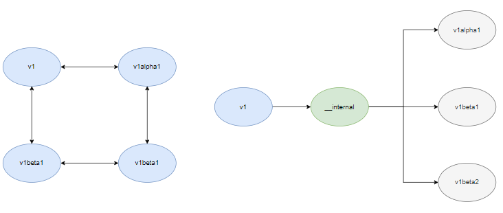
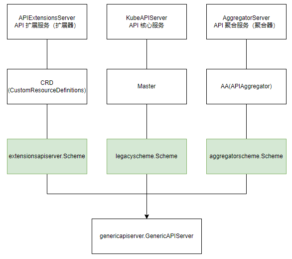

# 0. 前言

在进入 `kube-apiserver` 源码分析前，有一个非常重要的概念需要了解甚至熟悉的：资源注册表(scheme)。

`Kubernetes` 中一切皆资源，管理的是资源，创建、更新、删除的是资源。如何对庞杂的资源进行管理就成了一件大事。`Kubernetes` 通过引入 `scheme` 资源注册表，将资源信息注册到资源注册表，各个组件通过索引资源注册表实现资源的管理。

# 1. 介绍

直接开始阅读 `kube-apiserver` `scheme` 部分的源码是比较困难的，这里举代码示例如下：
```
package main

import (
	"fmt"

	appsv1 "k8s.io/api/apps/v1"
	corev1 "k8s.io/api/core/v1"
	metav1 "k8s.io/apimachinery/pkg/apis/meta/v1"
	"k8s.io/apimachinery/pkg/runtime"
	"k8s.io/apimachinery/pkg/runtime/schema"
)

func main() {
	// KnownType external
	coreGV := schema.GroupVersion{Group: "", Version: "v1"}
	extensionsGV := schema.GroupVersion{Group: "extensions", Version: "v1beta1"}

	// KnownType internal
	coreInternalGV := schema.GroupVersion{Group: "", Version: runtime.APIVersionInternal}

	// UnversionedType
	Unversioned := schema.GroupVersion{Group: "", Version: "v1"}

	schema := runtime.NewScheme()
	schema.AddKnownTypes(coreGV, &corev1.Pod{})
	schema.AddKnownTypes(extensionsGV, &appsv1.DaemonSet{})
	schema.AddKnownTypes(coreInternalGV, &corev1.Pod{})
	schema.AddUnversionedTypes(Unversioned, &metav1.Status{})

	fmt.Println(*schema)
    fmt.Println(schema.KnownTypes(coreGV))
}
```

示例中有几点需要关注。

1. 通过 `runtime.NewScheme` 创建 `scheme` 实例:
```
func NewScheme() *Scheme {
	s := &Scheme{
		gvkToType:                 map[schema.GroupVersionKind]reflect.Type{},
		typeToGVK:                 map[reflect.Type][]schema.GroupVersionKind{},
		unversionedTypes:          map[reflect.Type]schema.GroupVersionKind{},
		unversionedKinds:          map[string]reflect.Type{},
		fieldLabelConversionFuncs: map[schema.GroupVersionKind]FieldLabelConversionFunc{},
		defaulterFuncs:            map[reflect.Type]func(interface{}){},
		versionPriority:           map[string][]string{},
		schemeName:                naming.GetNameFromCallsite(internalPackages...),
	}
	s.converter = conversion.NewConverter(nil)

	...
	return s
}
```

`Scheme` 的结构体有四个 `field` 需要重点关注：
- `gvkToType`： 记录的是 `schema.GroupVersionKind` 和资源类型的映射关系。
- `typeToGVK`： 记录的是资源类型和 `schema.GroupVersionKind` 的映射关系。
- `unversionedTypes`： 记录的是无版本资源类型和 `schema.GroupVersionKind` 的映射关系。
- `unversionedKinds`： 记录的是资源种类 `Kind` 和无版本资源类型的映射关系。

还有一个 `Scheme.converter` 也挺重要，这里先跳过不讲。

2. 调用 `Scheme` 的 `AddKnownTypes` 和 `AddUnversionedTypes` 方法建立资源 `Group/Version/Kind` 和资源类型的相互映射关系。

以 `AddKnownTypes` 为例，函数通过反射 `reflect.TypeOf(obj)` 获得对象 `runtime.Object` 的资源类型。这里，对象是资源的接口，可实现资源和对象的相互转换。
```
func (s *Scheme) AddKnownTypes(gv schema.GroupVersion, types ...Object) {
	s.addObservedVersion(gv)
	for _, obj := range types {
		t := reflect.TypeOf(obj)
		if t.Kind() != reflect.Pointer {
			panic("All types must be pointers to structs.")
		}
		t = t.Elem()
		s.AddKnownTypeWithName(gv.WithKind(t.Name()), obj)
	}
}

func (gv GroupVersion) WithKind(kind string) GroupVersionKind {
	return GroupVersionKind{Group: gv.Group, Version: gv.Version, Kind: kind}
}

func (s *Scheme) AddKnownTypeWithName(gvk schema.GroupVersionKind, obj Object) {
	...
	t := reflect.TypeOf(obj)
	s.gvkToType[gvk] = t
}
```

然后调用 `gv.WithKind(t.Name())` 转换为 `GroupVersionKind`，可以看出上面反射的资源类型作为 `kind` 赋给 `GroupVersionKind`。

最后调用 `AddKnownTypeWithName` 将 `schema.GroupVersionKind` 和资源类型写入 `Scheme.gvkToType`。

执行代码结果如下：
```
{
	map[
		{ __internal Pod}:0xb46180 
		{ v1 Pod}:0xb46180 
		{ v1 Status}:0xb56d40 
		{extensions v1beta1 DaemonSet}:0xb44e40
	] 
	map[
		0xb44e40:[{extensions v1beta1 DaemonSet}] 
		0xb46180:[{ v1 Pod} { __internal Pod}] 
		0xb56d40:[{ v1 Status}]
	] 
	map[
		0xb56d40:{ v1 Status}
	] 
	map[
		Status:0xb56d40
	] 
	map[] 
	map[] 
	0xc000124888 
	map[] 
	[{ v1} {extensions v1beta1}] 
	pkg/runtime/scheme.go:100
}
map[Pod:v1.Pod Status:v1.Status]
```

3. `Kubernetes` 资源分为外部资源和内部资源。外部资源是对外可访问的，其版本为 `v1/v1beta1` 等，内部资源是 `Kubernetes` 内部访问的资源，其版本为 `__internal`。

为什么会有内部版本呢？  
为了适配版本间的 `convert`。  

试想，如果 `v1`、`v1apha1`、`v1beta1`、`v1beta2` 要相互转换需要建立十二种转换关系：  
```
v1 		 ---->  v1alpha1  
v1 		 ---->  v1beta1 
v1 		 ---->  v1beta2  
v1alpha1 ---->  v1  
v1alpha1 ---->  v1beta1  
v1alpha1 ---->  v1beta2
v1beta1  ---->  v1  
v1beta1  ---->  v1alpha1  
v1beta1  ---->  v1beta2
v1beta2  ---->  v1  
v1beta2  ---->  v1alpha1  
v1beta2  ---->  v1beta1
```

可以看到这种转换已经比较复杂了，随着资源增多，这种资源版本之间的转换会越来越复杂且难以维护。`Kubernetes` 通过引入内部版本 `__internl` 建立每种资源到 `__internal` 的转换，从而实现不同资源版本的相互转换。
```
v1 			---->  __internal  
__internal  ---->  v1 
v1alpha1 	---->  __internal 
__internal  ---->  v1alpha1 
v1beta1 	---->  __internal  
__internal  ---->  v1beta1
v1beta2 	---->  __internal
__internal  ---->  v1beta2
```


转换示意图如下：  


可以看到，相当干净，清爽。

# 2. kube-apiserver scheme

第一节介绍了 `scheme` 结构及部分特性。继续看 `kube-apiserver` 中 `scheme` 的应用。

## 2.1 注册资源

`kube-apiserver` 中资源的注册通过导入包的形式实现。`Kubernetes` 将资源拆分为三类，并且由三种 `HTTP Server` 负责处理这三类资源，架构如下。  



关于这幅图，这里不多讲，后续会逐层介绍。
要知道的是，三类资源分别注册到 `extensionsapiserver.Scheme`，`legacyscheme.Scheme` 和 `aggregatorscheme.Scheme` 三种资源注册表中。

以 `legacyscheme.Scheme` 资源注册表为例。  
`kube-apiserver` 的启动 `app` 包中导入 `"k8s.io/kubernetes/pkg/api/legacyscheme"` 和 `"k8s.io/kubernetes/pkg/controlplane"`包：
```
package app

import (
	"k8s.io/kubernetes/pkg/api/legacyscheme"
	"k8s.io/kubernetes/pkg/controlplane"
)
```

`legacyscheme` 包中创建了 `Scheme` 资源注册表，`Codecs` 编码器和 `ParameterCodec` 参数编码器。

```
# kubernetes/pkg/api/legacyscheme/scheme.go

package legacyscheme

var (
	Scheme = runtime.NewScheme()

	Codecs = serializer.NewCodecFactory(Scheme)

	ParameterCodec = runtime.NewParameterCodec(Scheme)
)
```

`controlplane` 包中导入需要注册的资源组：
```
# kubernetes/pkg/controlplane/import_known_versions.go

package controlplane

import (
	_ "k8s.io/kubernetes/pkg/apis/apps/install"
)
```

以注册 `apps` 资源组为例：
```
# kubernetes/pkg/apis/apps/install/install.go

package install

import (
	"k8s.io/apimachinery/pkg/runtime"
	utilruntime "k8s.io/apimachinery/pkg/util/runtime"
	"k8s.io/kubernetes/pkg/api/legacyscheme"
	"k8s.io/kubernetes/pkg/apis/apps"
	"k8s.io/kubernetes/pkg/apis/apps/v1"
	"k8s.io/kubernetes/pkg/apis/apps/v1beta1"
	"k8s.io/kubernetes/pkg/apis/apps/v1beta2"
)

func init() {
	Install(legacyscheme.Scheme)
}

func Install(scheme *runtime.Scheme) {
	utilruntime.Must(apps.AddToScheme(scheme))
	utilruntime.Must(v1beta1.AddToScheme(scheme))
	utilruntime.Must(v1beta2.AddToScheme(scheme))
	utilruntime.Must(v1.AddToScheme(scheme))
	utilruntime.Must(scheme.SetVersionPriority(v1.SchemeGroupVersion, v1beta2.SchemeGroupVersion, v1beta1.SchemeGroupVersion))
}
```

资源组中调用 `apps.AddToScheme`，`v1beta1.AddToScheme`,`v1beta2.AddToScheme` 和 `v1.AddToScheme` 函数将同一资源组不同版本的资源注册到 `legacyscheme.Scheme` 资源注册表中。  

其中 `apps.AddToScheme` 注册的是内部版本的资源：
```
package apps

var (
	SchemeBuilder = runtime.NewSchemeBuilder(addKnownTypes)
	AddToScheme = SchemeBuilder.AddToScheme
)

const GroupName = "apps"

var SchemeGroupVersion = schema.GroupVersion{Group: GroupName, Version: runtime.APIVersionInternal}

func addKnownTypes(scheme *runtime.Scheme) error {
	scheme.AddKnownTypes(SchemeGroupVersion,
		&DaemonSet{},
		&DaemonSetList{},
		&Deployment{},
		&DeploymentList{},
		&DeploymentRollback{},
		&autoscaling.Scale{},
		&StatefulSet{},
		&StatefulSetList{},
		&ControllerRevision{},
		&ControllerRevisionList{},
		&ReplicaSet{},
		&ReplicaSetList{},
	)
	return nil
}
```

`v1beta1.AddToScheme`,`v1beta2.AddToScheme` 和 `v1.AddToScheme` 注册的是外部版本的资源，以 `v1.AddToScheme` 为例：
```
package v1

const GroupName = "apps"

var SchemeGroupVersion = schema.GroupVersion{Group: GroupName, Version: "v1"}

var (
	SchemeBuilder      = runtime.NewSchemeBuilder(addKnownTypes)
	localSchemeBuilder = &SchemeBuilder
	AddToScheme        = localSchemeBuilder.AddToScheme
)

func addKnownTypes(scheme *runtime.Scheme) error {
	scheme.AddKnownTypes(SchemeGroupVersion,
		&Deployment{},
		&DeploymentList{},
		&StatefulSet{},
		&StatefulSetList{},
		&DaemonSet{},
		&DaemonSetList{},
		&ReplicaSet{},
		&ReplicaSetList{},
		&ControllerRevision{},
		&ControllerRevisionList{},
	)
	metav1.AddToGroupVersion(scheme, SchemeGroupVersion)
	return nil
}
```

需要注意的是，内部版本和外部版本注册的资源并不一样。比如 `Deployment` 资源，外部版本引用的是 `kubernetes/vendor/k8s.io/api/apps/v1/types.go` 中的资源定义：
```
type Deployment struct {
	metav1.TypeMeta `json:",inline"`
	metav1.ObjectMeta `json:"metadata,omitempty" protobuf:"bytes,1,opt,name=metadata"`
	Spec DeploymentSpec `json:"spec,omitempty" protobuf:"bytes,2,opt,name=spec"`
	Status DeploymentStatus `json:"status,omitempty" protobuf:"bytes,3,opt,name=status"`
}
```

资源声明了 `json` 和 `protobuf` tag，以便于外部访问的序列化，反序列化操作。

内部版本引用的是 `kubernetes/pkg/apis/apps/types.go` 中的资源定义：
```
type Deployment struct {
	metav1.TypeMeta
	metav1.ObjectMeta
	Spec DeploymentSpec
	Status DeploymentStatus
}
```

内部资源不需要被外部访问，没有 tag 声明。

到这里，kube-apiserver 关于资源的注册就差不多了。下一篇将进一步介绍 `scheme` 的 `convert`，`kube-apiserver` 中如何使用 `scheme` 及 `scheme` 和 `object` 相互转换等内容。
