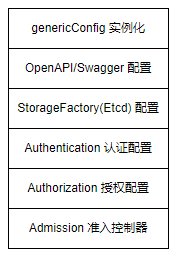

# 0. 前言

前面两篇文章 [Kubernetes:kube-apiserver 之 scheme(一)](https://www.cnblogs.com/xingzheanan/p/17771090.html) 和 [Kubernetes:kube-apiserver 之 scheme（二)](https://www.cnblogs.com/xingzheanan/p/17774196.html) 重点介绍了 `kube-apiserver` 中的资源注册表 `scheme`。这里进入正题，开始介绍 `kube-apiserver` 的核心实现。

# 1. kube-apiserver 启动流程

`kube-apiserver` 使用 [Cobra](https://github.com/spf13/cobra) 作为 `CLI` 框架，其初始化示意图如下。


结合示意图和代码看初始化过程效果更佳。代码在 `kubernetes/cmd/kube-apiserver/apiserver.go`。
```
# kubernetes/cmd/kube-apiserver/apiserver.go
package main

func main() {
	command := app.NewAPIServerCommand()
	code := cli.Run(command)
	os.Exit(code)
}

# kubernetes/cmd/kube-apiserver/app/server.go
func NewAPIServerCommand() *cobra.Command {
	s := options.NewServerRunOptions()
	cmd := &cobra.Command{
		Use: "kube-apiserver",
		...
		RunE: func(cmd *cobra.Command, args []string) error {
			// set default options
			completedOptions, err := s.Complete()
			if err != nil {
				return err
			}

			// validate options
			if errs := completedOptions.Validate(); len(errs) != 0 {
				return utilerrors.NewAggregate(errs)
			}

			return Run(completedOptions, genericapiserver.SetupSignalHandler())
		},
	}

    # parse flags to options
	fs := cmd.Flags()
	namedFlagSets := s.Flags()
	verflag.AddFlags(namedFlagSets.FlagSet("global"))

	return cmd
}
```

首先调用 `options.NewServerRunOptions()` 实例化 `options` 选项，接着 `s.Complete()` 补全默认 `options`，将补全的 `options` 送入 `Validate()` 方法进行验证。验证通过后进入 `Run(completedOptions, genericapiserver.SetupSignalHandler())`，`Run()` 函数是不会退出的函数，在函数内运行 `kube-apiserver`。

有一点要注意的是，`kube-apiserver` 的 [参数](https://kubernetes.io/docs/reference/command-line-tools-reference/kube-apiserver/) 通过 `flag` 解析赋给 `options`，这是框架的用法，不多讲。

进入 `Run()` 函数内。
```
func Run(opts options.CompletedOptions, stopCh <-chan struct{}) error {
    // 实例化 kube-apiserver 配置 config
	config, err := NewConfig(opts)
	if err != nil {
		return err
	}

    // 补全默认配置
	completed, err := config.Complete()
	if err != nil {
		return err
	}

    // 创建服务链
	server, err := CreateServerChain(completed)
	if err != nil {
		return err
	}

	prepared, err := server.PrepareRun()
	if err != nil {
		return err
	}

	return prepared.Run(stopCh)
}
```

如注释所示，`Run()` 函数内 `kube-apiserver` 的启动流程相当清晰。

下面分步看各个流程。

## 1.1 实例化配置

进入 `NewConfig(opts)` 看实例化 `config` 过程。
```
# kubernetes/cmd/kube-apiserver/app/config.go
func NewConfig(opts options.CompletedOptions) (*Config, error) {
    // 根据 options 实例化 Config
	c := &Config{
		Options: opts,
	}

    // 创建 controlPlane 配置文件
	controlPlane, serviceResolver, pluginInitializer, err := CreateKubeAPIServerConfig(opts)
	if err != nil {
		return nil, err
	}
	c.ControlPlane = controlPlane

    // 创建 apiExtensions 配置文件
	apiExtensions, err := apiserver.CreateAPIExtensionsConfig(*controlPlane.GenericConfig, controlPlane.ExtraConfig.VersionedInformers, pluginInitializer, opts.CompletedOptions, opts.MasterCount,
		serviceResolver, webhook.NewDefaultAuthenticationInfoResolverWrapper(controlPlane.ExtraConfig.ProxyTransport, controlPlane.GenericConfig.EgressSelector, controlPlane.GenericConfig.LoopbackClientConfig, controlPlane.GenericConfig.TracerProvider))
	if err != nil {
		return nil, err
	}
	c.ApiExtensions = apiExtensions

    // 创建 aggregator 配置文件
	aggregator, err := createAggregatorConfig(*controlPlane.GenericConfig, opts.CompletedOptions, controlPlane.ExtraConfig.VersionedInformers, serviceResolver, controlPlane.ExtraConfig.ProxyTransport, controlPlane.ExtraConfig.PeerProxy, pluginInitializer)
	if err != nil {
		return nil, err
	}
	c.Aggregator = aggregator

	return c, nil
}
```

将 `kube-apiserver` 的所有 `REST` 服务组合在一起是极为复杂的，这里 `kube-apiserver` 将服务拆分，解耦为三种 `HTTP Server`：`KubeAPIServer`，`APIExtensionsServer` 和 `AggregatorServer`。


三种 `HTTP Server` 拥有各自的配置文件。这里以 `APIExtensionsServer` 为例，查看其启动流程，其它两种 `HTTP Server` 与此类似。

进入 `CreateKubeAPIServerConfig(opts)`。
```
func CreateKubeAPIServerConfig(opts options.CompletedOptions) (
	*controlplane.Config,
	aggregatorapiserver.ServiceResolver,
	[]admission.PluginInitializer,
	error,
) {
    // 创建通用配置
    genericConfig, versionedInformers, storageFactory, err := controlplaneapiserver.BuildGenericConfig(
		opts.CompletedOptions,
		[]*runtime.Scheme{legacyscheme.Scheme, extensionsapiserver.Scheme, aggregatorscheme.Scheme},
		generatedopenapi.GetOpenAPIDefinitions,
	)

    config := &controlplane.Config{
		GenericConfig: genericConfig,
		ExtraConfig: controlplane.ExtraConfig{
			...
		},
	}

    // setup admission
	admissionConfig := &kubeapiserveradmission.Config{
		ExternalInformers:    versionedInformers,
		LoopbackClientConfig: genericConfig.LoopbackClientConfig,
		CloudConfigFile:      opts.CloudProvider.CloudConfigFile,
	}
    err = opts.Admission.ApplyTo(
		genericConfig,
		versionedInformers,
		clientgoExternalClient,
		dynamicExternalClient,
		utilfeature.DefaultFeatureGate,
		pluginInitializers...)
	if err != nil {
		return nil, nil, nil, fmt.Errorf("failed to apply admission: %w", err)
	}

    ...
    return config, serviceResolver, pluginInitializers, nil
}
```

试想，三种 `HTTP Server` 肯定有通用的配置。`kube-apiserver` 在函数 `CreateKubeAPIServerConfig(opts)` 内调用 `BuildGenericConfig()` 创建 `HTTP Server` 通用配置。

创建完通用配置后，实例化 `KubeAPIServer` 配置 `config`。接着，实例化 `admission` 准入相关配置，通过 `opts.Admission.ApplyTo()` 将准入配置赋给 `config`。

进入 `BuildGenericConfig` 看通用配置创建了什么。
```
func BuildGenericConfig(
	s controlplaneapiserver.CompletedOptions,
	schemes []*runtime.Scheme,
	getOpenAPIDefinitions func(ref openapicommon.ReferenceCallback) map[string]openapicommon.OpenAPIDefinition,
) (
	genericConfig *genericapiserver.Config,
	versionedInformers clientgoinformers.SharedInformerFactory,
	storageFactory *serverstorage.DefaultStorageFactory,

	lastErr error,
) {
    // NewConfig returns a Config struct with the default values
	genericConfig = genericapiserver.NewConfig(legacyscheme.Codecs)
	genericConfig.MergedResourceConfig = controlplane.DefaultAPIResourceConfigSource()

    //  ApplyTo applies the run options to the method receiver and returns self
	if lastErr = s.GenericServerRunOptions.ApplyTo(genericConfig); lastErr != nil {
		return
	}

    // wrap the definitions to revert any changes from disabled features
	getOpenAPIDefinitions = openapi.GetOpenAPIDefinitionsWithoutDisabledFeatures(getOpenAPIDefinitions)
	namer := openapinamer.NewDefinitionNamer(schemes...)
	genericConfig.OpenAPIConfig = genericapiserver.DefaultOpenAPIConfig(getOpenAPIDefinitions, namer)
	genericConfig.OpenAPIConfig.Info.Title = "Kubernetes"
	genericConfig.OpenAPIV3Config = genericapiserver.DefaultOpenAPIV3Config(getOpenAPIDefinitions, namer)
	genericConfig.OpenAPIV3Config.Info.Title = "Kubernetes"

    // New returns a new storage factory created from the completed storage factory configuration.
	storageFactoryConfig := kubeapiserver.NewStorageFactoryConfig()
	storageFactoryConfig.APIResourceConfig = genericConfig.MergedResourceConfig
	storageFactory, lastErr = storageFactoryConfig.Complete(s.Etcd).New()
	if lastErr != nil {
		return
	}

    // ApplyWithStorageFactoryTo mutates the provided server.Config.  It must never mutate the receiver (EtcdOptions).
	if lastErr = s.Etcd.ApplyWithStorageFactoryTo(storageFactory, genericConfig); lastErr != nil {
		return
	}

	// Authentication.ApplyTo requires already applied OpenAPIConfig and EgressSelector if present
	if lastErr = s.Authentication.ApplyTo(&genericConfig.Authentication, genericConfig.SecureServing, genericConfig.EgressSelector, genericConfig.OpenAPIConfig, genericConfig.OpenAPIV3Config, clientgoExternalClient, versionedInformers); lastErr != nil {
		return
	}

    // BuildAuthorizer constructs the authorizer
	genericConfig.Authorization.Authorizer, genericConfig.RuleResolver, err = BuildAuthorizer(s, genericConfig.EgressSelector, versionedInformers)
	if err != nil {
		lastErr = fmt.Errorf("invalid authorization config: %v", err)
		return
	}

    ...

	return
}
```

通用配置内创建了一系列配置，概括如下。  



这里不继续往下探各个配置的详细信息，后续需要再回头看。配置文件创建好后，返回 `Run()` 函数看服务链的创建。

## 1.2 创建服务链
进入 `CreateServerChain` 查看服务链。
```
func CreateServerChain(config CompletedConfig) (*aggregatorapiserver.APIAggregator, error) {
	// New returns an HTTP handler that is meant to be executed at the end of the delegation chain.
	// It checks if the request have been made before the server has installed all known HTTP paths.
	// In that case it returns a 503 response otherwise it returns a 404.
	notFoundHandler := notfoundhandler.New(config.ControlPlane.GenericConfig.Serializer, genericapifilters.NoMuxAndDiscoveryIncompleteKey)

	// New returns a new instance of CustomResourceDefinitions from the given config.
	apiExtensionsServer, err := config.ApiExtensions.New(genericapiserver.NewEmptyDelegateWithCustomHandler(notFoundHandler))
	if err != nil {
		return nil, err
	}
	crdAPIEnabled := config.ApiExtensions.GenericConfig.MergedResourceConfig.ResourceEnabled(apiextensionsv1.SchemeGroupVersion.WithResource("customresourcedefinitions"))

	kubeAPIServer, err := config.ControlPlane.New(apiExtensionsServer.GenericAPIServer)
	if err != nil {
		return nil, err
	}

	// aggregator comes last in the chain
	aggregatorServer, err := createAggregatorServer(config.Aggregator, kubeAPIServer.GenericAPIServer, apiExtensionsServer.Informers, crdAPIEnabled)
	if err != nil {
		// we don't need special handling for innerStopCh because the aggregator server doesn't create any go routines
		return nil, err
	}

	return aggregatorServer, nil
}
```

服务链中创建三种 `HTTP Server`，这里还是介绍 `apiExtensionsServer` 服务。

首先将 `notFoundHandler` handler 赋给 `apiExtensionsServer`，当 `REST` 路由不到指定 `API` 时会路由到 `notFoundHandler` 处理请求。

进入 `config.ApiExtensions.New`。
```
func (c completedConfig) New(delegationTarget genericapiserver.DelegationTarget) (*CustomResourceDefinitions, error) {
	// 创建通用 APIServer
	genericServer, err := c.GenericConfig.New("apiextensions-apiserver", delegationTarget)
	if err != nil {
		return nil, err
	}

	// 实例化 APIExtensions server: CustomResourceDefinitions
	s := &CustomResourceDefinitions{
		GenericAPIServer: genericServer,
	}

	// 创建 apiGroupInfo，通过 apiGroupInfo 建立 REST API 到资源实例的路由
	apiGroupInfo := genericapiserver.NewDefaultAPIGroupInfo(apiextensions.GroupName, Scheme, metav1.ParameterCodec, Codecs)
	storage := map[string]rest.Storage{}
	// customresourcedefinitions
	if resource := "customresourcedefinitions"; apiResourceConfig.ResourceEnabled(v1.SchemeGroupVersion.WithResource(resource)) {
		// 实例化 REST 资源：customResourceDefinitionStorage
		customResourceDefinitionStorage, err := customresourcedefinition.NewREST(Scheme, c.GenericConfig.RESTOptionsGetter)
		if err != nil {
			return nil, err
		}
		storage[resource] = customResourceDefinitionStorage
		storage[resource+"/status"] = customresourcedefinition.NewStatusREST(Scheme, customResourceDefinitionStorage)
	}
	if len(storage) > 0 {
		// 建立 version 到 REST 资源的 mapping
		apiGroupInfo.VersionedResourcesStorageMap[v1.SchemeGroupVersion.Version] = storage
	}

	// 通过 apiGroupInfo 建立 REST API 到资源实例的路由
	if err := s.GenericAPIServer.InstallAPIGroup(&apiGroupInfo); err != nil {
		return nil, err
	}

	...
}
```

`config.ApiExtensions.New` 中定义的流程如注释所示。下面逐层展开各个流程。

### 1.2.1 创建通用 APIServer

进入 `c.GenericConfig.New` 查看通用 APIServer 创建过程。
```
func (c completedConfig) New(name string, delegationTarget DelegationTarget) (*GenericAPIServer, error) {
	// 创建通用 APIServer 的 handler
	apiServerHandler := NewAPIServerHandler(name, c.Serializer, handlerChainBuilder, delegationTarget.UnprotectedHandler())

	// 实例化通用 APIServer 并将前面创建的 apiServerHandler 赋给通用 APIServer
	s := &GenericAPIServer{
		Handler:                        apiServerHandler,
		listedPathProvider: apiServerHandler,
	}

	// 建立通用 REST 路由
	installAPI(s, c.Config)

	return s, nil
}
```

首先，进入 `NewAPIServerHandler` 查看通用 `APIServer` `handler` 的创建。
```
func NewAPIServerHandler(name string, s runtime.NegotiatedSerializer, handlerChainBuilder HandlerChainBuilderFn, notFoundHandler http.Handler) *APIServerHandler {
	// 建立非 REST 资源的路由
	nonGoRestfulMux := mux.NewPathRecorderMux(name)
	if notFoundHandler != nil {
		nonGoRestfulMux.NotFoundHandler(notFoundHandler)
	}

	// 创建 go-restful container 处理 REST 资源的路由
	gorestfulContainer := restful.NewContainer()
	gorestfulContainer.ServeMux = http.NewServeMux()
	gorestfulContainer.Router(restful.CurlyRouter{}) // e.g. for proxy/{kind}/{name}/{*}
	gorestfulContainer.RecoverHandler(func(panicReason interface{}, httpWriter http.ResponseWriter) {
		logStackOnRecover(s, panicReason, httpWriter)
	})
	gorestfulContainer.ServiceErrorHandler(func(serviceErr restful.ServiceError, request *restful.Request, response *restful.Response) {
		serviceErrorHandler(s, serviceErr, request, response)
	})

	// 将两种路由 REST 资源路由和 非 REST 资源路由赋给 director
	director := director{
		name:               name,
		goRestfulContainer: gorestfulContainer,
		nonGoRestfulMux:    nonGoRestfulMux,
	}

	// 返回 APIServerHandler
	return &APIServerHandler{
		FullHandlerChain:   handlerChainBuilder(director),
		GoRestfulContainer: gorestfulContainer,
		NonGoRestfulMux:    nonGoRestfulMux,
		Director:           director,
	}
}
```

`kube-apiserver` 基于 [go-restful](https://github.com/emicklei/go-restful) 框架建立 `RESTful API` 的路由。  

创建好 `apiServerHandler` 后将该 `handler` 赋给通用 APIServer `GenericAPIServer`。接着进入 `installAPI(s, c.Config)` 看通用 `REST` 路由的创建过程。
```
func installAPI(s *GenericAPIServer, c *Config) {
	...
	routes.Version{Version: c.Version}.Install(s.Handler.GoRestfulContainer)
}
```

这里看一种 `REST` 路由 `version` 的建立过程，进入 `Version.Install`。
```
// Install registers the APIServer's `/version` handler.
func (v Version) Install(c *restful.Container) {
	if v.Version == nil {
		return
	}

	// Set up a service to return the git code version.
	versionWS := new(restful.WebService)
	versionWS.Path("/version")
	versionWS.Doc("git code version from which this is built")
	versionWS.Route(
		versionWS.GET("/").To(v.handleVersion).
			Doc("get the code version").
			Operation("getCodeVersion").
			Produces(restful.MIME_JSON).
			Consumes(restful.MIME_JSON).
			Writes(version.Info{}))

	c.Add(versionWS)
}

// handleVersion writes the server's version information.
func (v Version) handleVersion(req *restful.Request, resp *restful.Response) {
	responsewriters.WriteRawJSON(http.StatusOK, *v.Version, resp.ResponseWriter)
}
```

可以看到，在 `Install` 内建立了 `/version` 到 `v.handleVersion` 的路由。

下一节，将继续介绍创建服务链的流程。未完待续...
