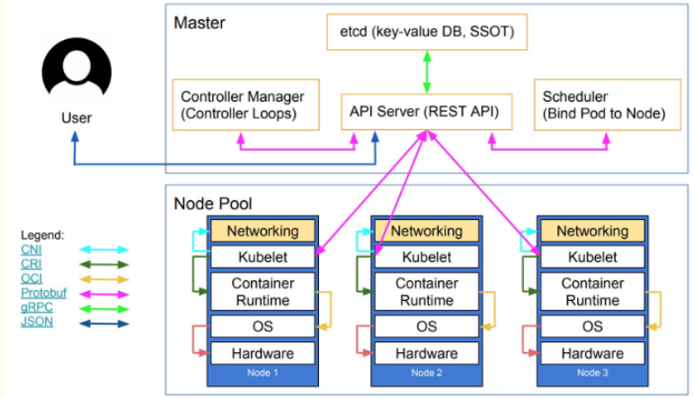

# 0. 前言

`kubelet` 是运行在 Kubernetes 节点上的“节点代理”，用来管理节点。



`kubelet` 主要负责所在节点上的资源对象的管理，例如 Pod 资源对象的创建，删除，监控，驱逐及生命周期管理等。

# 1. kubelet 源码分析
## 1.1 kubelet 模块

`kubelet` 包括的模块如下图：


从图中可以看出，`kubelet` 的模块众多，每个模块负责不同的功能。本文将围绕创建 Pod 流程有取舍的介绍 `kubelet` 各个模块。

在开始流程介绍前，让我们通过 kubelet 工作原理图将各个模块串联起来，这对于我们的源码分析是相当有帮助的。  


## 1.2 kubelet 启动及调试

下载 [Kubernetes](https://github.com/kubernetes/kubernetes) 源码，配置调试参数：
```
{
    "version": "0.2.0",
    "configurations": [
        {
            "name": "Kubelet",
            "type": "go",
            "request": "launch",
            "mode": "auto",
            "program": "${fileDirname}",
            "args": [
                "--container-runtime-endpoint=/run/k3s/containerd/containerd.sock",
                "-v=5",
                "--port=10251",
                "--kubeconfig=/root/.kube/config",
            ]
        }
    ]
}
```

打断点进入 `kubelet`:  


`kubelet` 使用 Cobra 作为应用命令行框架，和 `kube-scheduler`，`kube-apiserver` 初始化过程类似，其流程如下：  


这里，简要给出初始化示例代码：
```
// kubernetes/cmd/kubelet/app/server.go
func NewKubeletCommand() *cobra.Command {
    // 解析 flags
	cleanFlagSet := pflag.NewFlagSet(componentKubelet, pflag.ContinueOnError)
	cleanFlagSet.SetNormalizeFunc(cliflag.WordSepNormalizeFunc)
	kubeletFlags := options.NewKubeletFlags()

    // 获取 kubelet 配置
    kubeletConfig, err := options.NewKubeletConfiguration()

    cmd := &cobra.Command{
		...
        RunE: func(cmd *cobra.Command, args []string) error {
			...

            // 构建 kubeletServer
            kubeletServer := &options.KubeletServer{
				KubeletFlags:         *kubeletFlags,
				KubeletConfiguration: *kubeletConfig,
			}

            // 构建 kubeletDeps，kubeletDeps 是运行 kubelet 需要的依赖项
            kubeletDeps, err := UnsecuredDependencies(kubeletServer, utilfeature.DefaultFeatureGate)

            ...
            return Run(ctx, kubeletServer, kubeletDeps, utilfeature.DefaultFeatureGate)
        }
    }
}
```

进入 `Run` 函数运行 `kubelet`：
```
// kubernetes/cmd/kubelet/app/server.go
func Run(ctx context.Context, s *options.KubeletServer, kubeDeps *kubelet.Dependencies, featureGate featuregate.FeatureGate) error {
	...
	if err := run(ctx, s, kubeDeps, featureGate); err != nil {
		return fmt.Errorf("failed to run Kubelet: %w", err)
	}
	return nil
}

func run(ctx context.Context, s *options.KubeletServer, kubeDeps *kubelet.Dependencies, featureGate featuregate.FeatureGate) (err error) {
    ...
    if err := RunKubelet(s, kubeDeps, s.RunOnce); err != nil {
		return err
	}
    ...
}
```

`run` 函数的内容比较多，我们直接忽略，有重点的看 `RunKubelet`：  
```
// kubernetes/cmd/kubelet/app/server.go
func RunKubelet(kubeServer *options.KubeletServer, kubeDeps *kubelet.Dependencies, runOnce bool) error {
    ...
    k, err := createAndInitKubelet(kubeServer,
		kubeDeps,
		hostname,
		hostnameOverridden,
		nodeName,
		nodeIPs)
    if err != nil {
		return fmt.Errorf("failed to create kubelet: %w", err)
	}

    ...
    if runOnce {
		...
	} else {
		startKubelet(k, podCfg, &kubeServer.KubeletConfiguration, kubeDeps, kubeServer.EnableServer)
		klog.InfoS("Started kubelet")
	}
	return nil
}
```

这里 `createAndInitKubelet` 创建 `kubelet` 对象，该对象在 `startKubelet` 中运行：  
```
// kubernetes/cmd/kubelet/app/server.go
func startKubelet(k kubelet.Bootstrap, podCfg *config.PodConfig, kubeCfg *kubeletconfiginternal.KubeletConfiguration, kubeDeps *kubelet.Dependencies, enableServer bool) {
	// start the kubelet
	go k.Run(podCfg.Updates())

	// start the kubelet server
	if enableServer {
		go k.ListenAndServe(kubeCfg, kubeDeps.TLSOptions, kubeDeps.Auth, kubeDeps.TracerProvider)
	}
	if kubeCfg.ReadOnlyPort > 0 {
		go k.ListenAndServeReadOnly(netutils.ParseIPSloppy(kubeCfg.Address), uint(kubeCfg.ReadOnlyPort))
	}
	go k.ListenAndServePodResources()
}
```

`startKubelet` 调用 `kubelet.Run` 方法运行 `kubelet`。我们直接进入 `kubelet.Run` 方法看其中做了什么。

```
// kubernetes/pkg/kubelet/kubelet.go
func (kl *Kubelet) Run(updates <-chan kubetypes.PodUpdate) {
    ...
    // 初始化模块是初始化不依赖于 container runtime 的模块
    if err := kl.initializeModules(); err != nil {
		kl.recorder.Eventf(kl.nodeRef, v1.EventTypeWarning, events.KubeletSetupFailed, err.Error())
		klog.ErrorS(err, "Failed to initialize internal modules")
		os.Exit(1)
	}

    ...
    kl.syncLoop(ctx, updates, kl)
}
```

`Kubelet.Run` 中包括了不少操作，这里还是抓重点看 `Kubelet.syncLoop` 主逻辑做了什么。
```
// kubernetes/pkg/kubelet/kubelet.go
func (kl *Kubelet) syncLoop(ctx context.Context, updates <-chan kubetypes.PodUpdate, handler SyncHandler) {
	klog.InfoS("Starting kubelet main sync loop")

    // syncTicker 每秒检测一次是否有需要同步的 pod workers
    syncTicker := time.NewTicker(time.Second)
	defer syncTicker.Stop()

    // 每两秒检测一次是否有需要清理的 pod
	housekeepingTicker := time.NewTicker(housekeepingPeriod)
	defer housekeepingTicker.Stop()
    ...
	for {
		...
		kl.syncLoopMonitor.Store(kl.clock.Now())
		if !kl.syncLoopIteration(ctx, updates, handler, syncTicker.C, housekeepingTicker.C, plegCh) {
			break
		}
		kl.syncLoopMonitor.Store(kl.clock.Now())
	}
}

func (kl *Kubelet) syncLoopIteration(ctx context.Context, configCh <-chan kubetypes.PodUpdate, handler SyncHandler,
	syncCh <-chan time.Time, housekeepingCh <-chan time.Time, plegCh <-chan *pleg.PodLifecycleEvent) bool {
	select {
    case u, open := <-configCh:
        ...
        switch u.Op {
		case kubetypes.ADD:
			klog.V(2).InfoS("SyncLoop ADD", "source", u.Source, "pods", klog.KObjSlice(u.Pods))
			// After restarting, kubelet will get all existing pods through
			// ADD as if they are new pods. These pods will then go through the
			// admission process and *may* be rejected. This can be resolved
			// once we have checkpointing.
			handler.HandlePodAdditions(u.Pods)
            ...
        }
    }
}
```

`Kubelet.syncLoopIteration` 包括多个操作管道的行为，这里仅以 `configCh` 管道为例，看创建 pod 的行为。

在 `handler.HandlePodAdditions(u.Pods)` 这里打断点，然后创建 pod：
```
# helm install test .
NAME: test
LAST DEPLOYED: Sun May 19 15:34:54 2024
NAMESPACE: default
STATUS: deployed
```


```
I0519 15:34:54.577769 1801325 kubelet.go:2410] "SyncLoop ADD" source="api" pods=["default/test-6d47479b6b-pphb2"]
```

进入 `handler.HandlePodAdditions` 
```
func (kl *Kubelet) HandlePodAdditions(pods []*v1.Pod) {
	...
    for _, pod := range pods {
        // 获取 podManager 模块中记录的 pods
		existingPods := kl.podManager.GetPods()

        // 更新 podManager 中的 pod
        kl.podManager.AddPod(pod)

        // 根据 pod 的属性判断当前 pod 是不是 mirrorPod
        // mirrorPod 是仅受 kubelet 管理的，对 kubernetes 不可见的 pod
        pod, mirrorPod, wasMirror := kl.podManager.GetPodAndMirrorPod(pod)
        if wasMirror {
            ...
        }

        // 判断 pod 是否处于 termination 状态
        if !kl.podWorkers.IsPodTerminationRequested(pod.UID) {
            activePods := kl.filterOutInactivePods(existingPods)
            if utilfeature.DefaultFeatureGate.Enabled(features.InPlacePodVerticalScaling) {
                ...
            } else {
                // 判断 pod 是否可以运行在当前 node
                if ok, reason, message := kl.canAdmitPod(activePods, pod); !ok {
					kl.rejectPod(pod, reason, message)
					continue
				}
            }
        }

        kl.podWorkers.UpdatePod(UpdatePodOptions{
			Pod:        pod,
			MirrorPod:  mirrorPod,
			UpdateType: kubetypes.SyncPodCreate,
			StartTime:  start,
		})
    }
}
```

这里，`podManager` 模块负责存储和访问 pod 的信息，维持 static pod 和 mirror pods 的关系，podManager 会被 statusManager/volumeManager/runtimeManager 调用，`podManger` 记录所有被管理的 pod。

继续往下看 `podWorkers.UpdatePod`：
```
# kubernetes/pkg/kubelet/pod_workers.go
func (p *podWorkers) UpdatePod(options UpdatePodOptions) {
    ...
    status, ok := p.podSyncStatuses[uid]
    if !ok {
        klog.V(4).InfoS("Pod is being synced for the first time", "pod", klog.KRef(ns, name), "podUID", uid, "updateType", options.UpdateType)
        firstTime = true
		status = &podSyncStatus{
			syncedAt: now,
			fullname: kubecontainer.BuildPodFullName(name, ns),
		}
        ...
        p.podSyncStatuses[uid] = status
    }

    ...
    // 创建一个 pod worker 协程，如果该协程不存在的话
    podUpdates, exists := p.podUpdates[uid]
	if !exists {
        podUpdates = make(chan struct{}, 1)
		p.podUpdates[uid] = podUpdates
        ...
        go func() {
			defer runtime.HandleCrash()
			defer klog.V(3).InfoS("Pod worker has stopped", "podUID", uid)
			p.podWorkerLoop(uid, outCh)
		}()
    }
}

func (p *podWorkers) podWorkerLoop(podUID types.UID, podUpdates <-chan struct{}) {
    var lastSyncTime time.Time
    for range podUpdates {
        // startPodSync 判断 pod 是否可以被同步
		ctx, update, canStart, canEverStart, ok := p.startPodSync(podUID)

        ...
        err := func() error {
            var status *kubecontainer.PodStatus
            var err error
            switch {
			case update.Options.RunningPod != nil:
            default:
                status, err = p.podCache.GetNewerThan(update.Options.Pod.UID, lastSyncTime)
                ...
            }
        }

        switch {
			case update.WorkType == TerminatedPod:
            ...
            default:
				isTerminal, err = p.podSyncer.SyncPod(ctx, update.Options.UpdateType, update.Options.Pod, update.Options.MirrorPod, status)
			}

            lastSyncTime = p.clock.Now()
			return err
		}()

        ...
    }
}
```

这里，要注意的是 `podWorkers.podCache.GetNewerThan` 获取的是最新的 pod 状态。其中，`PLEG` 获取 container runtime 的 pod 状态，存入 podCache 中。podCache 中的 pod 状态和 `kubelet` 从 `kube-apiserver` 获取的 pod 状态做对比，以获取最新的 pod 状态。

接着，进入 `podWorkers.podSyncer.SyncPod` 同步 pod：
```
func (kl *Kubelet) SyncPod(ctx context.Context, updateType kubetypes.SyncPodType, pod, mirrorPod *v1.Pod, podStatus *kubecontainer.PodStatus) (isTerminal bool, err error) {
    ...
	klog.V(4).InfoS("SyncPod enter", "pod", klog.KObj(pod), "podUID", pod.UID)
    ...
    // 生成 apiPodStatus 以同步至 statusManager
    apiPodStatus := kl.generateAPIPodStatus(pod, podStatus, false)
    ...
    // 获取 statusManager 中存储的 pod 状态
    existingStatus, ok := kl.statusManager.GetPodStatus(pod.UID)
    ...
    // 调用 statusManager 同步 pod 状态
    kl.statusManager.SetPodStatus(pod, apiPodStatus)

    ...
    // ensure the kubelet knows about referenced secrets or configmaps used by the pod
    if !kl.podWorkers.IsPodTerminationRequested(pod.UID) {
		if kl.secretManager != nil {
			kl.secretManager.RegisterPod(pod)
		}
		if kl.configMapManager != nil {
			kl.configMapManager.RegisterPod(pod)
		}
	}

    // 创建 pod container manager
    pcm := kl.containerManager.NewPodContainerManager()
    ...

    // Make data directories for the pod
	if err := kl.makePodDataDirs(pod); err != nil {
		...
	}

    // Wait for volumes to attach/mount
	if err := kl.volumeManager.WaitForAttachAndMount(ctx, pod); err != nil {
		...
	}

    // Fetch the pull secrets for the pod
	pullSecrets := kl.getPullSecretsForPod(pod)

	// Ensure the pod is being probed
	kl.probeManager.AddPod(pod)

    ...
    result := kl.containerRuntime.SyncPod(sctx, pod, podStatus, pullSecrets, kl.backOff)
    ...
}
```

`Kubelet.SyncPod` 首先更新 statusManager 中 pod 的状态信息，接着开始创建 pod 所需要的资源，如 `data directories`，`volumes`，`secrets`。在调用 `container runtime` 同步 pod 前，将 pod 添加到 `probeManger` 模块，以检测 pod 状态。这里关于 `probeManger` 模块的详细内容可参考。

进入 `Kubelet.containerRuntime.SyncPod` 查看 `container runtime` 是怎么同步 pod 的。
```
// kubernetes/pkg/kubelet/kuberuntime/kuberuntime_manager.go
func (m *kubeGenericRuntimeManager) SyncPod(ctx context.Context, pod *v1.Pod, podStatus *kubecontainer.PodStatus, pullSecrets []v1.Secret, backOff *flowcontrol.Backoff) (result kubecontainer.PodSyncResult) {
	// Step 1: Compute sandbox and container changes.
	podContainerChanges := m.computePodActions(ctx, pod, podStatus)
    ...
    // Step 2: Kill the pod if the sandbox has changed.
	if podContainerChanges.KillPod {
        ...
    } else {
        // Step 3: kill any running containers in this pod which are not to keep.
        for containerID, containerInfo := range podContainerChanges.ContainersToKill {
            ...
        }
    }

    ...
    // Step 4: Create a sandbox for the pod if necessary.
    podSandboxID := podContainerChanges.SandboxID
	if podContainerChanges.CreateSandbox {
        ...
        createSandboxResult := kubecontainer.NewSyncResult(kubecontainer.CreatePodSandbox, format.Pod(pod))
		result.AddSyncResult(createSandboxResult)
        ...
        podSandboxID, msg, err = m.createPodSandbox(ctx, pod, podContainerChanges.Attempt)
        if err != nil {
            ...
        }

        // 调用 runtime cri 接口查询创建的 pod sandbox 状态
        resp, err := m.runtimeService.PodSandboxStatus(ctx, podSandboxID, false)
        ...
    }

    configPodSandboxResult := kubecontainer.NewSyncResult(kubecontainer.ConfigPodSandbox, podSandboxID)
	result.AddSyncResult(configPodSandboxResult)

    start := func(ctx context.Context, typeName, metricLabel string, spec *startSpec) error {
        ...
        klog.V(4).InfoS("Creating container in pod", "containerType", typeName, "container", spec.container, "pod", klog.KObj(pod))
        ...
        if msg, err := m.startContainer(ctx, podSandboxID, podSandboxConfig, spec, pod, podStatus, pullSecrets, podIP, podIPs); err != nil {
            ...
        }
        ...
    }

    // Step 5: start ephemeral containers
	for _, idx := range podContainerChanges.EphemeralContainersToStart {
		start(ctx, "ephemeral container", metrics.EphemeralContainer, ephemeralContainerStartSpec(&pod.Spec.EphemeralContainers[idx]))
	}

    if !utilfeature.DefaultFeatureGate.Enabled(features.SidecarContainers) {
        ...
    } else {
        // Step 6: start init containers.
		for _, idx := range podContainerChanges.InitContainersToStart {
            container := &pod.Spec.InitContainers[idx]
			// Start the next init container.
			if err := start(ctx, "init container", metrics.InitContainer, containerStartSpec(container)); err != nil {
                ...
            }

            // Successfully started the container; clear the entry in the failure
			klog.V(4).InfoS("Completed init container for pod", "containerName", container.Name, "pod", klog.KObj(pod))
        }
    }

    // Step 7: For containers in podContainerChanges.ContainersToUpdate[CPU,Memory] list, invoke UpdateContainerResources
	if isInPlacePodVerticalScalingAllowed(pod) {
		if len(podContainerChanges.ContainersToUpdate) > 0 || podContainerChanges.UpdatePodResources {
			m.doPodResizeAction(pod, podStatus, podContainerChanges, result)
		}
	}

    // Step 8: start containers in podContainerChanges.ContainersToStart.
	for _, idx := range podContainerChanges.ContainersToStart {
		start(ctx, "container", metrics.Container, containerStartSpec(&pod.Spec.Containers[idx]))
	}

	return

```

在 `Kubelet.containerRuntime.SyncPod` 中通过调用 `runtime` `cri` 接口创建 pod sandbox 和 container。以创建 pod sandbox 为例，在 `kubeGenericRuntimeManager.createPodSandbox` 中调用 `kubeGenericRuntimeManager.instrumentedRuntimeService.RunPodSandbox` 创建 pod sandbox：
```
func (m *kubeGenericRuntimeManager) createPodSandbox(ctx context.Context, pod *v1.Pod, attempt uint32) (string, string, error) {
    podSandboxConfig, err := m.generatePodSandboxConfig(pod, attempt)
    if err != nil {
        ...
    }

    // 创建 pod 的 log 目录
    err = m.osInterface.MkdirAll(podSandboxConfig.LogDirectory, 0755)
    ...

    podSandBoxID, err := m.runtimeService.RunPodSandbox(ctx, podSandboxConfig, runtimeHandler)
    if err != nil {
        ...
    }

    return podSandBoxID, "", nil
}

func (in instrumentedRuntimeService) RunPodSandbox(ctx context.Context, config *runtimeapi.PodSandboxConfig, runtimeHandler string) (string, error) {
	...
	out, err := in.service.RunPodSandbox(ctx, config, runtimeHandler)
	...
	return out, err
}

func (r *remoteRuntimeService) RunPodSandbox(ctx context.Context, config *runtimeapi.PodSandboxConfig, runtimeHandler string) (string, error) {
	...
	klog.V(10).InfoS("[RemoteRuntimeService] RunPodSandbox", "config", config, "runtimeHandler", runtimeHandler, "timeout", timeout)
	...
	resp, err := r.runtimeClient.RunPodSandbox(ctx, &runtimeapi.RunPodSandboxRequest{
		Config:         config,
		RuntimeHandler: runtimeHandler,
	})
    ...
}

// kubernetes/vendor/k8s.io/cri-api/pkg/apis/runtime/v1/api.pb.go
func (c *runtimeServiceClient) RunPodSandbox(ctx context.Context, in *RunPodSandboxRequest, opts ...grpc.CallOption) (*RunPodSandboxResponse, error) {
	out := new(RunPodSandboxResponse)
	err := c.cc.Invoke(ctx, "/runtime.v1.RuntimeService/RunPodSandbox", in, out, opts...)
	if err != nil {
		return nil, err
	}
	return out, nil
}
```

可以看到，这里通过调用 `cri` 接口的 `/runtime.v1.RuntimeService/RunPodSandbox` 创建 pod sandbox，至于创建 container 也是类似，调用 runtime cri 的接口实现创建 pod 的 container。

# 2. 小结

本文从 kubelet 源码层面介绍了 pod 创建的流程，后续将重点看 `runtime` 是如何工作的。
