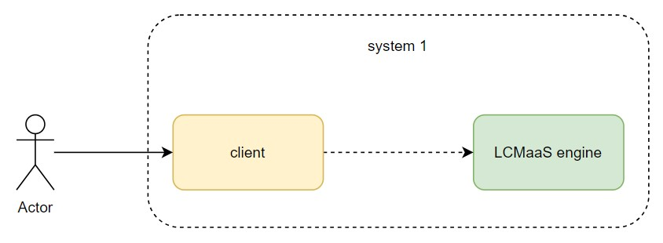
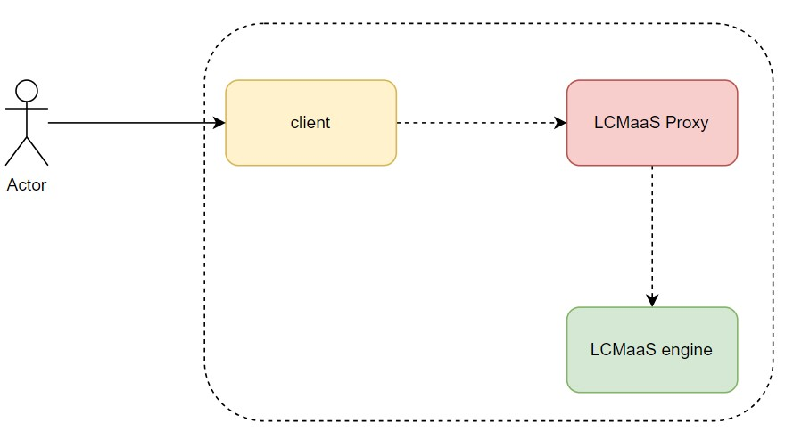

# 0. 代理模式

代理模式是在代理对象添加非业务功能，而让被代理对象专职负责业务处理的设计模式。


# 1. 实现

实现 application 对象负责处理外部请求。

```
package main

import "fmt"

type Server interface {
	HandleRequest(string, string) (int, string)
}

type Application struct{}

func (app *Application) HandleRequest(url, method string) (int, string) {
	if url == "/app/status" && method == "GET" {
		return 200, "OK"
	}

	if url == "/create/user" && method == "POST" {
		return 201, "User Created"
	}

	return 404, "NOK"
}
```

现在对 application 作限流操作，由于限流是和 `HandleRequest` 不想关的行为。我们使用代理模式，创建代理类负责限流处理。
```
type Nginx struct {
	app               *Application
	maxAllowedRequest int
	rateLimiter       map[string]int
}

func (nginx *Nginx) checkRateLimiting(url string) bool {
	if nginx.rateLimiter[url] == 0 {
		nginx.rateLimiter[url] = 1
	}

	if nginx.rateLimiter[url] > nginx.maxAllowedRequest {
		return false
	}

	nginx.rateLimiter[url] = nginx.rateLimiter[url] + 1
	return true
}

func (nginx *Nginx) HandleRequest(url, method string) (int, string) {
	if allowed := nginx.checkRateLimiting(url); !allowed {
		return 403, "Not Allowed"
	}

	return nginx.app.HandleRequest(url, method)
}
```

通过引入代理类，我们为 application 添加了不相关的限流功能。

代理模式结构如下：  


注意这里代理模式中使用委托将实际服务类放入代理对象中。代理对象可以添加成接口实现，如：
```
type Nginx struct {
	app               Server
	maxAllowedRequest int
	rateLimiter       map[string]int
}
```

# 2. 代理模式项目实现

我们有一模块 `LCMaaS engine` 提供资源的生命周期管理服务，该模块内置于一资源管理系统。其结构如下图：  



现需要开发另一资源管理系统，该资源管理系统调用 `LCMaaS engine` 模块的 API 提供资源生命周期管理。不过系统不能直接调用 `LCMaaS engine`，需要做一些环境上的适配。这里由于系统做的是和 `LCMaaS engine` 不相关的功能，我们可以考虑添加 `LCMaaS engine` 代理负责处理这部分不想关的功能。示例如下：  



