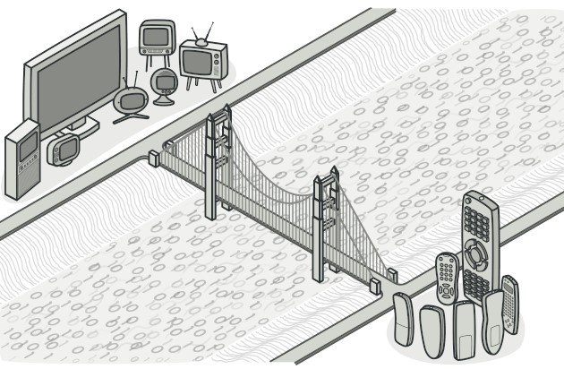

# 桥接模式



桥接模式是继承转组合非常好的运用，桥接模式也可以看作将类的职责拆分，实现高内聚低耦合。

# 实现

如果我们有计算机接口实现打印功能：
```
type Computer interface {
	Print()
	SetPrinter(Printer)
}
```

实现该接口需要计算机加打印机。这里有 Mac/Windows 电脑和 Hp/Epson 打印机。如果要构造类可以构造四种：`MacHp`，`MacEpson`，`WindowsHp` 和 `WindowsEpson` 实现打印功能。

如果要加上另外一种打印机需要在增加两个类。而且我们发现这其中类的功能不单一。计算机应该仅作为“抽象层”或者“高层”将工作委派给“实现层”，这样将计算机和打印机解耦。构造类如下：
```
package main

import "fmt"

type Computer interface {
	Print()
	SetPrinter(Printer)
}

type Mac struct {
	printer Printer
}

func (mac *Mac) Print() {
	fmt.Println("Print request from Mac")
	mac.printer.PrintFile()
}

func (mac *Mac) SetPrinter(printer Printer) {
	mac.printer = printer
}

type Windows struct {
	printer Printer
}

func (w *Windows) Print() {
	fmt.Println("Print request from Windows")
	w.printer.PrintFile()
}

func (w *Windows) SetPrinter(printer Printer) {
	w.printer = printer
}

type Printer interface {
	PrintFile()
}

type Epson struct{}

func (e *Epson) PrintFile() {
	fmt.Println("Print by Espon printer")
}

type Hp struct{}

func (hp *Hp) PrintFile() {
	fmt.Println("Print by Hp printer")
}
```

客户端调用计算机“抽象层”实现打印功能如下：
```
func main() {
	hpPrinter := &Hp{}
	epsonPrinter := &Epson{}

	macComputer := &Mac{}
	winComputer := &Windows{}

	macComputer.SetPrinter(hpPrinter)
	macComputer.Print()

	winComputer.SetPrinter(hpPrinter)
	winComputer.Print()

	macComputer.SetPrinter(epsonPrinter)
	macComputer.Print()

	winComputer.SetPrinter(epsonPrinter)
	winComputer.Print()
}
```

那么，如果新增打印机的话只需要新增打印机类及其实现就行，不需要和计算机绑定。

桥接模式结构图如下：  


# 桥接模式在 Kubernetes 中的应用

在 Kubernetes 中桥接模式的典型应用是 CRI。CRI 提供 `Kubelet` 对象实现 CRI 接口。`RuntimeService` 作为实现层负责实现容器运行时的一系列方法。
```
// kubernetes/pkg/kubelet/kubelet.go
type Kubelet struct {
    ...
    // Container runtime service (needed by container runtime Start()).
	runtimeService internalapi.RuntimeService
}

// kubernetes/vendor/k8s.io/cri-api/apis/services.go
// RuntimeService interface should be implemented by a container runtime.
// The methods should be thread-safe.
type RuntimeService interface {
	RuntimeVersioner
	ContainerManager
	PodSandboxManager
	ContainerStatsManager

	// UpdateRuntimeConfig updates runtime configuration if specified
	UpdateRuntimeConfig(ctx context.Context, runtimeConfig *runtimeapi.RuntimeConfig) error
	// Status returns the status of the runtime.
	Status(ctx context.Context, verbose bool) (*runtimeapi.StatusResponse, error)
	// RuntimeConfig returns the configuration information of the runtime.
	RuntimeConfig(ctx context.Context) (*runtimeapi.RuntimeConfigResponse, error)
}
```

具体的实现层可以是 `docker`，`cri-o` 等等。

通过这种将抽象和实现解耦，实现了高内聚低耦合。

