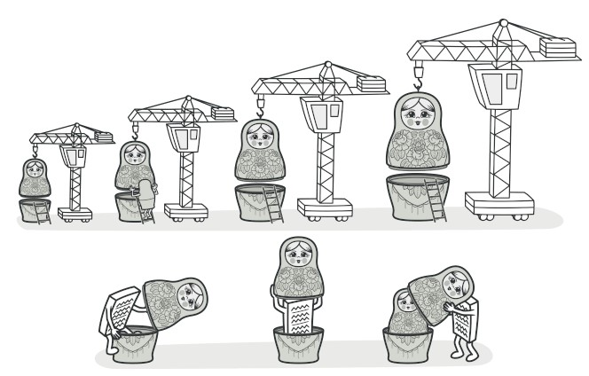

# 装饰器模式

装饰器模式是增强对象功能的模式。



# 实现

现有 Pizza 类如下：
```
package main

import (
	"fmt"
)

type Pizza interface {
	GetPrice() int
}

type BasicPizza struct{}

func (bp *BasicPizza) GetPrice() int {
	return 10
}
```

用户可以选择获取 Pizza 加配料 Chess/Onion。我们可以使用继承扩展 PizzaChess/PizzaOnion 和 PizzaChessOnion 类。多出来三个类还可以接受。
这里各种配料是可以组合搭配的，如果新增几个配料的话很快会出现子类数量太多，导致难以维护。

为了解决这个问题，我们将配料类单独抽取出来，构造 Chess 和 Onion 类。在每个增强类中添加接口，这样可以实现组合增强。如下：
```
type TomatoTopping struct {
	pizza Pizza
}

func (tt *TomatoTopping) GetPrice() int {
	return tt.pizza.GetPrice() + 5
}

type CheeseTopping struct {
	pizza Pizza
}

func (ct *CheeseTopping) GetPrice() int {
	return ct.pizza.GetPrice() + 3
}
```

那么，客户端可以随意组合实现基本类的装饰/增强。
```
func main() {
	basic := &BasicPizza{}
	fmt.Println(basic.GetPrice())

	tomatoTopping := &TomatoTopping{
		pizza: basic,
	}
	fmt.Println(tomatoTopping.GetPrice())

	cheeseTopping := &CheeseTopping{
		pizza: tomatoTopping,
	}
	fmt.Println(cheeseTopping.GetPrice())
}
```

这里，类的增强是无序的。客户端也可以先加 cheeseTopping 在加 tomatoTopping。
```
func main() {
	basic := &BasicPizza{}
	fmt.Println(basic.GetPrice())

	cheeseTopping := &CheeseTopping{
		pizza: tomatoTopping,
	}
	fmt.Println(cheeseTopping.GetPrice())

    tomatoTopping := &TomatoTopping{
		pizza: basic,
	}
	fmt.Println(tomatoTopping.GetPrice())
}
```

这种设计模式就是组合模式，其结构如下。  


# 装饰器模式在 Kubernetes 中的实现

Kubernetes 中的 Admission Webhook 也可以看作是一种装饰器模式的应用。Admission Webhook 允许在资源被创建、更新、删除时进行自定义逻辑处理。
```
package main

import "fmt"

// Admission 接口定义
type Admission interface {
    Admit(resource string) bool
}

// 基础 Admission 实现（模拟）
type BasicAdmission struct{}

func (a *BasicAdmission) Admit(resource string) bool {
    fmt.Println("BasicAdmission: Admitting resource")
    return resource != "forbidden"
}

// 验证 Admission 装饰器
type ValidateAdmission struct {
    Admission Admission
}

func (a *ValidateAdmission) Admit(resource string) bool {
    if !a.Admission.Admit(resource) {
        return false
    }
    fmt.Println("ValidateAdmission: Validating resource")
    return resource != "invalid"
}

// Mutate Admission 装饰器（模拟）
type MutateAdmission struct {
    Admission Admission
}

func (a *MutateAdmission) Admit(resource string) bool {
    if !a.Admission.Admit(resource) {
        return false
    }
    fmt.Println("MutateAdmission: Mutating resource")
    return resource != "immutable"
}

func main() {
    // 创建基础 Admission
    basicAdmission := &BasicAdmission{}

    // 创建带有验证的 Admission
    validateAdmission := &ValidateAdmission{
        Admission: basicAdmission,
    }

    // 创建带有变更的 Admission
    mutateAdmission := &MutateAdmission{
        Admission: validateAdmission,
    }

    // 尝试执行 Admission
    resources := []string{"valid", "forbidden", "invalid", "immutable"}
    for _, resource := range resources {
        if mutateAdmission.Admit(resource) {
            fmt.Printf("Resource '%s' admitted\n", resource)
        } else {
            fmt.Printf("Resource '%s' denied\n", resource)
        }
    }
}
```