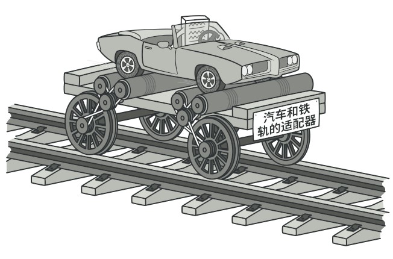

# 0. 适配器模式

适配器顾名思义，是为了适配对象之间的不匹配而设计的模式。  



# 1. 实现

假设我们有 `Computer` 接口实现 `InsertIntoLightningPort`方法：
```
type Computer interface {
	InsertIntoLightningPort()
}

type Mac struct{}

func (m *Mac) InsertIntoLightningPort() {
	fmt.Println("Lightning connector is plugged into mac machine.")
}
```

客户端调用 `Computer.InsertIntoLightningPort` 实现插入计算机端口操作：
```
package main

import "fmt"

type Client struct{}

func (c *Client) InsertLightningConnectorIntoComputer(com Computer) {
	fmt.Println("Client inserts Lightning connector into computer.")
	com.InsertIntoLightningPort()
}
```

不过对于 `Windows`，其插入计算机端口的实现是 `InsertIntoUSBPort`：
```
type Windows struct{}

func (w *Windows) InsertIntoUSBPort() {
	fmt.Println("USB connector is plugged into windows machine.")
}
```

`Windows` 属于计算机的一种，应该能被客户端调用，这里由于接口不统一，无法调用。我们可引入适配器负责适配 `Windows` 接口：
```
type WindowsAdapter struct {
	windows *Windows
}

func (wa *WindowsAdapter) InsertIntoLightningPort() {
	fmt.Println("Adapter converts Lightning signal to USB.")
	wa.windows.InsertIntoUSBPort()
}
```

通过引入适配器，我们通过 `WindowsAdapter` 即可在不改变 `Windows` 接口的情况下实现接口的统一。客户端调用如下：
```
func main() {
	client := &Client{}
	max := &Mac{}

	client.InsertLightningConnectorIntoComputer(max)

	windows := &Windows{}
	windowsAdapter := &WindowsAdapter{windows: windows}
	windowsAdapter.InsertIntoLightningPort()
}
```

适配器模式结构如下：  


# 2. Kubernetes 中适配器模式实现

在 Kubernetes 中 `informerAdapter` 适配器实现了统一的接口，客户端可通过 `informerAdapter` 实现统一的 `informer` 调用：
```
// kubernetes/pkg/controller/replication/conversion.go
// informerAdapter implements ReplicaSetInformer by wrapping ReplicationControllerInformer
// and converting objects.
type informerAdapter struct {
	rcInformer coreinformers.ReplicationControllerInformer
}

func (i informerAdapter) Informer() cache.SharedIndexInformer {
	return conversionInformer{i.rcInformer.Informer()}
}

func (i informerAdapter) Lister() appslisters.ReplicaSetLister {
	return conversionLister{i.rcInformer.Lister()}
}

// kubernetes/pkg/controller/replication/replication_controller.go
func NewReplicationManager(logger klog.Logger, podInformer coreinformers.PodInformer, rcInformer coreinformers.ReplicationControllerInformer, kubeClient clientset.Interface, burstReplicas int) *ReplicationManager {
	eventBroadcaster := record.NewBroadcaster()
	return &ReplicationManager{
		*replicaset.NewBaseController(logger, informerAdapter{rcInformer}, podInformer, clientsetAdapter{kubeClient}, burstReplicas,
			v1.SchemeGroupVersion.WithKind("ReplicationController"),
			"replication_controller",
			"replicationmanager",
			podControlAdapter{controller.RealPodControl{
				KubeClient: kubeClient,
				Recorder:   eventBroadcaster.NewRecorder(scheme.Scheme, v1.EventSource{Component: "replication-controller"}),
			}},
			eventBroadcaster,
		),
	}
}
```

# 3. 小结

适配器模式一般是用来适配设计的不全，它并没有创造新接口，而是统一了接口。
