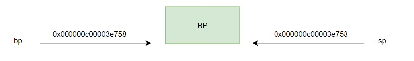
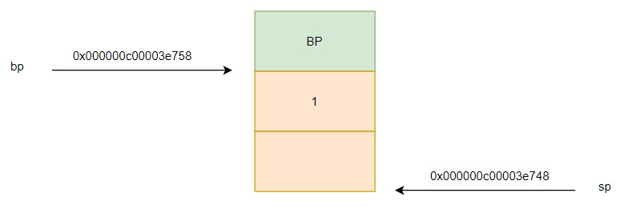

# 0. 前言

作为一个严肃的 Gopher，了解汇编是必须的。本汇编系列文章会围绕基本的 Go 程序介绍汇编的基础知识。

# 1. Go 程序到汇编

首先看一个简单到令人发指的示例：
```
package main

func main() {
	a := 1
	print(a)
}
```

运行程序，输出：
```
# go run ex0.go 
1
```

当使用 `go run` 运行程序时，代码会经过编译，链接，执行得到输出，这是自动执行的，没办法查看中间过程。我们可以使用 `dlv` 查看这段代码在执行时做了什么。`dlv` 将代码加载到内存中交给 CPU 执行，又不丧失对 CPU 的控制。换言之，我们是在底层通过 `dlv` 对 CPU 进行调试查看代码的执行过程，这对我们了解程序的执行是非常有帮助的。

使用 `dlv debug` 调试程序：
```
# go mod init ex0
go: creating new go.mod: module ex0
go: to add module requirements and sums:
        go mod tidy

# dlv debug
Type 'help' for list of commands.
(dlv)
```

使用 `disass` 可查看应用程序的汇编代码，这里的汇编是真实的机器执行的汇编代码。汇编是离机器最近的“语言”，翻译成汇编可以帮助我们知道机器在对我们的代码做什么。
```
(dlv) disass
TEXT _rt0_amd64_linux(SB) /usr/local/go/src/runtime/rt0_linux_amd64.s
=>      rt0_linux_amd64.s:8     0x466d00        e95bc9ffff      jmp $_rt0_amd64
```

从这段汇编代码可以看出，进入 `main` 函数前，机器执行的是 Go runtime 中 `rt0_linux_amd64.s` 第 8 行的汇编指令。查看 `rt0_linux_amd64.s`：
```
// Copyright 2009 The Go Authors. All rights reserved.
// Use of this source code is governed by a BSD-style
// license that can be found in the LICENSE file.

#include "textflag.h"

TEXT _rt0_amd64_linux(SB),NOSPLIT,$-8
	JMP	_rt0_amd64(SB)

TEXT _rt0_amd64_linux_lib(SB),NOSPLIT,$0
	JMP	_rt0_amd64_lib(SB)
```

第 8 行执行的是 `JMP _rt0_amd64(SB)` 跳转指令。

使用 `si` 命令单步调试，`si` 是指令级调试。执行 `si` 查看的是 CPU 执行的下一条指令：
```
(dlv) si
> _rt0_amd64() /usr/local/go/src/runtime/asm_amd64.s:16 (PC: 0x463660)
Warning: debugging optimized function
TEXT _rt0_amd64(SB) /usr/local/go/src/runtime/asm_amd64.s
=>      asm_amd64.s:16  0x463660        488b3c24        mov rdi, qword ptr [rsp]
        asm_amd64.s:17  0x463664        488d742408      lea rsi, ptr [rsp+0x8]
        asm_amd64.s:18  0x463669        e912000000      jmp $runtime.rt0_go
```

CPU 执行的是 `runtime/asm_amd64.s` 中的汇编指令。查看 `runtime/asm_amd64.s`：
```
// _rt0_amd64 is common startup code for most amd64 systems when using
// internal linking. This is the entry point for the program from the
// kernel for an ordinary -buildmode=exe program. The stack holds the
// number of arguments and the C-style argv.
TEXT _rt0_amd64(SB),NOSPLIT,$-8
	MOVQ	0(SP), DI	// argc
	LEAQ	8(SP), SI	// argv
	JMP	runtime·rt0_go(SB)
```

可以看到，Go runtime 的汇编和机器实际执行的汇编指令有所出入。这里 Go 的汇编可以理解成在汇编之上又定制的一层汇编，要注意的是机器实际执行的是 Go 汇编翻译之后的汇编。

## 1.1 main 函数栈

本文的重点并不是单步调试 runtime 的汇编指令，我们使用 `b` 给 main 函数加断点，使用 `c` 执行到断点处，重点看 main 函数中的执行过程：
```
(dlv) b main.main
Breakpoint 1 set at 0x45feca for main.main() ./ex0.go:3
(dlv) c
> main.main() ./ex0.go:3 (hits goroutine(1):1 total:1) (PC: 0x45feca)
     1: package main
     2:
=>   3: func main() {
     4:         a := 1
     5:         print(a)
     6: }
```

程序执行到 ex0.go 的第三行。`disass` 查看汇编指令：
```
(dlv) disass
TEXT main.main(SB) /root/go/src/foundation/ex0/ex0.go
        ex0.go:3        0x45fec0        493b6610                cmp rsp, qword ptr [r14+0x10]
        ex0.go:3        0x45fec4        762b                    jbe 0x45fef1
        ex0.go:3        0x45fec6        55                      push rbp
        ex0.go:3        0x45fec7        4889e5                  mov rbp, rsp
=>      ex0.go:3        0x45feca*       4883ec10                sub rsp, 0x10
```

汇编代码显示执行到内存地址 `0x45feca` 处，内存地址中存储的是汇编指令 `sub rsp, 0x10`，对应的十六进制是 `4883ec10`，转换为二进制机器指令是 `1001000100000111110110000010000`。

我们有必要分段介绍执行 `sub rsp, 0x10` 前 CPU 执行的指令，以方便理解。

首先，`cmp rsp, qword ptr [r14+0x10]` 指令比较 rsp 寄存器的值和 [r14+0x10] 寄存器中的值，并将比较的结果存储到标志寄存器中。  
接下来，指令 `jbe 0x45fef1` 将读取标志寄存器的结果，如果比较结果 rsp 小于或等于 [r14+0x10] 则跳转到内存 `0x45fef1`。查看 `0x45fef1` 中存储的指令：
```
ex0.go:3        0x45fef1        e8eacdffff              call $runtime.morestack_noctxt
```

`0x45fef1` 存储的是 `runtime.morestack_noctxt` 函数的调用。

机器指令的语义较难理解这几条指令在干嘛，翻译成语义信息就是，如果当前 main 函数栈的栈空间不足，则调用 `runtime.morestack_noctxt` 申请更多栈空间。

接着，继续执行指令 `push rbp`。在介绍这条指令前，有必要介绍下机器的寄存器，使用 `regs` 命令查看机器的寄存器：
```
(dlv) regs
    Rip = 0x000000000045feca
    Rsp = 0x000000c00003e758
    Rax = 0x000000000045fec0
    Rbx = 0x0000000000000000
    Rcx = 0x0000000000000000
    Rdx = 0x00000000004751a0
    Rsi = 0x00000000004c3160
    Rdi = 0x0000000000000000
    Rbp = 0x000000c00003e758
	...
```

机器有很多种寄存器，我们重点关注的是 `Rip`，`Rsp` 和 `Rbp` 寄存器。  

Rip 寄存器中存储的是 CPU 当前执行指令的内存地址，这里要注意，程序中的内存地址为虚拟地址，不存在段地址和偏移地址。当前 `Rip` 中存储的是 `0x000000000045feca`，对应执行的机器指令是 `=>      ex0.go:3        0x45feca*       4883ec10                sub rsp, 0x10`。

`Rsp` 寄存器一般作为函数栈的栈顶，用来存储函数栈的栈顶地址。`Rbp` 一般用来存储程序执行的下一条指令，函数栈在跳转时需要知道下一条执行的指令在什么位置(这里不清楚也没关系，后续文章会介绍)


回到 `push rbp` 指令，该指令会将 `rbp` 寄存器的值压栈，压栈是从高地址到低地址，`Rsp` 寄存器将减小 8 个字节。然后 `mov rbp, rsp` 指令将当前 `rsp` 寄存器的值赋给 `rbp`, `rbp` 将作为函数栈的栈底存在。

根据上述分析，可以画出当前栈的内存空间如下：



继续单步执行 `sub rsp, 0x10` 指令，`rsp` 向下减 `0x10`，这是为 `main` 函数栈开辟栈空间。rsp 值为：
```
(dlv) regs
    Rsp = 0x000000c00003e748
```

`disass` 查看后续执行的汇编指令：
```
(dlv) disass
Sending output to pager...
TEXT main.main(SB) /root/go/src/foundation/ex0/ex0.go
        ...
=>      ex0.go:4        0x45fece        48c744240801000000      mov qword ptr [rsp+0x8], 0x1
        ex0.go:5        0x45fed7        e8e449fdff              call $runtime.printlock
        ex0.go:5        0x45fedc        488b442408              mov rax, qword ptr [rsp+0x8]
        ex0.go:5        0x45fee1        e87a50fdff              call $runtime.printint
        ex0.go:5        0x45fee6        e8354afdff              call $runtime.printunlock
        ex0.go:6        0x45feeb        4883c410                add rsp, 0x10
        ex0.go:6        0x45feef        5d                      pop rbp
```

`mov qword ptr [rsp+0x8], 0x1` 将 `0x1` 放到 [rsp+0x8] 内存地址中。使用 `x` 命令可以查看内存地址中的值：
```
x 0x000000c00003e750
0xc00003e750:   0x01
```

接着，`mov rax, qword ptr [rsp+0x8]` 将内存地址 `[rsp+0x8]:0x000000c00003e750` 的值拷贝到寄存器 `rax` 中，调用 `call $runtime.printint` 打印寄存器中的值（这里忽略 `call $runtime.printint` 和 `call $runtime.printunlock` 指令）。

在我们执行下一条指令 `add rsp, 0x10` 前先看下当前内存空间使用情况。



`main` 函数栈中 `rbp` 指向的是函数栈的栈底，`rsp` 指向的是函数栈的栈顶，在 `[rsp+0x8]` 的地址存放着局部变量 1。

接着，执行 `add rsp, 0x10` 回收栈空间：
```
(dlv) si
> main.main() ./ex0.go:6 (PC: 0x45feef)
        ex0.go:6        0x45feeb*       4883c410        add rsp, 0x10
=>      ex0.go:6        0x45feef        5d              pop rbp

(dlv) regs
    Rsp = 0x000000c00003e758
```

要注意，回收只是改变 `Rsp` 寄存器的值，内存中的数据还是存在的，这是栈段，数据并不会被垃圾回收器回收：
```
x 0x000000c00003e750 
0xc00003e750:   0x01
```

继续，执行 `pop rbp` 将原来存储在栈底处的值放到 `rbp` 寄存器中：
```
(dlv) regs
	Rip = 0x000000000045feef
    Rsp = 0x000000c00003e758
    Rbp = 0x000000c00003e758

(dlv) si
> main.main() ./ex0.go:6 (PC: 0x45fef0)
        ex0.go:6        0x45feef        5d              pop rbp
=>      ex0.go:6        0x45fef0        c3              ret

(dlv) regs
    Rip = 0x000000000045fef0
    Rsp = 0x000000c00003e760
	Rbp = 0x000000c00003e7d0
```

最后执行 `ret` 指令退出 `main` 函数。

至此，我们一个简单的打印局部变量的程序就分析完了。下一篇，我们继续看，如何手写 plan9 汇编。

