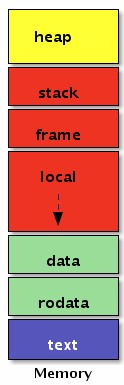
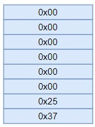
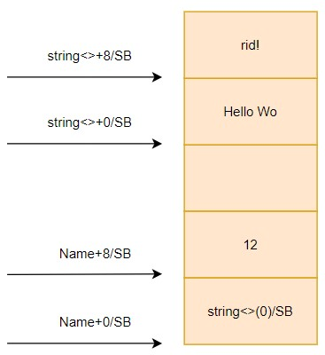

# 0. 前言

在 [Go plan9 汇编: 打通应用到底层的任督二脉](https://www.cnblogs.com/xingzheanan/p/18390537) 一文中介绍了从应用程序到汇编指令的转换。本文将结合汇编和 Go 程序实现手写基本的汇编指令，以加深对 Go plan9 汇编的了解。

# 1. 手写汇编

## 1.1 全局变量

首先写一个打印整型变量的函数如下：
```
// ex1/ex1.go
package main

var a = 9527

func main() {
	print(a)
}
```

使用 `go tool compile -S -N -l` 输出程序的汇编代码：
```
# go tool compile -S -N -l ex0.go 
main.main STEXT size=50 args=0x0 locals=0x10 funcid=0x0 align=0x0
    ...
main.a SNOPTRDATA size=8
        0x0000 37 25 00 00 00 00 00 00                          7%......
```

这里省略了 `main.main` 的汇编输出，重点关注 `main.a` 这个变量。输出的 `main.a` 表示汇编的标识符，`SNOPTRDATA` 表示这个变量是不包括指针的，这是给垃圾回收器看的，当扫描到这个变量时，垃圾回收器会跳过这个变量的回收。`size=8` 是这个变量的大小。重点在 `0x0000 37 25 00 00 00 00 00 00`，这段是 9527 在内存中的排列，0x2537 是 9527 的十六进制表示。

### 1.1.1 汇编实现全局变量

我们可以写汇编实现全局变量的输出。注意，本文不是汇编的教程，不会过多介绍 Go plan9 汇编的语法内容，关于这方面可以看曹大的 [Go 语言高级编程：汇编语言](https://www.bookstack.cn/read/advanced-go-programming-book/ch3-asm-readme.md)（写的真是太好了！）。

首先，Go plan9 汇编是需要和 Go 文件一起协同工作的。这里
```
// ex1/ex1.go
package main

import (
	"ex1/pkg"
)

func main() {
	println(pkg.Id)
}
```

在 `main` 包中打印 pkg 包的 Id 变量。
```
// ex1/pkg/pkg.go
package pkg

var Id int
```

我们可以写汇编实现 Id 变量的定义，如下：
```
// ex1/pkg/pkg_amd64.s
#include "textflag.h"

GLOBL ·Id(SB),NOPTR,$8

DATA ·Id+0(SB)/1,$0x37
DATA ·Id+1(SB)/1,$0x25
DATA ·Id+2(SB)/1,$0x00
DATA ·Id+3(SB)/1,$0x00
DATA ·Id+4(SB)/1,$0x00
DATA ·Id+5(SB)/1,$0x00
DATA ·Id+6(SB)/1,$0x00
DATA ·Id+7(SB)/1,$0x00
```

`NOPTR` 表示变量 Id 不包括指针，$8 表示变量占 8 个字节。`DATA` 声明变量存储在内存中的 `data` 段，内存中的段如下。



运行上述程序：
```
# go run ex1.go
9527
```

输出变量 9527，其内存分布如下：  



从变量内存分布可以看出，我们申请的 int(8 字节) 内存，只有 2 个字节是真正被用到的。其它字节都是 0。我们可以节省空间申请 Id 为 2 个字节如下：
```
// ex1/pkg/pkg.go
package pkg

var Id int16


// ex1/pkg/pkg_amd64.s
#include "textflag.h"

GLOBL ·Id(SB),NOPTR,$8

DATA ·Id+0(SB)/1,$0x37
DATA ·Id+1(SB)/1,$0x25
```

输出：
```
# go run ex1.go 
9527
```

改写 `pkg_amd64.s`：
```
#include "textflag.h"

GLOBL ·Id(SB),NOPTR,$2

DATA ·Id+0(SB)/1,$0x37
DATA ·Id+1(SB)/1,$0x25
DATA ·Id+2(SB)/1,$0x20
```

输出：
```
# go run ex1.go 
9527
```

在 `0x2537` 之上的 1 个字节 `0x20` 并不会被 CPU 寻址到，CPU 会根据变量声明从内存中读取 2 个字节的 Id 变量送入寄存器中处理。

## 1.2 字符串

结合 Go 和汇编打印字符串：
```
// ex2/main.go
package main

import (
	"ex2/pkg"
	"fmt"
)

func main() {
	fmt.Println(pkg.Name)
}

// ex2/pkg/pkg.go
package pkg

var Name string
```

字符串 `Name` 的声明在 pkg 包中，使用汇编定义变量 `Name`：
```
// ex2/pkg/pkg_amd64.s
#include "textflag.h"

GLOBL string<>(SB),NOPTR,$16
DATA string<>+0(SB)/8,$"Hello Wo"
DATA string<>+8(SB)/8,$"rld!"

GLOBL ·Name(SB),NOPTR|RODATA,$16
DATA ·Name+0(SB)/8,$string<>(SB)
DATA ·Name+8(SB)/8,$12
```

这里字符串变量实际是一个 16 字节的包括长度和指针的结构体。变量定义在：
```
GLOBL ·Name(SB),NOPTR|RODATA,$16
DATA ·Name+0(SB)/8,$string<>(SB)
DATA ·Name+8(SB)/8,$12
```

前 8 个字节指向的是存储实际字符串的内存地址，后 8 个字节是字符串的长度。真实的字符串存储在内存中的数据段。这里 `string<>` 表示该变量 `string` 时不可导出变量，否则外部 Go 程序可直接访问字符串变量。

画出内存分布图如下：



## 2. 小结

我们顺着上述思路可以继续函数的汇编实现，不过本文重点是了解汇编的写法，不是真正去写汇编。我们通过两个简单的全局变量和字符串的汇编示例，了解汇编代码的写法。在实际应用中几乎不会自己去写，重在了解。更多关于汇编实现的内容可以参考曹大的 [Go 高级编程](https://www.bookstack.cn/read/advanced-go-programming-book/ch3-asm-ch3-04-func.md)。
