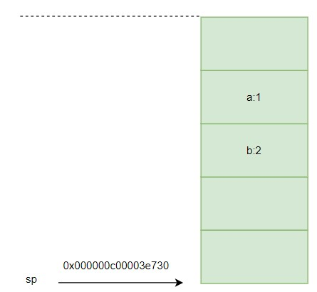
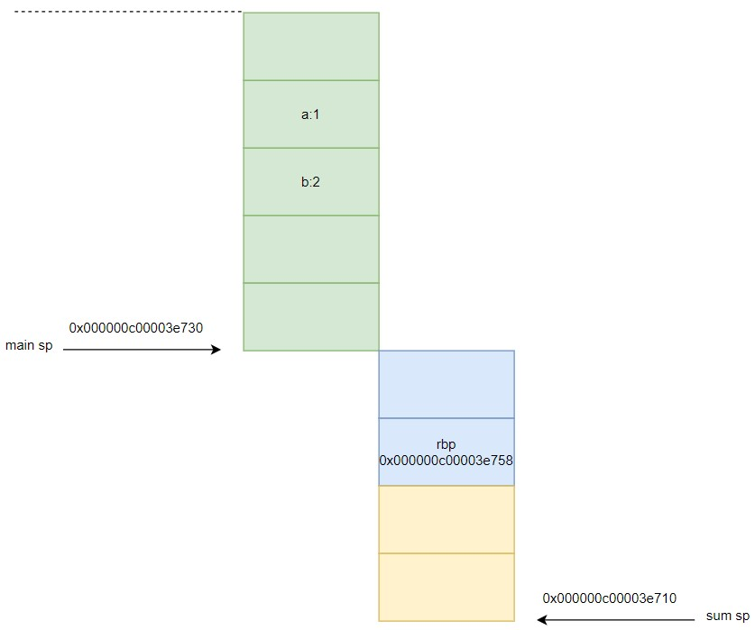
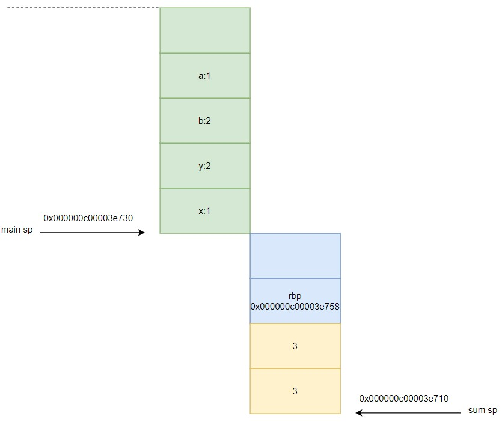
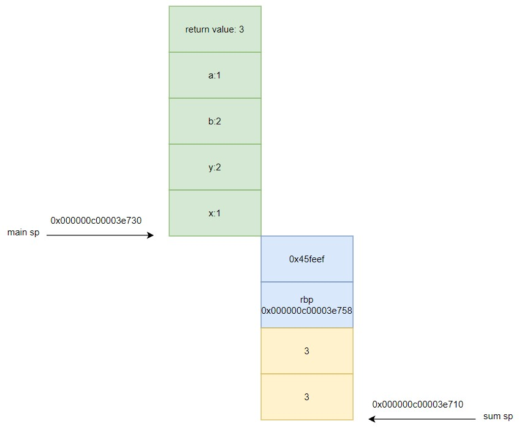

# 0. 前言

函数是 Go 的一级公民，本文从汇编角度出发看看我们常用的一些函数在干什么。

# 1. 函数

## 1.1 main 函数

在 main 函数中计算两数之和如下：
```
package main

func main() {
	x, y := 1, 2
	z := x + y
	print(z)
}
```

使用 `dlv` 调试函数(不了解 `dlv` 的请看 [Go plan9 汇编: 打通应用到底层的任督二脉](https://www.cnblogs.com/xingzheanan/p/18390537))：
```
# dlv debug
Type 'help' for list of commands.
(dlv) b main.main
Breakpoint 1 set at 0x45feca for main.main() ./ex4.go:3
(dlv) c
> main.main() ./ex4.go:3 (hits goroutine(1):1 total:1) (PC: 0x45feca)
     1: package main
     2:
=>   3: func main() {
     4:         x, y := 1, 2
     5:         z := x + y
     6:         print(z)
     7: }
```

`disass` 查看对应的汇编指令：
```
(dlv) 
TEXT main.main(SB) /root/go/src/foundation/ex4/ex4.go
        ex4.go:3        0x45fec0        493b6610                cmp rsp, qword ptr [r14+0x10]
        ex4.go:3        0x45fec4        763d                    jbe 0x45ff03
        ex4.go:3        0x45fec6        55                      push rbp
        ex4.go:3        0x45fec7        4889e5                  mov rbp, rsp
=>      ex4.go:3        0x45feca*       4883ec20                sub rsp, 0x20
        ex4.go:4        0x45fece        48c744241801000000      mov qword ptr [rsp+0x18], 0x1
        ex4.go:4        0x45fed7        48c744241002000000      mov qword ptr [rsp+0x10], 0x2
        ex4.go:5        0x45fee0        48c744240803000000      mov qword ptr [rsp+0x8], 0x3
        ex4.go:6        0x45fee9        e8d249fdff              call $runtime.printlock
        ex4.go:6        0x45feee        488b442408              mov rax, qword ptr [rsp+0x8]
        ex4.go:6        0x45fef3        e86850fdff              call $runtime.printint
        ex4.go:6        0x45fef8        e8234afdff              call $runtime.printunlock
        ex4.go:7        0x45fefd        4883c420                add rsp, 0x20
        ex4.go:7        0x45ff01        5d                      pop rbp
        ex4.go:7        0x45ff02        c3                      ret
        ex4.go:3        0x45ff03        e8d8cdffff              call $runtime.morestack_noctxt
        ex4.go:3        0x45ff08        ebb6                    jmp $main.main
(dlv) regs
    Rsp = 0x000000c00003e758
```

相信看过 [Go plan9 汇编: 打通应用到底层的任督二脉](https://www.cnblogs.com/xingzheanan/p/18390537) 的同学对上述汇编指令已经有一定了解的。

这里进入 main 函数，执行到 `sub rsp, 0x20` 指令，该指令为 main 函数开辟 0x20 字节的内存空间。继续往下执行，分别将 `0x1`，`0x2` 和 `0x3` 放到 `[rsp+0x18]`，`[rsp+0x10]` 和 `[rsp+0x8]` 处（从汇编指令好像没看到 `z := x + y` 的加法，合理怀疑是编译器做了优化）。

继续，`mov rax, qword ptr [rsp+0x8]` 将 `[rsp+0x8]` 地址的值 `0x3` 放到 `rax` 寄存器中。然后，调用 `call $runtime.printint` 打印 `rax` 的值。实现输出两数之后。后续的指令我们就跳过了，不在赘述。

## 1.2 函数调用

在 `main` 函数中实现两数之和，我们没办法看到函数调用的过程。  
接下来，定义 `sum` 函数实现两数之和，在 `main` 函数中调用 `sum`。重点看函数在调用时做了什么。

示例如下：
```
package main

func main() {
	a, b := 1, 2
	println(sum(a, b))
}

func sum(x, y int) int {
	z := x + y
	return z
}
```

使用 `dlv` 调试函数：
```
# dlv debug
Type 'help' for list of commands.
(dlv) b main.main
Breakpoint 1 set at 0x45feca for main.main() ./ex6.go:3
(dlv) c
> main.main() ./ex6.go:3 (hits goroutine(1):1 total:1) (PC: 0x45feca)
     1: package main
     2:
=>   3: func main() {
     4:         a, b := 1, 2
     5:         println(sum(a, b))
     6: }
     7:
     8: func sum(x, y int) int {
(dlv) disass
Sending output to pager...
TEXT main.main(SB) /root/go/src/foundation/ex6/ex6.go
        ex6.go:3        0x45fec0        493b6610                cmp rsp, qword ptr [r14+0x10]
        ex6.go:3        0x45fec4        764f                    jbe 0x45ff15
        ex6.go:3        0x45fec6        55                      push rbp
        ex6.go:3        0x45fec7        4889e5                  mov rbp, rsp
=>      ex6.go:3        0x45feca*       4883ec28                sub rsp, 0x28
        ex6.go:4        0x45fece        48c744241801000000      mov qword ptr [rsp+0x18], 0x1
        ex6.go:4        0x45fed7        48c744241002000000      mov qword ptr [rsp+0x10], 0x2
        ex6.go:5        0x45fee0        b801000000              mov eax, 0x1
        ex6.go:5        0x45fee5        bb02000000              mov ebx, 0x2
        ex6.go:5        0x45feea        e831000000              call $main.sum
        ex6.go:5        0x45feef        4889442420              mov qword ptr [rsp+0x20], rax
        ex6.go:5        0x45fef4        e8c749fdff              call $runtime.printlock
        ex6.go:5        0x45fef9        488b442420              mov rax, qword ptr [rsp+0x20]
```

`regs` 查看寄存器状态：
```
(dlv) regs
    Rip = 0x000000000045feca
    Rsp = 0x000000c00003e758
    Rbp = 0x000000c00003e758
    ...
```

继续往下分析指令的执行过程：  
1）`sub rsp, 0x28`: `rsp` 的内存地址减 `0x28`，意味着 `main` 函数开辟 `0x28` 字节的栈空间。  
2）`mov qword ptr [rsp+0x18], 0x1` 和 `mov qword ptr [rsp+0x10], 0x2`：将 `0x1` 和 `0x2` 分别放到内存地址 `[rsp+0x18]` 和 `[rsp+0x10]` 中。  
3）`mov eax, 0x1` 和 `mov ebx, 0x2`：将 `0x1` 和 `0x2` 分别放到寄存器 `eax` 和 `ebx` 中。  

跳转到 `0x45feea` 指令：
```
(dlv) b *0x45feea
Breakpoint 2 set at 0x45feea for main.main() ./ex6.go:5
(dlv) c
> main.main() ./ex6.go:5 (hits goroutine(1):1 total:1) (PC: 0x45feea)
     1: package main
     2:
     3: func main() {
     4:         a, b := 1, 2
=>   5:         println(sum(a, b))
     6: }
     7:
     8: func sum(x, y int) int {
     9:         z := x + y
    10:         return z
(dlv) disass
Sending output to pager...
TEXT main.main(SB) /root/go/src/foundation/ex6/ex6.go
        ex6.go:3        0x45fec0        493b6610                cmp rsp, qword ptr [r14+0x10]
        ex6.go:3        0x45fec4        764f                    jbe 0x45ff15
        ex6.go:3        0x45fec6        55                      push rbp
        ex6.go:3        0x45fec7        4889e5                  mov rbp, rsp
        ex6.go:3        0x45feca*       4883ec28                sub rsp, 0x28
        ex6.go:4        0x45fece        48c744241801000000      mov qword ptr [rsp+0x18], 0x1
        ex6.go:4        0x45fed7        48c744241002000000      mov qword ptr [rsp+0x10], 0x2
        ex6.go:5        0x45fee0        b801000000              mov eax, 0x1
        ex6.go:5        0x45fee5        bb02000000              mov ebx, 0x2
=>      ex6.go:5        0x45feea*       e831000000              call $main.sum
        ex6.go:5        0x45feef        4889442420              mov qword ptr [rsp+0x20], rax
        ex6.go:5        0x45fef4        e8c749fdff              call $runtime.printlock
        ex6.go:5        0x45fef9        488b442420              mov rax, qword ptr [rsp+0x20]
        ex6.go:5        0x45fefe        6690                    data16 nop
```

在执行 `call $main.sum` 前，让我们先看下内存分布：

  
*（绿色部分表示 main 函数栈）*

继续执行 `call $main.sum`:
```
(dlv) si
> main.sum() ./ex6.go:8 (PC: 0x45ff20)
TEXT main.sum(SB) /root/go/src/foundation/ex6/ex6.go
=>      ex6.go:8        0x45ff20        55                      push rbp
        ex6.go:8        0x45ff21        4889e5                  mov rbp, rsp
        ex6.go:8        0x45ff24        4883ec10                sub rsp, 0x10
        ex6.go:8        0x45ff28        4889442420              mov qword ptr [rsp+0x20], rax
        ex6.go:8        0x45ff2d        48895c2428              mov qword ptr [rsp+0x28], rbx
        ex6.go:8        0x45ff32        48c7042400000000        mov qword ptr [rsp], 0x0
        ex6.go:9        0x45ff3a        4801d8                  add rax, rbx
        ex6.go:9        0x45ff3d        4889442408              mov qword ptr [rsp+0x8], rax
        ex6.go:10       0x45ff42        48890424                mov qword ptr [rsp], rax
        ex6.go:10       0x45ff46*       4883c410                add rsp, 0x10
        ex6.go:10       0x45ff4a        5d                      pop rbp
        ex6.go:10       0x45ff4b        c3                      ret
(dlv) regs
    Rip = 0x000000000045ff20
    Rsp = 0x000000c00003e728
    Rbp = 0x000000c00003e758
```

可以看到，Rsp 寄存器往下减 8 个字节，压栈开辟 8 个字节空间。继续往下分析指令：  
1) `push rbp`：将 `rbp` 寄存器的值压栈，rbp 中存储的是地址 `0x000000c00003e758`。由于进行了压栈操作，这里的 `Rsp` 会往下减 8 个字节。
2) `mov rbp, rsp`：将当前 rsp 的值给 `rbp`，`rbp` 为 `sum` 函数栈的栈底。
3) `sub rsp, 0x10`：`rsp` 往下减 `0X10` 个字节，开辟16 个字节的空间，做为 `sum` 的函数栈，此时 `rsp` 的地址为 `0x000000c00003e710`，表示函数栈的栈顶。

执行到这里，我们画出内存分布图如下：  



继续往下分析：
1) `mov qword ptr [rsp+0x20], rax` 和 `mov qword ptr [rsp+0x28], rbx`：分别将 `rax` 寄存器的值 1 放到 `[rsp+0x20]：0x000000c00003e730`，`rbx` 寄存器的值 2 放到 `[rsp+0x28]：0x000000c00003e738`。
2) `mov qword ptr [rsp], 0x0`：将 0 放到 `[rsp]` 中。
3) `add rax, rbx`：将 rax 和 rbx 的值相加，结果放到 rax 中，相加后 rax 中的值为 3。
4) `mov qword ptr [rsp+0x8], rax`：将 3 放到 `[rsp+0x8]` 中。
5) `mov qword ptr [rsp], rax`：将 3 放到 `[rsp]` 中。

根据上述分析，画出内存分布图如下：



可以看出，传给 sum 的形参 x 和 y 实际是在 main 函数栈分配的。

继续往下执行：
1) `add rsp, 0x10`：`rsp` 寄存器加 `0x10` 回收 `sum` 栈空间。
2) `pop rbp`：将存储在 `0x000000c00003e720` 的值 `0x000000c00003e758` 移到 `rbp` 中。
3) `ret`：`sum` 函数返回。

在执行 `ret` 指令前最后看下寄存器的状态：
```
(dlv) regs
    Rip = 0x000000000045ff4b
    Rsp = 0x000000c00003e728
    Rbp = 0x000000c00003e758
```

我们知道 `Rip` 寄存器存储的是运行指令所在的内存地址，那么问题就来了，当函数返回时，要执行调用函数的下一条指令：
```
TEXT main.sum(SB) /root/go/src/foundation/ex6/ex6.go
        ex6.go:5        0x45feea*       e831000000              call $main.sum
        ex6.go:5        0x45feef        4889442420              mov qword ptr [rsp+0x20], rax
```

这里我们需要 `main.sum` 返回后执行的下一条指令是 `mov qword ptr [rsp+0x20], rax`。可是 `Rip` 指令怎么获得指令所在的地址 `0x45feef` 呢？

答案在 `call $main.sum` 这里，这条指令会将下一条指令压栈，在 `sum` 函数调用 `ret` 返回时，将之前压栈的指令移到 `Rip` 寄存器中。这个压栈的内存地址是 `0x000000c00003e728`，查看其中的内容：
```
(dlv) print *(*int)(uintptr(0x000000c00003e728))
4587247
```

`4587247` 的十六进制就是 `0x45feef`。

执行 `ret`：
```
(dlv) si
> main.main() ./ex6.go:5 (PC: 0x45feef)
        ex6.go:4        0x45fece        48c744241801000000      mov qword ptr [rsp+0x18], 0x1
        ex6.go:4        0x45fed7        48c744241002000000      mov qword ptr [rsp+0x10], 0x2
        ex6.go:5        0x45fee0        b801000000              mov eax, 0x1
        ex6.go:5        0x45fee5        bb02000000              mov ebx, 0x2
        ex6.go:5        0x45feea*       e831000000              call $main.sum
=>      ex6.go:5        0x45feef        4889442420              mov qword ptr [rsp+0x20], rax
        ex6.go:5        0x45fef4        e8c749fdff              call $runtime.printlock
        ex6.go:5        0x45fef9        488b442420              mov rax, qword ptr [rsp+0x20]
        ex6.go:5        0x45fefe        6690                    data16 nop
        ex6.go:5        0x45ff00        e85b50fdff              call $runtime.printint
        ex6.go:5        0x45ff05        e8f64bfdff              call $runtime.printnl
(dlv) regs
    Rip = 0x000000000045feef
    Rsp = 0x000000c00003e730
    Rbp = 0x000000c00003e758
```

可以看到 `Rip` 指向了下一条指令的位置。

继续往下执行：
1) `mov qword ptr [rsp+0x20], rax`：将 3 放到 `[rsp+0x20]` 中，`[rsp+0x20]` 就是存放 `sum` 函数返回值的内存地址。
2) `call $runtime.printint`：调用 `runtime.printint` 打印返回值 3。

分析完上述调用函数的过程我们可以画出函数栈调用的完整内存分布如下：



# 2. 小结

本文从汇编角度看函数调用的过程，力图做到对函数调用有个比较通透的了解。
