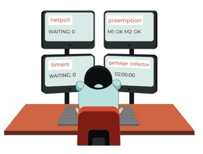

# 0. 前言

在 [Go runtime 调度器精讲（七）：案例分析](https://www.cnblogs.com/xingzheanan/p/18415503) 一文我们介绍了一个抢占的案例。从案例分析抢占的实现，并未涉及到源码层面。本文将继续从源码入手，看 Go runtime 调度器是如何实现抢占逻辑的。

# 1. sysmon 线程

还记得 [Go runtime 调度器精讲（四）：运行 main goroutine](https://www.cnblogs.com/xingzheanan/p/18412514) 一文我们蜻蜓点水的提了一嘴 `sysmon` 线程，它是运行在系统栈上的监控线程，负责监控 goroutine 的状态，并且做相应处理。当然，也负责做抢占的处理，它是本讲的重点。



`sysmon` 的创建在 [src/runtime/proc.go:sysmon](https://github.com/golang/go/blob/master/src/runtime/proc.go#L173)：
```
// The main goroutine.
func main() {
	...
	if GOARCH != "wasm" { // no threads on wasm yet, so no sysmon
		systemstack(func() {
			newm(sysmon, nil, -1)
		})
	}
    ...
}
```

`sysmon` 不需要和 P 绑定，作为监控线程运行在系统栈。进入 `sysmon`：
```
func sysmon() {
	...
    idle := 0 // how many cycles in succession we had not wokeup somebody
	delay := uint32(0)

	for {
		if idle == 0 { // start with 20us sleep...
			delay = 20  // 
		} else if idle > 50 { // start doubling the sleep after 1ms...
			delay *= 2
		}
		if delay > 10*1000 { // up to 10ms
			delay = 10 * 1000
		}
		usleep(delay)           // 休眠 delay us

        // retake P's blocked in syscalls
		// and preempt long running G's
		if retake(now) != 0 {
			idle = 0
		} else {
			idle++
		}
        ...
    }
}
```

省略了很多和抢占无关的内容，和抢占相关的是 `retake` 函数，进入 `retake`：
```
func retake(now int64) uint32 {
	n := 0
	lock(&allpLock)
    
    // 。。。
	for i := 0; i < len(allp); i++ {
        if pp == nil {
			// This can happen if procresize has grown
			// allp but not yet created new Ps.
			continue
		}

        pd := &pp.sysmontick                                        // 用于 sysmon 线程记录被监控 p 的系统调用次数和调用时间
		s := pp.status
		sysretake := false
		if s == _Prunning || s == _Psyscall {                       // 如果 P 是 _Prunning 或者 _Psyscall，则对 P 进行处理
			// Preempt G if it's running for too long.
			t := int64(pp.schedtick)                                // P 的 schedtick 用于记录 P 被调度的次数
			if int64(pd.schedtick) != t {                           
				pd.schedtick = uint32(t)                            // 如果系统监控和调度次数不一致，则更新系统监控的调度次数和调度时间点
				pd.schedwhen = now
			} else if pd.schedwhen+forcePreemptNS <= now {          // forcePreemptNS 为 10ms，如果 P 的 goroutine 运行时间超过 10ms 则对 P 发起抢占
				preemptone(pp)                                      // 抢占 P
				// In case of syscall, preemptone() doesn't
				// work, because there is no M wired to P.
				sysretake = true                                    // 设置 retake 标志为 true
			}
		}
        ...
    }
    unlock(&allpLock)
	return uint32(n)
}
```

这里重点在如果 P 的 goroutine 运行时间过长，则进入 `preemptone(pp)` 抢占 P，也就是抢占运行时间过长的 goroutine。

## 1.1 抢占运行时间过长的 goroutine

进入 `preemptone`：
```
func preemptone(pp *p) bool {
	mp := pp.m.ptr()                                                // P 绑定的线程 
	if mp == nil || mp == getg().m {
		return false
	}
	gp := mp.curg                                                   // 线程运行的 goroutine，就是该 goroutine 运行过长的
	if gp == nil || gp == mp.g0 {
		return false
	}

    gp.preempt = true                                               // 设置抢占标志位为 true

    // Every call in a goroutine checks for stack overflow by
	// comparing the current stack pointer to gp->stackguard0.
	// Setting gp->stackguard0 to StackPreempt folds
	// preemption into the normal stack overflow check.
	gp.stackguard0 = stackPreempt                                   // 官方的注释已经很清晰了，设置 goroutine 的 stackguard0 为 stackPreempt，stackPreempt 是一个比任何栈都大的数

    // Request an async preemption of this P.
	if preemptMSupported && debug.asyncpreemptoff == 0 {            // 是否开启异步抢占，这里我们先忽略
		pp.preempt = true
		preemptM(mp)
	}

	return true
}
```

可以看到，`preemptone` 主要是更新了 goroutine 的 `gp.stackguard0`，为什么更新这个呢？

主要是在下一次调用函数时，调度器会根据这个值判断是否应该抢占当前 goroutine。

我们看一个 goroutine 栈如下：
```
func gpm() {
	print("hello runtime")
}

func main() {
	go gpm()
	time.Sleep(1 * time.Minute)
	print("hello main")
}
```

给 goroutine 加断点，`dlv` 进入断点处：
```
(dlv) b main.gpm
Breakpoint 1 set at 0x46232a for main.gpm() ./main.go:5
(dlv) c
> main.gpm() ./main.go:5 (hits goroutine(5):1 total:1) (PC: 0x46232a)
     1: package main
     2:
     3: import "time"
     4:
=>   5: func gpm() {
     6:         print("hello runtime")
     7: }
     8:
     9: func main() {
    10:         go gpm()
(dlv) disass
TEXT main.gpm(SB) /root/go/src/foundation/gpm/main.go
        main.go:5       0x462320        493b6610        cmp rsp, qword ptr [r14+0x10]
        main.go:5       0x462324        762a            jbe 0x462350
        main.go:5       0x462326        55              push rbp
        main.go:5       0x462327        4889e5          mov rbp, rsp
=>      main.go:5       0x46232a*       4883ec10        sub rsp, 0x10
        main.go:6       0x46232e        e82d28fdff      call $runtime.printlock
        ...
        main.go:5       0x462350        e8abb1ffff      call $runtime.morestack_noctxt
        main.go:5       0x462355        ebc9            jmp $main.gpm
```

在 `main.gpm` 栈中，首先执行 `cmp rsp, qword ptr [r14+0x10]` 指令，这个指令的意思是将当前栈的栈顶和 `[r14+0x10]` 比较，`[r14+0x10]` 就是 goroutine 的 stackguard0 值。如果 rsp 大于 `g.stackguard0` 表示栈容量是足够的，如果小于 `g.stackguard0` 表示栈空间不足，需要执行 `jbe 0x462350` 跳转指令，调用 `call $runtime.morestack_noctxt` 扩栈。

这里如果 goroutine 是要被抢占的，那么 `g.stackguard0` 将被 `sysmon` 设置成很大的值。goroutine（中的函数） 在调用时，会执行 `cmp rsp, qword ptr [r14+0x10]` 指令比较栈顶指针和 `g.stackguard0`。因为栈顶 rsp 肯定小于 `g.stackguard0`，调用 `call $runtime.morestack_noctxt` 扩栈。

进入 [runtime.morestack_noctxt](https://github.com/golang/go/blob/master/src/runtime/asm_amd64.s#L626)：
```
// morestack but not preserving ctxt.
TEXT runtime·morestack_noctxt(SB),NOSPLIT,$0
	MOVL	$0, DX
	JMP	runtime·morestack(SB)

TEXT runtime·morestack(SB),NOSPLIT|NOFRAME,$0-0
    ...
    // runtime.morestack 内容很多，这里只挑重点和抢占相关的 runtime.newstack 介绍
    BL	runtime·newstack(SB)
    ...
```

进入 [runtime.newstack](https://github.com/golang/go/blob/master/src/runtime/stack.go#L976)：
```
func newstack() {
    thisg := getg()
    ...
    gp := thisg.m.curg
    ...
    stackguard0 := atomic.Loaduintptr(&gp.stackguard0)
    preempt := stackguard0 == stackPreempt                                  // 如果 gp.stackguard0 == stackPreempt，则设置抢占标志 preempt == true
    if preempt {
		if !canPreemptM(thisg.m) {                                          // 判断是否可以抢占
			// Let the goroutine keep running for now.
			// gp->preempt is set, so it will be preempted next time.
			gp.stackguard0 = gp.stack.lo + stackGuard                       // 如果不能抢占，恢复 gp.stackguard0 为正常值
			gogo(&gp.sched) // never return                                 // gogo 执行 goroutine
		}
	}
    ...
    if preempt {                                                            // 执行到这里，说明 goroutine 是可以抢占的，再次判断抢占标志是否为 true
		if gp == thisg.m.g0 {
			throw("runtime: preempt g0")
		}
		if thisg.m.p == 0 && thisg.m.locks == 0 {
			throw("runtime: g is running but p is not")
		}

		...

		if gp.preemptStop {                                                 // 判断抢占类型是否是 preemptStop，这个类型和 GC 有关，这里我们不讨论
			preemptPark(gp) // never returns
		}

		// Act like goroutine called runtime.Gosched.
		gopreempt_m(gp) // never return                                     // 重点看 gopreempt_m 进行的抢占
	}
    ...
}
```

`newstack` 会执行抢占逻辑，如注释所示，经过层层执行，调用 [gopreempt_m](https://github.com/golang/go/blob/master/src/runtime/proc.go#L4163) 抢占运行时间过长的 goroutine：
```
func gopreempt_m(gp *g) {
	goschedImpl(gp)
}

func goschedImpl(gp *g) {
	status := readgstatus(gp)                           // 获取 goroutine 的状态
	if status&^_Gscan != _Grunning {
		dumpgstatus(gp)
		throw("bad g status")
	}
	casgstatus(gp, _Grunning, _Grunnable)               // 这时候 goroutine 还是运行的，更新 goroutine 的状态为 _Grunnable
	dropg()                                             // 调用 dropg 解除线程和 goroutine 的绑定
	lock(&sched.lock)
	globrunqput(gp)                                     // 将 goroutine 放到全局可运行队列中，因为 goroutine 运行时间够长了，不会放到 P 的本地队列中，这也是一种惩罚机制吧
	unlock(&sched.lock)

	schedule()                                          // 线程再次进入调度逻辑，运行下一个 _Grunnable 的 goroutine
}
```

至此，我们知道对于运行时间过长的 goroutine 是怎么抢占的。

再次梳理下执行流程：
1. `sysmon` 监控线程发现运行时间过长的 goroutine，将 goroutine 的 stackguard0 更新为一个比任何栈都大的 stackPreempt 值
2. 当线程进行函数调用时，会比较栈顶 rsp 和 g.stackguard0 检查 goroutine 栈的栈空间。
3. 因为更新了 goroutine 栈的 `stackguard0`，线程会走到扩展逻辑，进入根据 preempt 标志位，执行对应的抢占调度。

# 2. 小结

本讲介绍了 sysmon 线程，顺着 sysmon 线程介绍了抢占运行时间过长的 goroutine 的实现方式。下一讲会继续介绍 sysmon 线程和抢占系统调用时间过长的 goroutine。