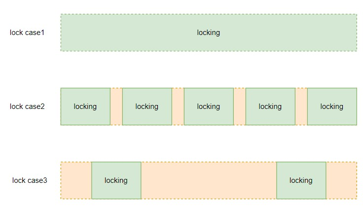

# 0. 前言

缓存是一个非常大的 topic。常用的缓存算法有 LRU（Latest Recently Used）最近最少使用和 LFU（Latest Frenquency Used）最不经常最少使用算法。

本文会介绍这两种算法，并且给出缓存使用的一些介绍。

# 1. LRU

首先，LRU 是最近最少使用算法，根据时间的顺序淘汰最久没被使用到的缓存。既然是有顺序那么我们在实现过程中就可以用能体现顺序性的数据结构来表示 LRU 中的缓存。常用的数据结构数组，链表，散列表，
树和图中先把非线性的树和图排除掉，接着散列表是无序的，不能满足我们对顺序性的要求，也可以排除。数组和链表都可以表示顺序性，但数组涉及到缓存搬移性能就会变差，而缓存更新是非常常见的，
这里使用能表示顺序性且更加灵活的链表作为缓存存储的数据结构。

对于缓存算法，不仅有添加缓存对象到链表，也有删除链表中的缓存。因此，我们使用双向链表通过 O(1) 的复杂度来实现删除操作。同时，LRU 涉及到淘汰最久的缓存，我们可以指定链表头或者尾作为最久的缓存，
相应的链表尾或头就是最新的缓存。在缓存达到容量时，淘汰链表中最久的缓存。那么插入，删除，更新（删除，插入）的复杂度都为 O(1) 了。

由于链表的限制，当我们要查找链表中的缓存时必须遍历链表，复杂度较高。我们知道散列表对查找特别友好，只有 O(1) 的复杂度。通过空间换时间的思想，引入散列表来存储链表中的缓存。当我们查找指定缓存时就可以先通过
散列表确定其在链表中的位置。

根据上述思路，可以写出 LRU 代码如下：
```
type LRUCache struct {
	head, tail *Node
	caches     map[int]*Node
	capacity   int
}

func (c *LRUCache) Get(key int) bool {
	node, ok := c.caches[key]
	if ok {
		c.moveToTail(node)
		return true
	}

	return false
}

// modeToTail is to move the existed node to tail
func (c *LRUCache) moveToTail(node *Node) {
	if c.head == nil {
		fmt.Println("Failed to move the node to tail because the cache is empty")
		return
	}

	if c.tail == node {
		return
	}

	if c.head == node {
		c.head = node.Next
		c.head.Pre = nil
		node.Next = nil
	} else {
		node.Pre.Next = node.Next
		node.Next.Pre = node.Pre
		node.Pre, node.Next = nil, nil
	}

	node.Pre = c.tail
	c.tail.Next = node
	c.tail = node
}

func (c *LRUCache) removeHead() {
	delete(c.caches, c.head.key)

	if c.head == nil {
		fmt.Println("Failed to move the head node because the cache is empty")
		return
	}

	if c.head == c.tail {
		c.head, c.tail = nil, nil
		return
	}

	c.head = c.head.Next
	c.head.Pre.Next = nil
	c.head.Pre = nil
}

func (c *LRUCache) addToTail(node *Node) {
	if c.head == nil {
		c.head, c.tail = node, node
		return
	}

	node.Pre = c.tail
	c.tail.Next = node
	node.Next = nil
	c.tail = node

	if c.len() > c.capacity {
		c.removeHead()
	}
}

func (c *LRUCache) Put(key int, value int) {
	node, ok := c.caches[key]
	if ok {
		node.value = value
		c.moveToTail(node)
		return
	}

	newNode := &Node{key: key, value: value}
	c.addToTail(newNode)
	c.caches[key] = newNode
}
```

## 1.1 并发 LRU

进一步的我们想能不能实现并发的 LRU。当我们想并发时，就会想引入读写锁或者互斥锁。假设这里访问缓存是读多写少的场景，我们使用读写锁防止竞态发生。

确定读写锁，锁的粒度又是问题，要加多大的锁。简单粗暴点可以每个大的读操作加读锁，每个大的写操作加写锁，如 [concurrency LRU with coarse locking](https://github.com/hxia043/go-by-example/blob/main/cache/lru/clru_biglock.go) 所示。
更细化点可以把代码拆分更细粒度的加读写锁，如 [concurrency LRU with fine-grained locking](https://github.com/hxia043/go-by-example/blob/main/cache/lru/clru_sync_map.go) 所示。

加粗锁示例中，对每个读写操作加同一把大锁。加细粒度锁中，对于 map 的访问，引入 sync.map 并发访问，sync.map 内包含两个 map，一个读 map，一个写 map，每个 map 都是并发安全的，这是一种对读友好的 map。接着，给缓存引入一把锁，主要是给链表的
操作加锁，这里根据每个步骤，更细化的加锁。

粗锁和细锁并没有绝对的谁好谁坏。加粗锁，具有更少的协程切换，减少了 Go 运行时调度器的压力，但是由于加的锁粒度粗，多协程在串行的等待同一把锁，导致性能下降。相对的，细琐如果加的太过连续，会导致频繁的协程切换，增加调度器的压力，
同时如果太过连续也起不到太好的并发执行的效果。



使用什么粒度的锁要结合具体代码具体分析，如果像上图 case3 的例子一样，那用细粒度的锁是比较适合的。

继续参考 [霜神的并发版本](https://halfrost.com/lru_lfu_interview/)，使用分片 map 来从访问对象上分流协程，提高并发效率。

分片的思路是把协程访问的 map 分片成更加细粒度的 map，每个协程根据访问的 key 确定自己要访问哪个 map，这样从数据结构上分流了协程，各协程之间不干扰。当然，每个分片 map 还是要加锁的，这个锁是为了访问到同样
分片 map 的协程而加，防止分片 map 的竞态。

示意图如下：


*图片来源于 [面试中 LRU / LFU 的青铜与王者](https://halfrost.com/lru_lfu_interview/)*

使用分片 map 可以分流协程，但是协程操作的链表还是共享的，我们需要对链表加锁。

这里有一个问题，可以使用通道来避免对链表加锁吗？笔者个人觉得应该不行，协程从通道读取的数据还是要作用在共享的链表上，通道是实现了协程之间访问的有序性，但是没有限制访问共享资源的有序性。逻辑可能有点绕，举个例子如下：
```
func main() {
	var x = make(chan int, 10)
	var c = 0

	for i := 0; i < 10; i++ {
		go func(i int) {
			x <- i
		}(i)
	}

	for i := 0; i < 10; i++ {
		go func(c *int) {
			for n := range x {
				*c = *c + n
				fmt.Printf("%d ", *c)
			}
		}(&c)
	}

	time.Sleep(1 * time.Second)
	fmt.Println()
}
```

输出：
```
1 4 6 10 15 1 38 32 24 45
```

上述示例中，多个协程从通道中读取发送协程发送的变量，并且和共享变量 c 相加。如果没有竞争的话，我们希望输出是不一致的，结果显示多线程读完数据之后发生竞态（输出两个相同的 1）。

所以，我们这里没有通道还是老老实实的给链表加锁，那么主要的提高性能的地方就是 map 的分片，实现见 [这里](https://github.com/hxia043/go-by-example/blob/main/cache/lru/clru_bucket_map.go)。

给 map 分片是通过不同的 key 定位协程访问到不同的分片 map 中，这是通过哈希实现的，如下所示：
```
h := fnv.New32a()
h.Write([]byte(strconv.Itoa(key)))
return h.Sum32() & mask
```

# 2. LFU

LFU 是最近最不常用缓存淘汰算法。LFU 是根据使用频率进行缓存淘汰的算法，而不是基于时间的，是时间不敏感的淘汰算法。

既然是根据频率来进行淘汰的，每个缓存对象需要维护一个使用频率的引用计数，用来指示当前缓存对象使用了多少次。每种次数（频率）都可以有多个缓存对象。同样的，需要快速查找到缓存对象，使用散列表存储
每个缓存对象。

通过每种频率有多个缓存对象，很自然的想到可以结合数组/map 和链表来表达这一结构。示意图如下：


这里需要通过频率快速访问到对应的链表，使用 map 加链表的方式表征该结构更合适。

给出 LFU 代码如下：
```
type LFUCache struct {
	lists    map[int]*list.List
	nodes    map[int]*list.Element
	min      int
	capacity int
}

type node struct {
	key, value int
	frenquency int
}

func (c *LFUCache) updateNode(n *node) {
	c.lists[n.frenquency].Remove(c.nodes[n.key])

	if n.frenquency == c.min && c.lists[c.min].Len() == 0 {
		c.min++
	}

	n.frenquency++
	if _, ok := c.lists[n.frenquency]; !ok {
		c.lists[n.frenquency] = list.New()
	}

	ne := c.lists[n.frenquency].PushFront(n)
	c.nodes[n.key] = ne
}

func (c *LFUCache) Get(key int) bool {
	e, ok := c.nodes[key]
	if ok {
		n := e.Value.(*node)
		c.updateNode(n)
		return true
	}

	return false
}

func (c *LFUCache) Put(key int, value int) {
	e, ok := c.nodes[key]
	if ok {
		n := e.Value.(*node)
		c.updateNode(n)
		return
	}

	if len(c.nodes) == c.capacity {
		e := c.lists[c.min].Back()
		c.lists[c.min].Remove(e)
		delete(c.nodes, e.Value.(*node).key)
	}

	c.min = 1
	if _, ok = c.lists[1]; !ok {
		c.lists[1] = list.New()
	}

	n := &node{key: key, value: value, frenquency: 1}
	e = c.lists[1].PushFront(n)
	c.nodes[key] = e
}

func New(capacity int) *LFUCache {
	return &LFUCache{
		lists:    make(map[int]*list.List),
		nodes:    make(map[int]*list.Element),
		capacity: capacity,
	}
}
```

*引申：由于删除只会删除最少使用频次的，我们可以通过维护一个最小堆代替链表。这里也可以在思考下，为什么不能用最小堆代替 LRU 中的链表呢？*

# 3. LRU 和 LFU 对比

| 特性                   | LRU                            | LFU                             |
|------------------------|--------------------------------|---------------------------------|
| **淘汰策略**           | 最近最少使用                  | 最少使用频率                    |
| **时间局部性适用性**   | 强                             | 弱                              |
| **频率局部性适用性**   | 弱                             | 强                              |
| **适合的访问模式**     | 近期数据更有可能被再次访问    | 频繁访问的数据应被长期保存      |
| **实现复杂度**         | 较低                           | 较高                            |
| **优缺点**             | 更简单高效，但对频率支持较差。如果有一个热数据访问频率高但不在最近访问，<br>则会被淘汰  | 更适合频繁访问，但实现复杂对于“突发访问”可能不够灵活，<br>因为短期内高频访问的数据可能会被缓存为“高频”，而后续访问频率降低时依然占据缓存。       |

**选择策略的依据**：
- **LRU**：适合大多数对缓存要求不高的场景，且最近访问的数据在未来更可能被访问。
- **LFU**：适合需要长时间保存高频数据的场景。

# 4. 缓存场景

当我们构建好缓存算法后，有一些缓存的场景需要在注意的。

## 4.1 缓存击穿

如果多流量访问缓存中某一个数据，而该数据不存在，这些缓存将拥到数据库，试图从数据库读取数据。如果这时候未对访问进行限制，可能会导致数据库响应缓慢甚至无法响应正常请求等问题。这种场景被称为缓存击穿。我们可以通过在访问
数据库时，为访问加锁来限制多线程。同时，在访问之后，更新该数据到缓存，在把流量引导到缓存中读取数据。这是一种双向检测技术，示例代码如下：
```
func (c *Cache) GetOrSet(key string, duration time.Duration, wg *sync.WaitGroup) {
	defer wg.Done()

    // step1: 重试
	retryTimes := 5
	for i := 0; i < retryTimes; i++ {
		value, found := c.Get(key)
		if found {
			fmt.Printf("Cache hit for [%s:%s]\n", key, value)
			return
		}
		fmt.Printf("Cache miss for key: %s\n", key)
	}

	// add lock from caller
    // step2: 加锁，从数据库读取数据
	c.dbLock.Lock()

    // step3: 再读缓存中的数据
	value, found := c.Get(key)
	if found {
		fmt.Printf("Cache hit for [%s:%s]\n", key, value)
		c.dbLock.Unlock()
		return
	}

    // 从数据库中读取数据，并更新至缓存
	value = queryFromDB(key)
	c.Set(key, value, duration)
	fmt.Printf("Updated cache for key: %s\n", key)
	c.dbLock.Unlock()
}
```

## 4.2 缓存穿透

大流量或者恶意流量请求访问缓存而找不到数据，会拥到数据库请求，这种场景叫做缓存穿透。这时候因为并发量很大，即使我们加锁很有可能会导致正常的数据库请求难以响应。并且，如果这些
流量是恶意流量，即构造的数据在数据库中不存在，那么按照缓存击穿的逻辑，把数据库中不存在的数据加载到缓存中会引起缓存很多无效数据。

我们可以在加锁的基础上引入布隆过滤器用来过滤恶意流量。布隆过滤器会同步数据库和自身，保证查询的是实时的数据库信息。

如果布隆过滤器判断请求数据不存在，则直接返回，起到拦截大流量，恶意流量的目的。示例代码如下：

```
// 布隆过滤器 + 缓存的实现
type CacheWithBloom struct {
	Cache3
	Bf *bloom.BloomFilter
}

// 创建带有布隆过滤器的缓存
func NewCacheWithBloom() *CacheWithBloom {
	// 初始化布隆过滤器，假设有 1000 个元素，错误率为 0.01
	bf := bloom.New(1000*20, 5) // 5 个哈希函数
	return &CacheWithBloom{
		Cache3: *NewCache3(),
		Bf:     bf,
	}
}

// 高并发获取数据，使用布隆过滤器防止缓存穿透
func (c *CacheWithBloom) GetOrSet(key string, duration time.Duration, wg *sync.WaitGroup) {
	defer wg.Done()

	// 使用布隆过滤器判断 key 是否有可能存在
	if !c.Bf.TestString(key) {
		fmt.Printf("Bloom filter: Key %s does not exist, skipping DB query\n", key)
		return
	}

	// 先从缓存获取数据
	value, found := c.Get3(key)
	if found {
		fmt.Printf("Cache hit for key: %s\n", key)
		return
	}

	// 如果缓存未命中，模拟从数据库加载数据
	fmt.Printf("Cache miss for key: %s, querying from DB\n", key)
	value = queryFromDB(key)

	// 更新缓存
	c.Set3(key, value, duration)

	// 同时将 key 添加到布隆过滤器中
	c.Bf.AddString(key)

	fmt.Printf("Updated cache for key: %s and added to Bloom filter\n", key)
}
```


## 4.3 缓存雪崩

如果大量缓存数据在同一时间点失效，那么请求的流量会拥到数据库请求，导致服务器后端或者数据库产生巨大压力，造成响应变慢，甚至不可用的场景，这种场景叫做缓存雪崩。

避免缓存雪崩，我们可以通过在过期时间点上加上随机区间，防止数据在同一时间过期。

同时，我们可以甚至多级缓存防止雪崩。


在缓存的场景设计上，可以结合这三种场景进行设计，给出示意图如下：


