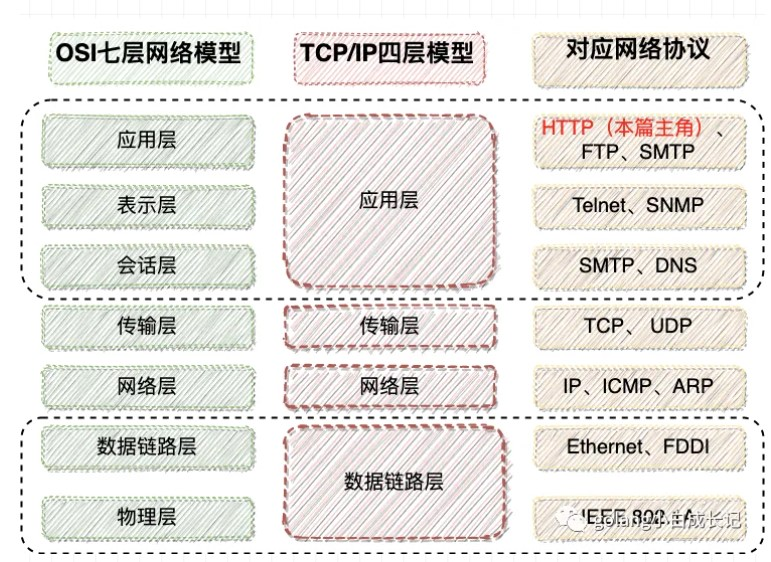

网络是非常需要实践的知识。如今快速的过一遍，实属应付面试，这是我非常不想的。可是，工作中用到的少，看了就忘，没有系统的，深入的学，很容易就忘。

本文虽是对网络的小结，但也希望能多学点网络的知识，力图做到深那么一点点。

# 1. 从浏览器地址栏输入 url 到显示页面的步骤？

这是前后端配合的问题，也是一个覆盖面较广，可以选一个点深入问下去的题。

这里我们从步骤说起：
1. 输入 URL，URL 由几部分组成，分别是 [协议头：域名：资源地址]。其中，URL 分为 https/http/ftp 等，它们是是传输层协议。输入的域名可以是 ip 或者域名，域名会经过 DNS 服务解析成 ip 地址，结合端口就可以定位网络上的主机。最后资源地址表示的是请求的是主机上哪一种资源。
2. 在 DNS 解析过程中，通过浏览器缓存，主机缓存，交换机/路由器缓存等查找是否该域名事先已缓存，如果已缓存则直接读取该域名对应的 ip 地址。如果没有缓存，则从 DNS 服务器中读取，读取的过程可以看作从子 DNS 到根 DNS 服务器的递归过程。
3. 当解析到域名之后，浏览器会从缓存中查找要访问的资源是否已事先缓存，如果是的话则直接读取资源。
4. 如果浏览器没有缓存资源，浏览器会组 http 或者 https 消息发送给服务端。发送消息前，首先通过 TCP 进行三次握手，经过局域网/交换机/路由器等发送请求报文给服务端，这里的服务端就是 ip 指向的主机。服务端会解析报文并且发送回客户端，从客户端视角来看，这一来一回已经确定了应答关系，不过服务端还是不知道自己发送的包有没有成功到达，当客户端发送应答包给服务端，这时从服务端视角看，发送接收是没有问题的。建立 TCP 连接，至此就可以传输，http/https 报文了。
5. http/https 包括请求头，请求方法，资源 body。服务端拿到 https/https 报文，会解析该报文，返回给客户端对应的资源。
6. 根据返回的资源，客户端浏览器会进行渲染。如果是 HTML 的格式，客户端会通过 DOM 树解析渲染显示给用户，解析的过程可以看作 树的深度优先遍历过程。

参考资料：
- [大厂常问：输入URL到显示页面的全过程（敲详细）](https://blog.csdn.net/Newbie___/article/details/107212575)
- [经典面试题：从 URL 输入到页面展现到底发生什么？](https://zhuanlan.zhihu.com/p/57895541)
- [前端经典面试题: 从输入URL到页面加载发生了什么？](https://segmentfault.com/a/1190000006879700)

# 2. 什么是超时重传和快速重传？

客户端传输数据报文给服务端，服务端在返回应答报文给客户端，这一来一回的时间称作 RTT，往返时间。如果在往返时间内，包丢失，并且超过一次往返时间，则客户端或者服务端会触发重传报文。

RTT 的设置时间如果较小，那么没等到报文来就设成超时，接着重传，会出现误判，导致网络拥塞。如果时间较大，则超时等待时间较长，造成传输效率变差。

而快速重传，是为了解决等待时间而设置的重传机制。客户端在发送数据报给服务端时，在不等待应答的情况下可以连续发送数据包，服务端在返回应答给客户端时，返回没有接收的需要接收的数据包序列号，客户端收到后会重发该报文给服务端。

参考资料：
- [30张图解： TCP 重传、滑动窗口、流量控制、拥塞控制](https://www.cnblogs.com/xiaolincoding/p/12732052.html)

# 3. 聊聊TCP的粘包、拆包以及解决方案

粘包是由于 TCP 传输时，传输的是连续的字节流。该字节流在通过 MTU 时会根据报文的大小进行合并，或者拆包。从 TCP 层面看，都是字节流都是一样的，可以任意对字节流进行处理。比如，MTU 是 1500，如果要通过两个包大小分别为 100 和 200 字节，那么 TCP 会合并这两个包。接着在等待时间内，如果没有新的包到来，则通过 MTU 发送合并的包。这个包在服务端会被拆分，或者被当作一个包处理。就会形成乱码，这是粘包的危害。

粘包本质上还是在输入包的问题，而不是 TCP 本身的问题。上层应用可以在包的头部/尾部添加分隔符的方式来确定包的边界。那么，传输到服务端的包会根据同样的分隔符得到正确的解析。

相反的，当一个数据包过大会被拆分成连续的小包。比如，MTU 是 1500，如果数据包大小为 1800，那么数据包会被拆分成 1500 和 300 的包，进而发送给服务端。服务端在收到包时会进行重组。

参考资料：
- [https://zhuanlan.zhihu.com/p/356225028](https://zhuanlan.zhihu.com/p/356225028)
- [硬核图解|tcp为什么会粘包？背后的原因让人暖心](https://segmentfault.com/a/1190000039691657)

**更新**

[network.go](./network.go) 是处理粘包的逻辑，通过定义消息头定义消息长度，固定读取消息来解决粘包问题。

在服务端接收的字节流中是没有分隔符的，我们可以在服务端将接收的长度多加一些验证字节流是否粘包：
```
length := binary.BigEndian.Uint32(header)
data := make([]byte, length+13)
```

输出：
```
Received: Hello, world!Another m
```

可以发现发生了粘包，粘包不是 TCP 的问题，而是应用层没有正确处理导致的。

大致有几种解决方案，固定长度，消息前缀后缀，和头字段定义长度，还是头字段定义长度比较适用，“性价比”高。详细可参考 [粘包](./粘包.md)

# 4. UDP 会出现粘包吗？TCP 和 UDP 的应用场景有哪些？

UDP 不会，因为 UDP 是面向非连接的，主打的是快速发包。发送的是数据报文，不是字节流。对可靠性的要求降低，对传输速率的要求变高。因此，UDP 发送的报文是自带长度的长度，可以确定边界，并且 UDP 的包是不存在拆包的。

TCP 主要用在连接可靠，传输速率要求不高的场景。  
UDP 主要用在连接不可靠，传输速率要求高的场景。

TCP 应用：
- FTP：文件传输协议
- SSH：安全登录、文件传送（SCP）和端口重定向
- Telnet：不安全文本传送
- SMTP：简单邮件传输协议
- HTTP：超文本传输协议

UDP 应用：

- 流媒体：如果采用TCP，一旦发生丢包，TCP会将后续包缓存起来，等前面的包重传并接收到后再继续发送，延迟会越来越大。基于UDP的协议入WebRTC使极佳的选择。
- 实时游戏：对实时要求较为严格的情况下，采用自定义的可靠UDP协议，自定义重传策略，能哦把丢包产生的延迟降到最低，尽量减少网络问题对游戏性造成的影响。

# 5. 知道 UDP 是不可靠的传输，如果你来设计一个基于 UDP 差不多可靠的算法，怎么设计？

这个更像是发散题，考验的是设计的功底。如果让我来设计，首先让 UDP 可靠又不失快速，我们可以采用弱连接，弱连接是接收到 UDP 报文的服务端在报文组装时发现报文丢失，再发起重传给客户端的机制。客户端收到需要重传的包，在重传一份给服务端。以此实现可靠传输，至于可靠连接，可以采用一问一答的方式，这种方式相对来说比较脆弱，不过它的目的是让客户端了解，对方是在线的，可以接收到消息的。

当然，综合来看，重发机制要优于弱连接。

# 6. TCP 怎么保证有序传输的？

首先，超时重传和快速重传确保数据包的完整性。接着，序列号分配确定数据包的有序性。

# 7. TIME_WAIT 状态，这个状态出现在什么时候？

当客户端或者服务端在发起关闭连接时会进入 TIME_WAIT 状态，进入 TIME_WAIT 状态会等待对端的应答包，如果确认对端收到，则关闭本端的连接。TIME-WAIT 状态可以防止由于提前关闭连接而导致的数据包丢失问题。

```
为了理解 TIME_WAIT 状态的必要性，我们先来假设没有这么一种状态会导致的问题。暂以 A、B 来代指 TCP 连接的两端，A 为主动关闭的一端。

四次挥手中，A 发 FIN， B 响应 ACK，B 再发 FIN，A 响应 ACK 实现连接的关闭。而如果 A 响应的 ACK 包丢失，B 会以为 A 没有收到自己的关闭请求，然后会重试向 A 再发 FIN 包。

如果没有 TIME_WAIT 状态，A 不再保存这个连接的信息，收到一个不存在的连接的包，A 会响应 RST 包，导致 B 端异常响应。

此时， TIME_WAIT 是为了保证全双工的 TCP 连接正常终止。

我们还知道，TCP 下的 IP 层协议是无法保证包传输的先后顺序的。如果双方挥手之后，一个网络四元组（src/dst ip/port）被回收，而此时网络中还有一个迟到的数据包没有被 B 接收，A 应用程序又立刻使用了同样的四元组再创建了一个新的连接后，这个迟到的数据包才到达 B，那么这个数据包就会让 B 以为是 A 刚发过来的。

此时， TIME_WAIT 的存在是为了保证网络中迷失的数据包正常过期。

由以上两个原因，TIME_WAIT 状态的存在是非常有意义的。
```

参考资料：
- [谈谈 TCP 的 TIME_WAIT](https://www.cnblogs.com/zhenbianshu/p/10637964.html)

# 8. 为什么四次挥手要比三次握手多一次？

因为三次握手，服务端在向客户端发起应答包的同时会发起自己的请求包以确认自身的链路是否是完整的。而四次挥手，是已经建立连接之后的行为，双方都要等对方就绪，达到关闭连接条件才会发起下一个关闭连接行为，以确保可靠性。


参考资料：
- [“三次握手，四次挥手”你真的懂吗？](https://www.cnblogs.com/qcrao-2018/p/10182185.html)

# 9. http 与 https 有啥区别？说下 https 解决了什么问题，怎么解决的？

http 是超文本传输协议，作用在应用层。https 是具有加密功能的超文本传输协议，同样作用在应用层。不同的是，https 应用了 SSL/TLS 等加密技术实现对请求包的加密，而服务端在解密实现请求包的可靠传输。http 是明文传输，有一定的安全风险。一般在公司内，局域网范围可以使用 http 传输，在公网需要使用 https 传输报文。

https 的握手是加密，解密的过程。

参考资料：
- [在B站看猫片被老板发现？不如按下F12学学HTTP](https://mp.weixin.qq.com/s?__biz=MzkxNTU5MjE0MQ==&mid=2247492766&idx=1&sn=1f38b243670a836d7ab4068993378466&source=41#wechat_redirect)

# 10. 计算机网络的多层模型介绍？



# 11. http get 和 head

HEAD: 请求的是数据包的头信息，头信息包括数据包的大小，自带 URL 信息等，一般用 head 获取数据包大小或者 URL 信息比较多。
Get: 请求的是 URL 对应的服务端的资源。

# 12. http keep-alive

长连接 + 超时时间。具体可参考 [在B站看猫片被老板发现？不如按下F12学学HTTP](https://mp.weixin.qq.com/s?__biz=MzkxNTU5MjE0MQ==&mid=2247492766&idx=1&sn=1f38b243670a836d7ab4068993378466&source=41#wechat_redirect)


