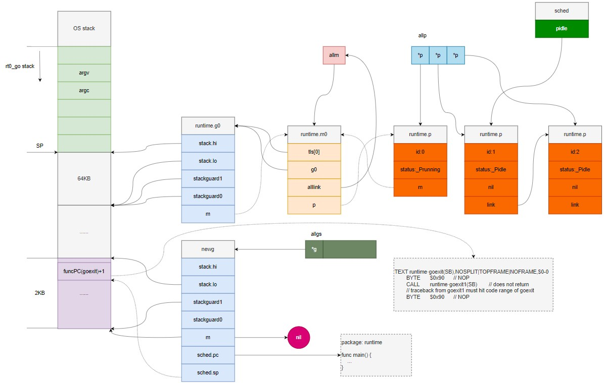
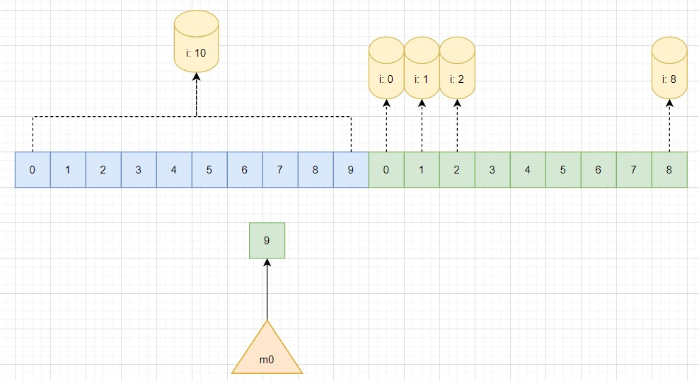

# 设计模式

1. 为何继承优于组合？

首先，分析继承和组合各自的作用。接着，进入继承的优缺点对比，回答为何继承优于组合的问题。

继承指的是在面向对象语言中子类继承父类的行为，它是一种 is a 的关系，适合用在结构稳定，关系纵深不深的情况。组合是 has a 的行为，相比于继承，结构更为松散。

继承在结构稳定，继承关系不复杂时是适用的。但是如果结构不稳定，对象关系是会变化的，并且继承关系容易变动的情况下就会带来继承关系复杂，耦合度较高，难以维护且不够优雅的问题。适用组合加委托和接口，可以实现继承的功能，并且由于组合本身较为松散，结构更为扁平，能应对软件变化带来的问题。

为何继承优于组合，主要是软件的对象的功能并不是单一，不变的，随着时间的推移，使用继承的关系有可能会改变，本质上说是应对变化的需求，组合更能应对软件变化的需求。

参考文章见：[在设计原则中，为什么反复强调组合要优于继承？](https://www.cnblogs.com/Kevin-ZhangCG/p/14892610.html)

2. 面向对象和面向过程的编程语言对比？

从语言特性（继承，封装，多态）出发，站在可扩展，可维护，可复用的角度回答。

- 面向对象编程更加适合应对大规模复杂程序的开发
- 面向对象编程风格的代码易复用，易扩展，易维护

3. 单例模式的弊端？

- 单例模式隐藏类之间的关系
- 单例模式影响单元测试
- 单例模式影响代码的可扩展性

4. 常用的设计模式？

参见 [设计模式学习笔记](../design_pattern/设计模式学习笔记.md)

# Go

## 内存管理

1. 谈一下 Go 的 GC 机制？

GC 这么广，重点是从哪个角度入手。首先，GC 是什么，接着运用到什么技术，处在流程中的哪一环，最后描述 GC 这一套流程。

GC 指的是垃圾回收，它是 Go 的运行时在程序运行阶段自动回收分配对象的机制。Go 中通过三色标记法结合混合写屏障对分配对象，包括全局对象，栈对象，寄存器中对象标记，清除的过程。三色标记是通过黑/白/灰三种颜色标记对象，通过三色标记可以逻辑严密的释放不可达对象，这里的不可达指的是三色标记中的用语。三色标记，通过波面推进，初始标记对象为黑色，黑色指的是确定还在用对象，其自身及所指向的对象都已扫描完毕。接着灰色对象作为波面，由运行时往前推进扫描，将灰色对象置黑，灰色对象指向的白色对象置灰，一层层往前对象，指导结束为止。三色标记实际操作的是一个对象之间的有向图。最终，扫描完的白色对象既是 GC 需要回收的对象。

扫描阶段结束，Go 的运行时将进入清除阶段，对于线程缓存中的垃圾会将对象所处的 mspan 的比特位置 0 来表示对象可以在分配。对于中心缓存到系统缓存也是类似的，不过操作的数据结构不一样。对于 mspan 中的对象操作的是数组，对于中心缓存操作的是链表。

这里的回收并没有立即归还给系统，我们程序中的内存长时间不使用，或者内存达到一定的清理阈值，Go 的运行时会调用拾荒器，经操作系统接口归还内存给系统。

2. 说下三色标记算法的原理

同一，结合有向图和波面推进来分析。

3. 内存分配的机制

在运行时初始化时会从操作系统分配内存到页堆。分配内存采用的是多级缓存的结构，第一层是每个线程自带的线程缓存，该缓存中存储的分配的内存。第二层是中心缓存，最后一层是页堆。  
在用户程序分配内存时，根据对象是微对象，小对象还是大对象从不同层缓存分配内存。如果是微对象或者小对象，内存先从线程缓存开始分配，如果分配不足，则转到中心缓存开始分配，中心缓存还不足，则像页堆请求内存分配，如果页堆中内存也不足，则调用操作系统接口从操作系统请求内存分配。对于小对象可从线程缓存，中心缓存，页堆中分配内存，对于大对象则直接从堆中分配内存。

分配内存的单元是 mspan 跨度，mspan 根据对象大小不同，又分为不同的 spanclass，防止分配对象时造成内存浪费。mspan 可以包括多个对象，或者多个对象包括一个 mspan。最终垃圾回收时，会释放 mspan 中的内存。

## map

1. map 是什么？

map 是 Go 中的字典，用来存储键值对。map 的底层实现是散列表。Go 中结合散列表和链表实现 map。具体实现是，通过 hash 分配 key 到对应的散列表区间，记作桶。每个桶指向一个链表，用来防止哈希冲突。不同的 key 如果存在哈希冲突，会落到一样的桶中，添加到链表中。那么，后序在索引是需要比较链表中的值已确认是否是查找的键值对。

由于存在散列冲突，map 需要解决散列冲突，一般有开放寻址法和链表法两种。Go 使用的是链表法。当散列冲突较多，超过装载因子时，Go 会扩容 map，创建新 map，并且将老的数据拷贝到新 map 中。这个拷贝不是一次性的，而是每次删除或者插入数据时小批量拷贝。通过这种方式，使得用户对运行时中 map 的拷贝无感知。

2. map 是有序的吗？

从上述分析可以看出来，map 中的元素并不是固定的，而是动态变化的。因此，map 是无序的。

如果 map 是不变化，没有搬移，扩容，是有序的吗？  
也不是。理论上是可以做到有序，只需要按顺序遍历每个桶就行了，但是 Go 为了防止造成一种 map 是有序的错觉，会随机遍历 map，这也导致了即使没有搬移，扩容，遍历 map 也是无序的。

3. map 是线程安全的吗？

map 不是线程安全的，这是由于几方面的考虑：
- 普遍 case，不涉及原子操作；
- 非普遍 case，需要原子操作；
- map 往往是大结构的集合，大结构本身会维护一把锁，如果读取数据时在加锁，会导致性能下降。

为了适应普遍性，而放弃特殊性。这是来自 [Go FAQ: Why are map operations not defined to be atomic?](https://go.dev/doc/faq#atomic_maps) 的解释。

4. 如何实现 map 的线程安全？

有三种方式实现 map 的线程安全。
- 加锁。加锁的方式，简单，但是缺点也很明显，锁的粒度太多，容易降低程序执行效率。
- map 分片，将访问 map 转换为访问小 map，根据 hash 值映射到不同的小 map 中，这种方式锁的粒度小，执行效率高，但是实现复杂。
- Go 实现的读写分离，通过维护读和写 map 将读写操作分开。读操作使用原子操作读数据的 map。写操作通过加锁的方式更新写 map。

sync.Map：
```
type Map struct {
	mu Mutex
	read atomic.Pointer[readOnly]
	dirty map[any]*entry
    ...
}
```

这是 ChatGPT 的回答：
```
Go 的 `sync.Map` 能够实现并发读写，主要是因为它设计中使用了读写分离的策略，并结合了锁和无锁的优化机制，从而在多线程环境下提供高效的并发访问。下面是具体的原因：

### 1. 读写分离
`sync.Map` 在内部实现了一个读写分离的策略，读操作与写操作使用了不同的结构来存储数据。具体地说，`sync.Map` 分为两个部分：
- **只读部分（read map）**：存储较稳定的数据，主要用于快速的读操作。读操作通常是无锁的，这使得读的性能非常高。
- **脏数据部分（dirty map）**：存储正在被修改的数据或新写入的数据。写操作会更新这个部分。

当读操作发生时，`sync.Map` 会优先尝试从只读部分获取数据，这部分是无锁访问的；如果在只读部分找不到数据，才会尝试从脏数据部分中查找。

### 2. 原子操作
`sync.Map` 使用了 Go 提供的 **原子操作** 来保证在多线程环境下的安全性。特别是在只读部分中，`sync.Map` 可以通过原子操作读取和更新指针或标志位，避免了传统锁机制带来的性能开销。

### 3. 写操作和升级机制
写操作稍微复杂一些，但仍然是线程安全的。写操作首先会更新脏数据部分，而脏数据的写入是通过一个互斥锁（`sync.Mutex`）来保证线程安全的。随着系统中的读操作增多，当发现只读部分和脏数据部分有较大差异时，`sync.Map` 会将脏数据升级为只读数据，进一步减少锁的使用频率。

### 4. 延迟删除策略
为了避免频繁地创建和销毁 map，`sync.Map` 采用了延迟删除的策略。即使某个数据被删除，它并不会立刻从内存中移除，而是等到只读 map 进行“重新构建”或垃圾回收时才被清理。这也减少了频繁的写操作对性能的影响。

### 总结
`sync.Map` 通过读写分离、原子操作、互斥锁以及延迟删除等机制，减少了锁的使用频率，实现了高效的并发读写。它尤其适合读多写少的场景，能够在并发访问的情况下提供较好的性能。
```

5. float 类型可以作为 map 的 key 吗？

float 类型会被内部转换为 uint64 类型，作为 map 的 key。

6. 可以对 map 的元素取地址吗？

不可以，由于 map 中的 key/value 是移动的，对其取地址，将变得不可用。

7. 可以边遍历边删除吗？

如果是顺序遍历完然后删除那是可以的。如果同时遍历删除，是多线程的并发访问，会导致 panic。

## context

1. context 的作用，原理和超时控制？

context 用于在多 goroutine 之间传递信号，包括取消信号，超时信号等。

context 通过在多 goroutine 之间维护共享通道，并且将多 goroutine 分级的方式实现统一管理多 goroutine 的取消，超时等行为。具体地说，在同级 goroutine 中，使用共享通道，来判断是否应该关闭 goroutine，而不同级 goroutine 通过维护 context 的 children 字段实现关联，如果父 goroutine 取消，则下级子 goroutine 也将随之取消。如果子 goroutine 取消，则子 goroutine 将关闭，脱离父 goroutine。

goroutine 之间的超时是 context 维护一个内部的定时器，通过设置超时时间触发通道的关闭，在超时时间内各 goroutine 可以管理自己的任务。

context 是相对松散的，无侵入性的。但是用 context 传递业务数据则被视为一种不好的设计，主要原因有：
1. 耦合太强，不是每个 goroutine 都需要业务数据处理。违反了单一知识原则。
2. 违反开闭原则。数据应该是封装好的，而不是每个 goroutine 都可以拿的到的。
3. 逻辑不够清晰，业务数据应该尽可能的贴近业务代码，而不是和控制逻辑相关联。


尽管 context 不适合传递业务参数，但它在一些特定场景下是合理的，例如：

- 请求的取消和超时控制：例如网络请求、数据库查询等长时间操作需要可以被取消的功能。
- 分布式追踪：在微服务架构下，通过 context 传递请求 ID 或 trace ID 以进行全链路的分布式追踪是合理的，因为这属于跨层级的元数据，不是具体的业务逻辑参数。
- 认证信息的传递：在一些场景下，认证令牌可以通过 context 传递，尤其是在中间件或拦截器链条中传递用户身份验证信息。

参考资料：
- [context 从入门到深入了解](https://www.cnblogs.com/xingzheanan/p/15692269.html)
- [ 上下文 Context](https://draveness.me/golang/docs/part3-runtime/ch06-concurrency/golang-context/)

## 通道 channel

1. 什么是 channel？你如何使用它来实现并发编程？

channel 是通道，是 CSP 思想的一种应用。通过通道和协程可以便捷的实现多线程并发安全。通道包括接收方和发送方，发送方通过向通道发送数据，接收方通过通道接收数据来实现多线程通过通信共享内存。

从类型上分，通道分为无缓冲和有缓冲通道。根据不同场景可以适用不同的通道。

通过通道实现并发编程，主要是通过通道共享线程间的内存。

2. 解释 Go 的并发模型，Goroutine 和 channel 如何配合使用？

Go 的并发模型通过协程和通道相互配合实现并发模型。具体的说协程作为发送者和接收者，共享通道中的内存实现多线程间的内存共享。

3. Go 中的并发模式有哪些？请给出示例？

基于消费者-生产者结构。有 work pool 将多个任务分发给消费者处理；分发多个不同任务给消费者处理；根据不同任务阶段，消费者处理不同任务等模式。

4. Go 中的同步原语有哪些？它们是如何工作的？

- 锁，锁通过在应用层维护一个信号量来判断当前协程是否可以加锁，如果不能，则阻塞，休眠，直到唤醒。如果超时间未获取锁，则进入饥饿模式，将锁置为饥饿锁，直接获取锁，直到锁转为正常模式。
- CAS 原子操作，底层通过中断或者通过机器指令的支持。
- 通道，背后也是通过加锁实现。

5. channel 底层实现？

channel 的底层通过循环队列和双向队列实现。具体的说，循环队列记录的是通道中的数据，遵循先进先出原则。双向队列，通过双向链表分别维护一个发送和接收的 goroutine 链路。

具体的实现又分为无缓冲通道和有缓冲通道的处理。

无缓冲通道：

向一个无缓冲通道发送数据，如果此时有接收者接收，则直接将数据复制给接收者的内存。如果无接收者接收，则调用 gopark 将当前 goroutine 挂起，等待接收者接收。如果有数据接收，调用 goready 唤醒阻塞的 goroutine，并且将线程的 runnext 指向唤醒的 goroutine，指向唤醒的 goroutine 并不是立即执行，同样的要循环调度器的调度，如果调度到所在线程，那么该 goroutine 将会被执行。

从一个无缓冲通道中读数据，如果有发送者，则将发送者的数据复制到接收者内存。如果无发送者，则挂起接收 goroutine 并将其加入到通道的队列中，直到有数据发送。类似的，当有数据发送时，调用 goready 唤醒阻塞的 goroutine。

有缓冲通道:

向一个有缓冲通道发送数据，如果通道未满，则直接将数据装入通道，也就是循环队列中。如果通道已满，则调用 gopark 挂起当前 goroutine。  
从一个有缓冲通道读取数据，如果通道未满且有数据，则直接读取数据。如果通道已满，则挂起 goroutine，等待数据的到来。


6. select 可以用于什么？

7. channel 在什么情况下会 panic？

如果通道已关闭，向一个关闭的通道中写数据会导致 panic。  
如果关闭一个关闭的通道会触发 panic。  
如果关闭一个 nil 通道则会触发 panic。

注意，向一个 nil 通道读或写数据会阻塞。

8. channel 的有缓冲和无缓冲适合场景？

有缓冲适用于生产者-消费者模型，消息队列等对于读取发送数据相对宽松的场景。  
无缓冲适用于对于生产者消费者比较严格的场景，如取消控制，顺序执行多线程等场景。

9. 通道在什么情况下会造成资源泄漏？

由于通道在协程阻塞时会挂起协程，直到再次唤醒，那么如果很多协程被挂起而无法被 GC 回收时会造成资源泄漏。

10. 如何优雅的关闭通道？

这个很有意思。分场景，如果是一对一则从发送方关闭，发送方写数据，理应从发送方关通道。如果是多发送方，单接收方，则接收方通过另一通道将告知发送方可以关闭通道了。如果是多发送方，多接收方，则可以抽象出一层通道，由发送方或者接收方发消息至该通道，实现关闭共享通道。

还是一句话，没有什么是加一层解决不了的。如果有，就在加一层。

11. 关闭的通道为什么可以读取数据？

这里的关闭实际上是站在发送方的视角来看的，关闭通道，是把发送方的协程挂起至队列中，通道中的数据还是存在的，只是堵住了发送方在发送这一条路。

## 锁

1. 什么情况下会死锁？

死锁并不是因为 Goroutine 等待时间过长，而是由于 Goroutine 之间的资源竞争和相互依赖导致的。具体来说，死锁发生在以下条件下：

### 死锁的四个必要条件

1. **互斥条件（Mutual Exclusion）**：
   - 至少有一个资源是以排他方式分配的，即一个资源一次只能被一个 Goroutine 使用。

2. **占有且等待（Hold and Wait）**：
   - 至少有一个 Goroutine 持有一个资源，并等待获取其他被占用的资源。

3. **不剥夺条件（No Preemption）**：
   - 资源不能被强制剥夺，只有当持有该资源的 Goroutine 自愿释放资源时，其他 Goroutine 才能获得。

4. **循环等待（Circular Wait）**：
   - 存在一个 Goroutine 的环形等待关系，即 Goroutine A 等待 Goroutine B 持有的资源，Goroutine B 又等待 Goroutine A 持有的资源。

### 示例：死锁的发生

考虑以下代码示例：

```go
package main

import (
    "fmt"
    "sync"
)

var mu1, mu2 sync.Mutex

func func1() {
    mu1.Lock()
    fmt.Println("func1: acquired mu1")
    
    // 模拟长时间持有锁
    mu2.Lock()
    fmt.Println("func1: acquired mu2")
    mu2.Unlock()
    
    mu1.Unlock()
}

func func2() {
    mu2.Lock()
    fmt.Println("func2: acquired mu2")
    
    // 模拟长时间持有锁
    mu1.Lock()
    fmt.Println("func2: acquired mu1")
    mu1.Unlock()
    
    mu2.Unlock()
}

func main() {
    go func1()
    go func2()

    // 等待 Goroutines 完成
    select {}
}
```

### 死锁的分析

- 在这个示例中，`func1` 获取了 `mu1` 的锁，并试图获取 `mu2` 的锁，而 `func2` 则获取了 `mu2` 的锁，并试图获取 `mu1` 的锁。这样会导致两个 Goroutine 相互等待，形成循环依赖，进而引发死锁。
  
### 解决死锁的方法

死锁并不是因为等待时间过长，而是因为 Goroutine 之间的资源获取和释放关系不当。因此，避免死锁需要考虑资源的管理和调度：

1. **保持锁的顺序**：确保所有 Goroutine 都以相同的顺序获取锁，避免循环等待。
  
2. **使用超时**：尝试获取锁时使用带超时的方式，可以防止长时间等待。

3. **避免嵌套锁**：尽量避免在持有一个锁时再尝试获取其他锁。

4. **使用无锁数据结构**：利用 Go 的 Channel 进行通信和数据共享，避免使用显式的锁。

5. **监控和日志**：在开发和调试阶段，添加日志和监控，以便于跟踪锁的使用情况和可能的死锁。

### 结论

死锁不是由于等待时间过长造成的，而是因为 Goroutine 在资源管理上的不当设计和相互依赖。通过合理的设计和策略，可以有效避免死锁的发生。

2.  通道导致死锁的情况？

- 向 nil 通道读取数据时会死锁；
- 无缓冲通道中，接收方和发送方的数量不一致时会死锁；
- 有缓冲通道中，如果通道满，且持续写/读数据时，会造成 goroutine 死锁。
- 循环等待会发生死锁。

参考资料：
- [Channel](https://draveness.me/golang/docs/part3-runtime/ch06-concurrency/golang-channel/)
- [通道](Go 程序员面试笔试宝典)

3. go 的 mutx 怎么使用，乐观和悲观锁分别怎么实现，使用场景是什么？

mutx 互斥锁是在多线程访问共享资源时，通过对共享资源加 mutex 互斥锁，防止多个线程访问共享资源的机制。通过 mutex 可以防止资源竞态。

乐观锁是对共享资源持乐观态度的锁，如果资源已经更新，那么乐观锁会等待，直到更新资源为止。乐观锁可以读取到资源，对资源进行判断。  
悲观锁是对访问资源持悲观态度的锁，在访问资源时首先会资源加锁，已确保对资源访问的唯一性。

使用场景：  
乐观锁可用在资源访问没有那么大的情况，请对共享资源的更新没有那么着急时使用。  
悲观锁可用在资源访问大，对共享资源更新较严苛的场景。

还是要结合具体场景具体分析。

```
乐观锁和悲观锁是两种不同的并发控制机制，各有其适用的场景。下面是对这两种锁的简要说明以及它们的使用场景。

### 1. 悲观锁（Pessimistic Lock）

**定义**：
悲观锁是一种假设冲突会经常发生的锁机制。在访问资源时，悲观锁会在操作开始时就加锁，确保其他线程不能同时访问该资源。

**使用场景**：
- **高竞争场景**：当多个线程经常竞争对同一资源的访问时，使用悲观锁可以确保数据的安全性。
- **需要确保数据一致性**：如数据库事务处理，在多线程环境中需要确保某个操作的完整性。
- **复杂的业务逻辑**：当操作过程较长，且需要保持中间状态一致性时，悲观锁可以防止其他线程对数据的访问。

**示例**：
- 数据库中的行级锁或表级锁。
- 需要保护的共享资源（如计数器、配置文件等）。

### 2. 乐观锁（Optimistic Lock）

**定义**：
乐观锁是一种假设冲突不会经常发生的锁机制。在进行操作时，乐观锁不会加锁，而是在更新数据时检查在此期间是否有其他线程修改过数据。如果有冲突，操作将会失败。

**使用场景**：
- **低竞争场景**：当资源的竞争相对较少时，使用乐观锁可以提高系统的吞吐量。
- **数据更新较少**：在大多数情况下，数据不会被并发修改。
- **系统性能要求高**：乐观锁由于减少了加锁的开销，适合性能要求较高的场合。

**示例**：
- 在 Web 应用中，用户的账户余额通常不会频繁更新，可以使用乐观锁来避免冲突。
- 使用版本号（或时间戳）来进行数据版本控制，常用于分布式系统。

### 对比总结

| 特性         | 悲观锁                             | 乐观锁                             |
| ------------ | ---------------------------------- | ---------------------------------- |
| 锁定方式     | 先加锁后操作                      | 先操作后验证                      |
| 性能         | 在高竞争场景下性能较差            | 在低竞争场景下性能较好            |
| 使用复杂性   | 处理比较简单                      | 需要额外的冲突检测机制            |
| 适用场景     | 高竞争资源、一致性要求高的场景   | 低竞争资源、性能要求高的场景      |

### 选择建议

- **选择悲观锁**：
  - 当系统需要高度一致性，且在访问同一资源时竞争较激烈。
  - 业务逻辑复杂且需要保证数据完整性。

- **选择乐观锁**：
  - 当系统性能至关重要，且对数据的并发更新不频繁。
  - 业务逻辑相对简单，且可以接受操作失败并重试的情况。

通过根据具体的应用场景选择合适的锁策略，可以提高系统的性能和可靠性。
```

4. 锁的底层实现？什么是饥饿锁，为什么会出现饥饿锁？

锁的底层实现是一个 32 位的状态字节，其中底层的三位从低到高分别表示 锁位，唤醒位和饥饿位，剩余的高位表示可以访问锁的 goroutine 数量。除了状态字节 state 还有一个 sema 信号量，用来唤醒阻塞的 goroutine。

具体的说，当多个 goroutine 拿锁，只有一个 goroutine 可以至 state 的锁位，如果锁位为 1，表示已经拿锁。等待的 goroutine 会选择是否进入自旋，如果自旋之后，锁释放，则等待的 goroutine 会拿到锁。如果锁未释放，则 goroutine 将阻塞添加到等待队列中，等待被唤醒，获取锁。

如果被唤醒时，有自旋的 goroutine 拿锁，且 goroutine 等待时间过长，那么 goroutine 将进入饥饿模式，进入等待队列的队首。进入饥饿模式后，会将锁置为饥饿状态，饥饿状态下的锁会直接给队首的 goroutine，队首的 goroutine 拿到锁。根据一系列条件判断是否可以退出饥饿模式。

5. sync.WaitGroup 底层原理？

[sync.WaitGroup 分析](./docs/sync.WaitGroup%20分析.md)

6. 读写锁的底层实现？读写锁和互斥锁的区别？

读写锁是基于互斥锁基础上实现的锁，将锁拆分为读和写操作。多个读操作是并发安全的，而读写，写写是互斥的。写操作加的锁，实际上是互斥锁，那么写写互斥就好理解了，本质上是互斥锁的等待。读写互斥是通过控制读写锁的 `readerCount` 实现的。读写锁的结构如下：
```
type RWMutex struct {
	w           Mutex        // held if there are pending writers
	writerSem   uint32       // semaphore for writers to wait for completing readers
	readerSem   uint32       // semaphore for readers to wait for completing writers
	readerCount atomic.Int32 // number of pending readers
	readerWait  atomic.Int32 // number of departing readers
}
```

从上到下分别是：
- w：用于写操作加的锁，实际调用的是互斥锁。
- writerSem：写操作的信号量，用于将写协程陷入休眠或者唤醒。
- readerSem：读操作的信号量，用于将读协程陷入休眠或者唤醒。
- readerCount: 记录读操作的协程数量。
- readerWait：记录等待读操作的协程数量。

读写锁的代码也不复杂。这里从读和写两个角度分析如下。

**读操作**

加锁，如果当前没有写操作的协程，则递增 readerCount，返回。开始读操作。如果当前有写操作的协程，并且该协程拿到了写锁（互斥锁），读协程陷入休眠，等待唤醒。

解锁，读操作完，递减 `readerCount`。如果返回值大于等于 0 表示无写锁需要释放，直接返回。如果小于 0 表示有写操作正在执行，调用 `RWMutex.rUnlockSlow` 方法会减少获取锁的写操作等待的读操作数 readerWait 并在所有读操作都被释放之后触发写操作的信号量 writerSem，该信号量被触发时，调度器就会唤醒尝试获取写锁的 Goroutine。

那么 `readerWait` 是在哪里被加上去的呢？我们继续看写操作的加锁解锁过程。

**写操作**

加锁，首先获取写锁，接着更新读写锁的 `readerCount`，更新的目的是为了后续的读锁，在判断 `readerCount` 时知道当前有写操作，直接进入休眠，等待写锁释放被唤醒。接着通过 `readerCount` 判断当前是否有读操作已经在进行，如果已经在进行，则等待读操作释放读锁（实际是递减更新 `readerWait`），自己进入休眠状态，等待最后一个读锁释放唤醒它。

解锁，协程拿到写锁，操作完，开始释放锁。首先还原 `readerCount` 为了后续的读锁可以正常读，接着唤醒读操作的协程。理论上到这里，读操作就可以正常开始而不用等写锁调用 `runtime_Semrelease` 释放的。但是写操作的协程还是需要等待的。

具体实现可以结合着 [Go 设计与实现：sync.RWMutex](https://draveness.me/golang/docs/part3-runtime/ch06-concurrency/golang-sync-primitives/#rwmutex) 和 Go 读写锁的代码一起看。

读写锁和互斥锁的区别，读写锁是基于互斥锁基础上，更加细粒度的锁。适用于读多写少的场景...

```
我们可以类比下上述操作，假设有一群员工和一位管理员，员工去查工资条，管理员可以改工资条。如果管理员在改工资条发现已经有一群员工在看工资条了，为保证有序性，管理员将进入休眠，等待唤醒。当最后一个看完工资条的员工结束时，唤醒管理员，然后走人。这时候管理员开始改工资条，在改的时候如果有其它管理员要改，或者有其它员工想看工资条都会陷入休眠，管理员在改完之后，首先把员工唤醒，这时候员工可以去看工资条了，但是其它管理员还不能看，接着管理员在释放锁，这时候其它管理员也可以去改工资条了。

从上述过程也可以反映出，对于读多写少这种模式是合适的，如果读写差不多，那就经常要切换，休眠，唤醒，代价很大，不划算。如果读少写多，那就不如直接用互斥锁了，再用读写锁的意义就不大了。
```

## 调度

1. goroutine 和线程有什么区别？

从 LCM 角度分析，管理，创建，切换，创建，goroutine 创建需要 2K，非常小，线程需要几兆。切换，goroutine 只包括三个寄存器，保存上下文，切换非常快。管理，goroutine 由运行时管理，线程由操作系统管理，一个作用在用户态，一个作用在内核态。

2. Go scheduler 是什么？

描述 Go scheduler 的上下游，以及具体做什么？

Go scheduler 是 Go 运行时的调度器，负责调度 Go 的协程 goroutine 到线程上运行。为了完成这一功能，Go scheduler 引入了 GPM 模型，介绍 GPM 模型（GPM 要提为什么引入 P 和本地队列和全局队列），最后升华本质，是生产者-消费者模型。

3. Go scheduler 支持哪些调度方式？

协作式调度和抢占式调度，阐述过程。

4. goroutine 的调度时机有哪些？

- 使用 go 关键字创建 goroutine
- GC，抢占式调度
- 系统调用，M 是拿还是不拿？
- 内存同步访问，等待唤醒，挂起（协作式调度？）

5. 工作窃取是什么？

描述之后，升华为了均匀分担 Processor 的压力，使得 goroutine 都能被尽快均匀的执行到。

6. g0 和用户栈的区别？

g0 栈是线程运行的栈，为线程运行提供环境。  
用户栈是用户协程创建的栈，提供运行协程的环境。

7. 程序启动的流程？

- 初始化 g0 栈，为主线程 m0 提供运行时环境；
- 初始化 m0 和 g0 栈绑定；
- 进入调度器初始化阶段，主要创建 Ps，并且将 P 和待运行的 M0 绑定；
- 调用 newproc 创建 newg，也就是第一个 goroutine，main goroutine；



- main goroutine 要进入运行状态需要和 P 绑定，调用 `runqput` 将 P 的 runnext 替换为 main goroutine。同时 `runqput` 的逻辑要注意，如果当前 runnext 已经有 goroutine 了，则将该 goroutine 踢到队列的队尾。如果队列已满，则从本地队列队头开始取一半 goroutine 到全局队列，并且将一半的那个元素设成旧的本踢走的 goroutine。
- main goroutine 和 P 绑定后，进入 mstart 开始 M0 的执行。调用 `findRunnable` 取出 P 中的 main goroutine，调用 gogo 切换 g0 栈到 main goroutine 的用户栈 g1 栈，开始执行 main goroutine 的逻辑。

8. Go 中调度 goroutine 的策略是怎样的？

[Go runtime 调度器精讲（五）：调度策略](https://www.cnblogs.com/xingzheanan/p/18413743)

9. Go 中的抢占机制是怎样的？

抢占分为协作式抢占和异步抢占。协作式抢占和异步抢占都是通过 sysmon 监控线程触发的。协作式抢占会抢占运行时间过长或者系统调用时间过长的 goroutine，当 goroutine 运行时间过长时，sysmon 会将该 goroutine 的抢占标志位置为 true,该抢占标志位会在 goroutine 调用函数时被检测到（通过在栈的序言处比较栈大小），执行到这里的 M，会主动解绑当前执行的 G，并把它放入全局运行队列中，接着调度下一个 goroutine 实现 goroutine 的切换。抢占系统调用时间过长的 goroutine 时，当前 M 还是和 G 绑定，只不过 P 会和 M 解绑。

异步抢占是基于信号的真抢占模式，GC 调用或者 sysmon 在发现当前协程无法协作式抢占时，会给线程发送 _SIGHUP 信号，接收到信号的线程会执行相应的处理，有一点需要注意的是，线程只有在安全点上才能拿掉协程，如果进不了安全点，就是异步抢占也没办法抢占正在运行的协程。

更多抢占信息可以参考 [Go runtime 调度器精讲（八）：运行时间过长的抢占](https://www.cnblogs.com/xingzheanan/p/18415899)，[Go runtime 调度器精讲（九）：系统调用引起的抢占](https://www.cnblogs.com/xingzheanan/p/18416149)，[Go runtime 调度器精讲（十）：异步抢占](https://www.cnblogs.com/xingzheanan/p/18416290) 和 [preempt](./go/preempt/preempt.go)。


## 对象

1. 对象分配是在哪里分配的？

问对象分配就涉及到逃逸分析了，这里抓逃逸分析的几个点。

- 有外部引用的对象分配在堆上；
- 局部对象分配在栈上；
- 未知大小，大小超过连续栈大小的分配在堆上；

这里重点要理解的是第三条，连续栈。goroutine 用的栈，连续栈大小是 2K-8M，如果超出了则分配的栈就不是连续空间了，最大栈空间是 1G。这也是为什么 [逃逸分析：变量申请过大](https://www.cnblogs.com/xingzheanan/p/18367326) 发生逃逸的原因。


# 编程题

1. 实现两个协程交替打印 0 和 1？

[交替打印](./go/channel/channel.go)

从程序能看出来几点：
- 一定要关闭通道，不然结果是未知的。指望垃圾回收或者 main goroutine 退出并不是一个好的方式。这里两个 goroutine 互为发送方/接收方，需要在两个 goroutine 都加入关闭通道的逻辑。如果谁到达终止条件，那么可以关闭通道，结束 goroutine。
- wg.WaitGroup 涉及信号量，传递的是指针，而不是值。

2. 实现生产者-消费者模型？

[生产者-消费者模型](./go/channel/csp.go)

从这个模型可以看出来，如何优雅关闭一个通道。

- 通道应该只由发送者关闭；
- 在多对多的情况下，可以通过添加 wg 等待所有得生成者结束在关通道，这种方式更加清晰；
- 只在需要引入第三方关闭通道时才引入，因为第三方并不会管已经打开的通道；

3. 程序会输出什么？

```
func max()  {
    runtime.GOMAXPROCS(1)
    wg := sync.WaitGroup{}
    wg.Add(20)
    for i:=0;i<10;i++{
        go func() {
            fmt.Println(i)
            wg.Done()
        }()
    }
    for i:=0;i<10;i++{
        go func(i int) {
            fmt.Println(i)
            wg.Done()
        }(i)
    }
    wg.Wait()
}

func main(){
    max()
}
```

这段程序很有意思，首先执行线程只有一个，主要考点就是调度策略，在底层调度时发生了什么？

需要注意的有几点：
- main goroutine 加载用户 goroutine，用户 goroutine 并不是立即执行的，它会先从队头到队尾按顺序加入 P 的本地运行队列；
- runnext 是会替代的，如果发现前一个 runnext 不为 0 则会将 runnext 踢到本地队列的队尾。
- 同时考了线程对全局变量的访问。

执行示意图如下：



4. 云工场编程题

```
// ● 编程题，两个goroutine 交替打印，要求：  
//   ○ 一个 goroutine 打印数字，从1到26
//   ○ 一个 goroutine 打印字母，按照 ABCDEFGHIJKLMNOPQRSTUVWXYZ 的顺序打印
//   ○ 两个 goroutine 需要依次打印，第一个goroutine打印一个数字后第二个goroutine 打印字母
//   ○ 输出结果：1A2B3C4D5E6F7G8H9I10J11K12L13M14N15O16P17Q18R19S20T21U22V23W24X25Y26Z
```

# 缓存

1. 怎么避免缓存击穿？还有更好的方法吗？

2. 缓存算法有哪些？实现 LRU 缓存？

参考 [缓存 LRU 和 LFU 实现](https://github.com/hxia043/blog/blob/main/Go/%E7%BC%93%E5%AD%98/%E7%BC%93%E5%AD%98%20LRU%20%E5%92%8C%20LFU%20%E5%AE%9E%E7%8E%B0.md)

# 数据结构和算法

1. 判断链表是否有回环？

快慢指针

2. 怎么反转树的左右节点？

递归


# 网络

- [网络面试题](./network/network.md)

# 框架

1. rpc 的具体实现？

rpc 分服务端和客户端。服务端注册服务，客户端调用服务。

具体实现细节是，rpc 服务端注册对象，该对象是提供远程过程调用的对象。接着，将该对象注册到 rpc 服务中，随后，rpc 监听本地服务端端口用来提供 rpc 服务。

客户端实例化对象，并且通过 `Call` 方法调用服务端对象的方法。从而实现调用 rpc 服务端服务像调用本地服务一样。

具体实现可参考 [rpc](./rpc/rpc.md)


2. client-go


# 项目

1. 介绍下自己的项目？

jobmanager

2. 开发的流程规范是什么？

从 FoT 到敏捷开发小组，系统的，连贯的说。

3. 服务器受到攻击怎么定位服务器问题？

这个问题太广了，我觉得 ChatGPT 回答的比较好，可以结合者 ChatGPT 的回答分析。


# 参考

- [记录一次腾讯Go开发岗位面试经过](https://learnku.com/articles/51080)
- [https://cloud.tencent.com/developer/article/1943980](https://cloud.tencent.com/developer/article/1943980)
- [搞定阿里云Go面试：Golang到Redis，一网打尽！](https://juejin.cn/post/7350141012311015487)
- [华为 OD 笔试题](https://blog.csdn.net/tiger9991/article/details/107037724)
