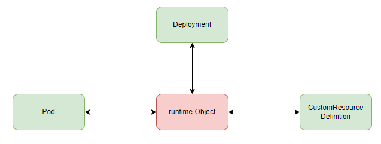

接 [Kubernetes:kube-apiserver 之 scheme(一)](https://www.cnblogs.com/xingzheanan/p/17771090.html)。

## 2.2 资源 convert

上篇说到资源版本之间通过内部版本 `__internal` 进行资源转换。这里进一步扩展介绍资源转换内容，以加深理解。

同样以例子开始，通过 `kubectl` 将 `apps/v1beta1/Deployment` 转换为 `apps/v1/Deployment`。
```
apiVersion: apps/v1beta1
kind: Deployment
metadata:
  name: myapp
spec:
  replicas: 1
  template:
    metadata:
      labels:
        app: myapp
    spec:
      containers:
      - name: myapp
        image: myapp:1.0.0
        resources:
          limits:
            memory: "128Mi"
            cpu: "500m"
        ports:
        - containerPort: 80
```

执行 `kubectl convert -f v1beta1Deployment.yaml --output-version=apps/v1`，输出 `apps/v1/Deployment` 资源配置：
```
apiVersion: apps/v1
kind: Deployment
metadata:
  labels:
    app: myapp
  name: myapp
spec:
  progressDeadlineSeconds: 600
  replicas: 1
  revisionHistoryLimit: 2
  ...
status: {}
```

这条命令背后，`kubectl` 将转换命令组成 `client-go` 识别的 `Restful API` 消息，通过 `client-go` 发给 `kube-apiserver`。`kube-apiserver` 根据事先注册的转换函数 `convert` 将 `apps/v1beta1/Deployment` 转换为 `apps/__internal/Deployment`，接着将 `apps/__internal/Deployment` 转换为 `apps/v1/Deployment`。

代码示例如下：
```
v1beta1Deployment := &appsv1beta1.Deployment{
    TypeMeta: metav1.TypeMeta{
        Kind:       "Deployment",
        APIVersion: "apps/v1beta1",
    },
}

// v1beta1 -> __internal
targetVersion := schema.GroupVersion{Group: "apps", Version: "__internal"}
objInternal, err := scheme.ConvertToVersion(v1beta1Deployment, targetVersion)
if err != nil {
    panic(err)
}

// __internal -> v1
objV1, err := scheme.ConvertToVersion(objInternal, appsv1.SchemeGroupVersion)
if err != nil {
    panic(err)
}
```

`scheme.ConvertToVersion` 函数转换对象到指定资源版本。

### 2.2.1 kube-apiserver 资源版本 convert

资源版本的转换首先需要注册版本转换函数到 `scheme`，只有注册过的版本才能进行资源版本转换。 

`kube-apiserver` 通过导入包的方式注册转换函数。

```
# kubernetes/cmd/kube-apiserver/app/server.go
package app

import (
    "k8s.io/kubernetes/pkg/controlplane"
    ...
)

# kubernetes/pkg/controlplane/import_known_versions.go
package controlplane

import (
	_ "k8s.io/kubernetes/pkg/apis/apps/install"
    ...
)
```

`kube-apiserver` 启动的 `app` 包导入 `controlplane` 包，`controlplane` 继续导入资源组的安装包。以 `apps` 资源组为例，查看资源组下资源转换函数是怎么注册的。

资源组下的每个外部资源版本都有 `zz_generated.conversion.go` 文件，该文件由 `conversion-go` 自动生成，文件中定义了外部资源到内部资源的相互转换。
```
# kubernetes/pkg/apis/apps/
apps/
    /v1
        /zz_generated.conversion.go
    /v1beta1
        /zz_generated.conversion.go
    /v1beta2
        /zz_generated.conversion.go
```

以 `v1` 版本为例，`zz_generated.conversion.go` 中注册资源转换函数：

```
package v1

func init() {
	localSchemeBuilder.Register(RegisterConversions)
}

func RegisterConversions(s *runtime.Scheme) error {
    if err := s.AddGeneratedConversionFunc((*v1.DeploymentSpec)(nil), (*apps.DeploymentSpec)(nil), func(a, b interface{}, scope conversion.Scope) error {
		return Convert_v1_DeploymentSpec_To_apps_DeploymentSpec(a.(*v1.DeploymentSpec), b.(*apps.DeploymentSpec), scope)
	}); err != nil {
		return err
	}
    if err := s.AddConversionFunc((*apps.DeploymentSpec)(nil), (*v1.DeploymentSpec)(nil), func(a, b interface{}, scope conversion.Scope) error {
		return Convert_apps_DeploymentSpec_To_v1_DeploymentSpec(a.(*apps.DeploymentSpec), b.(*v1.DeploymentSpec), scope)
	}); err != nil {
		return err
	}
    ...
}
```

可以看到，函数 `Convert_v1_DeploymentSpec_To_apps_DeploymentSpec` 注册了 `v1/DeploymentSpec` 到 `__internal/DeploymentSpec` 的资源转换，`Convert_apps_DeploymentSpec_To_v1_DeploymentSpec` 注册了 `__internal/DeploymentSpec` 到 `v1/DeploymentSpec`。

关于资源版本转换基本告一段落。下面进一步介绍，在 `kube-apiserver` 是怎么使用 `scheme` 资源注册表的。

## 2.3 使用资源注册表 scheme

这一节会进入 `kube-apiserver` 看 `scheme` 是如何使用的。需要说明的是，`kube-apiserver` 非常复杂，这里并不介绍启动流程，建立 `Restful API` 等内容，仅从 `scheme` 的视角看 `kube-apiserver`。
```
# kubernetes/cmd/kube-apiserver/app/server.go

func CreateServerChain(config CompletedConfig) (*aggregatorapiserver.APIAggregator, error) {
	notFoundHandler := notfoundhandler.New(config.ControlPlane.GenericConfig.Serializer, genericapifilters.NoMuxAndDiscoveryIncompleteKey)
	apiExtensionsServer, err := config.ApiExtensions.New(genericapiserver.NewEmptyDelegateWithCustomHandler(notFoundHandler))
	if err != nil {
		return nil, err
	}
  ...
}
```

在 `CreateServerChain` 函数中创建 `API 扩展服务（APIExtensionServer）`，`API 核心服务（KubeAPIServer）` 和 `API 聚合服务（AggregatorServer）`。这里以 `API 扩展服务（APIExtensionServer）` 看 `scheme` 是如何使用的。

进入 `config.ApiExtensions.New(genericapiserver.NewEmptyDelegateWithCustomHandler(notFoundHandler))` 方法。  
```
# kubernetes/vendor/k8s.io/apiserver/pkg/server/genericapiserver.go
// APIGroupInfo 中保存资源注册表 Scheme
func NewDefaultAPIGroupInfo(group string, scheme *runtime.Scheme, parameterCodec runtime.ParameterCodec, codecs serializer.CodecFactory) APIGroupInfo {
	return APIGroupInfo{
		PrioritizedVersions:          scheme.PrioritizedVersionsForGroup(group),
		VersionedResourcesStorageMap: map[string]map[string]rest.Storage{},
		OptionsExternalVersion: &schema.GroupVersion{Version: "v1"},
		Scheme:                 scheme,
		ParameterCodec:         parameterCodec,
		NegotiatedSerializer:   codecs,
	}
}

# kubernetes/vendor/k8s.io/apiextensions-apiserver/pkg/apiserver/apiserver.go
// 将 apiserver.Scheme 传入 NewDefaultAPIGroupInfo
func (c completedConfig) New(delegationTarget genericapiserver.DelegationTarget) (*CustomResourceDefinitions, error) {
	...
	apiGroupInfo := genericapiserver.NewDefaultAPIGroupInfo(apiextensions.GroupName, Scheme, metav1.ParameterCodec, Codecs)
  ...
  if err := s.GenericAPIServer.InstallAPIGroup(&apiGroupInfo); err != nil {
		return nil, err
	}
}

# kubernetes/vendor/k8s.io/apiserver/pkg/server/genericapiserver.go
func (s *GenericAPIServer) InstallAPIGroup(apiGroupInfo *APIGroupInfo) error {
	return s.InstallAPIGroups(apiGroupInfo)
}

func (s *GenericAPIServer) InstallAPIGroups(apiGroupInfos ...*APIGroupInfo) error {
  ...
  for _, apiGroupInfo := range apiGroupInfos {
    if err := s.installAPIResources(APIGroupPrefix, apiGroupInfo, openAPIModels); err != nil {
      return fmt.Errorf("unable to install api resources: %v", err)
    }
  }
}

// 在 GenericAPIServer.getAPIGroupVersion 方法中将 apiGroupInfo 转换解析为 apiGroupVersion
// apiGroupVersion 中保存资源注册表 scheme
func (s *GenericAPIServer) installAPIResources(apiPrefix string, apiGroupInfo *APIGroupInfo, typeConverter managedfields.TypeConverter) error {
	for _, groupVersion := range apiGroupInfo.PrioritizedVersions {
		apiGroupVersion, err := s.getAPIGroupVersion(apiGroupInfo, groupVersion, apiPrefix)
		if err != nil {
			return err
		}

    ...
		discoveryAPIResources, r, err := apiGroupVersion.InstallREST(s.Handler.GoRestfulContainer)
  }
}

# kubernetes/vendor/k8s.io/apiserver/pkg/endpoints/groupversion.go
func (g *APIGroupVersion) InstallREST(container *restful.Container) ([]apidiscoveryv2beta1.APIResourceDiscovery, []*storageversion.ResourceInfo, error) {
	installer := &APIInstaller{
		group:             g,
		prefix:            prefix,
		minRequestTimeout: g.MinRequestTimeout,
	}

	apiResources, resourceInfos, ws, registrationErrors := installer.Install()
	...
}

# kubernetes/vendor/k8s.io/apiserver/pkg/endpoints/installer.go
func (a *APIInstaller) Install() ([]metav1.APIResource, []*storageversion.ResourceInfo, *restful.WebService, []error) {
	for _, path := range paths {
		apiResource, resourceInfo, err := a.registerResourceHandlers(path, a.group.Storage[path], ws)
		...
	}
	...
}

func (a *APIInstaller) registerResourceHandlers(path string, storage rest.Storage, ws *restful.WebService) (*metav1.APIResource, *storageversion.ResourceInfo, error) {
  fqKindToRegister, err := GetResourceKind(a.group.GroupVersion, storage, a.group.Typer)
	if err != nil {
		return nil, nil, err
	}
}

func GetResourceKind(groupVersion schema.GroupVersion, storage rest.Storage, typer runtime.ObjectTyper) (schema.GroupVersionKind, error) {
	object := storage.New()
	fqKinds, _, err := typer.ObjectKinds(object)
	if err != nil {
		return schema.GroupVersionKind{}, err
	}
  ...
}
```

函数链很长，最后在函数 `GetResourceKind` 中调用 `typer.ObjectKinds(object)` 获取对象 `object` 的类型。其中，`typer` 是一个获取对象类型的接口，对应的实例是 `scheme`，实际是调用 `scheme.ObjectKinds` 方法获取对象类型。

注意，能获取对象类型是因为该对象提前注册在资源注册表 `scheme` 中，否则将会报 `no kind is registered for the type xxx` 错误。

示例代码如下。
```
package main

import (
	"fmt"

	metav1 "k8s.io/apimachinery/pkg/apis/meta/v1"
	"k8s.io/apimachinery/pkg/runtime"
	"k8s.io/apimachinery/pkg/runtime/schema"
	"k8s.io/kubernetes/pkg/apis/core"
)

func main() {
	pod := &core.Pod{
		TypeMeta: metav1.TypeMeta{
			Kind: "Pod",
		},
		ObjectMeta: metav1.ObjectMeta{
			Labels: map[string]string{"name": "foo"},
		},
	}

	coreGV := schema.GroupVersion{Group: "", Version: "v1"}
	schema := runtime.NewScheme()
	schema.AddKnownTypes(coreGV, &core.Pod{})

	gvk, _, err := schema.ObjectKinds(pod)
	if err != nil {
		fmt.Println(err)
	}

	fmt.Println(gvk)
}
```

### 2.3.1 资源对象 runtime.Object

上面说到资源对象，这里有必要在扩展下资源对象 `runtime.Object`。`runtime.Object` 是一个接口，资源需要实现该接口，通过接口方法可以实现资源和接口的相互转换。示意图如下。



示意代码如下：
```
package main

import (
	"reflect"

	metav1 "k8s.io/apimachinery/pkg/apis/meta/v1"
	"k8s.io/apimachinery/pkg/runtime"
	"k8s.io/kubernetes/pkg/apis/core"
)

func main() {
	pod := &core.Pod{
		TypeMeta: metav1.TypeMeta{
			Kind: "Pod",
		},
		ObjectMeta: metav1.ObjectMeta{
			Labels: map[string]string{"name": "foo"},
		},
	}

	obj := runtime.Object(pod)

	pod2, ok := obj.(*core.Pod)
	if !ok {
		panic("unexpected runtime object")
	}

	if !reflect.DeepEqual(pod, pod2) {
		panic("unexpected")
	}
}
```

介绍完资源注册表 `scheme`，后续将继续介绍 `kube-apiserver` 是怎么启动，注册 `RESTful API`，如何实现认证，鉴权等操作，未完待续...
