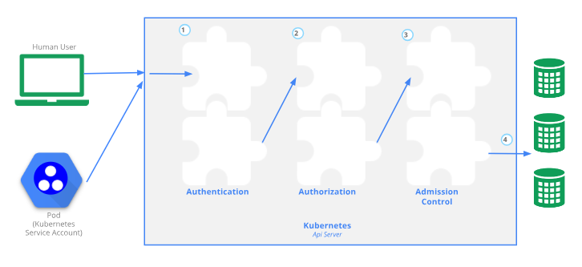

`kubernetes:kube-apiserver` 系列文章：
- [Kubernetes:kube-apiserver 之 scheme(一)](https://www.cnblogs.com/xingzheanan/p/17771090.html)
- [Kubernetes:kube-apiserver 之 scheme(二)](https://www.cnblogs.com/xingzheanan/p/17774196.html)
- [Kubernetes:kube-apiserver 之启动流程(一)](https://www.cnblogs.com/xingzheanan/p/17787066.html)
- [Kubernetes:kube-apiserver 之启动流程(二)](https://www.cnblogs.com/xingzheanan/p/17810006.html)
- [Kubernetes:kube-apiserver 和 etcd 的交互 ](https://www.cnblogs.com/xingzheanan/p/17810847.html)

# 0. 前言

`kube-apiserver` 不仅负责 `RESTful API` 路由的建立，也负责请求的认证，授权和准入。如下图所示：



本篇文章将介绍 `kube-apiserver` 的认证机制。

# 1. 认证 Authentication

认证是对请求的认证，确认请求是否具有访问 `Kubernetes` 集群的权限。在 `kube-apiserver` 中，通过 `handler` 处理请求的认证，所有请求都将通过认证 `handler` 进行认证。可以把它理解成 `Gin` 框架的中间件。

## 1.1 认证 handler

首先，从认证 `handler` 的创建过程入手。
```
# kubernetes/vendor/k8s.io/apiserver/pkg/server/config.go
// 进入 GenericAPIServer 的创建函数 New
func (c completedConfig) New(name string, delegationTarget DelegationTarget) (*GenericAPIServer, error) {
	handlerChainBuilder := func(handler http.Handler) http.Handler {
		return c.BuildHandlerChainFunc(handler, c.Config)
	}


	apiServerHandler := NewAPIServerHandler(name, c.Serializer, handlerChainBuilder, delegationTarget.UnprotectedHandler())
    ...
}

# kubernetes/vendor/k8s.io/apiserver/pkg/server/config.go
func NewAPIServerHandler(name string, s runtime.NegotiatedSerializer, handlerChainBuilder HandlerChainBuilderFn, notFoundHandler http.Handler) *APIServerHandler {
	...

	director := director{
		name:               name,
		goRestfulContainer: gorestfulContainer,
		nonGoRestfulMux:    nonGoRestfulMux,
	}

	return &APIServerHandler{
        // 创建 FullHandlerChain
		FullHandlerChain:   handlerChainBuilder(director),
		GoRestfulContainer: gorestfulContainer,
		NonGoRestfulMux:    nonGoRestfulMux,
		Director:           director,
	}
}
```

这里 `FullHandlerChain` 内装有认证 `handler`。继续看哪里定义 `handlerChainBuilder` 函数的。
```
# kubernetes/vendor/k8s.io/apiserver/pkg/server/config.go
func NewConfig(codecs serializer.CodecFactory) *Config {
	return &Config{
        ...
		BuildHandlerChainFunc:          DefaultBuildHandlerChain,
    }
}

# kubernetes/vendor/k8s.io/apiserver/pkg/server/config.go
func DefaultBuildHandlerChain(apiHandler http.Handler, c *Config) http.Handler {
    handler = genericapifilters.WithAuthentication(handler, c.Authentication.Authenticator, failedHandler, c.Authentication.APIAudiences, c.Authentication.RequestHeaderConfig)
    return handler
}

# kubernetes/vendor/k8s.io/apiserver/pkg/endpoints/filters/authentication.go
func WithAuthentication(handler http.Handler, auth authenticator.Request, failed http.Handler, apiAuds authenticator.Audiences, requestHeaderConfig *authenticatorfactory.RequestHeaderConfig) http.Handler {
	return withAuthentication(handler, auth, failed, apiAuds, requestHeaderConfig, recordAuthenticationMetrics)
}
```

在创建配置 `Config` 时，将 `DefaultBuildHandlerChain` 赋值给 `BuildHandlerChainFunc`。`DefaultBuildHandlerChain` 内的 `genericapifilters.WithAuthentication` 创建了认证 `handler`。

接着往下走，进入 `genericapifilters.WithAuthentication`。
```
func withAuthentication(handler http.Handler, auth authenticator.Request, failed http.Handler, apiAuds authenticator.Audiences, requestHeaderConfig *authenticatorfactory.RequestHeaderConfig, metrics authenticationRecordMetricsFunc) http.Handler {
	return http.HandlerFunc(func(w http.ResponseWriter, req *http.Request) {
		resp, ok, err := auth.AuthenticateRequest(req)

		// authorization header is not required anymore in case of a successful authentication.
		req.Header.Del("Authorization")

		req = req.WithContext(genericapirequest.WithUser(req.Context(), resp.User))
		handler.ServeHTTP(w, req)
	})
}

type Request interface {
	AuthenticateRequest(req *http.Request) (*Response, bool, error)
}
```

可以看到，认证 `handler` 中通过 `auth.AuthenticateRequest(req)` 对 `RESTful API` 请求进行认证。这里 `auth` 是一个实现 `Request` 接口的实例。

那么，`auth` 实例是在哪里创建的呢，调用的 `AuthenticateRequest` 方法具体做的是什么呢？带着这个问题我们看下一节认证实例。

## 1.2 认证实例

通过层层回溯找到调用点。
```
handler = genericapifilters.WithAuthentication(handler, c.Authentication.Authenticator, failedHandler, c.Authentication.APIAudiences, c.Authentication.RequestHeaderConfig)
```

这里 `c.Authentication.Authenticator` 即为 `auth` 的实例。我们看 `c.Authentication.Authenticator` 是在哪里创建的。
```
# kubernetes/pkg/controlplane/apiserver/config.go
func BuildGenericConfig(
	s controlplaneapiserver.CompletedOptions,
	schemes []*runtime.Scheme,
	getOpenAPIDefinitions func(ref openapicommon.ReferenceCallback) map[string]openapicommon.OpenAPIDefinition,
) (
	genericConfig *genericapiserver.Config,
	versionedInformers clientgoinformers.SharedInformerFactory,
	storageFactory *serverstorage.DefaultStorageFactory,

	lastErr error,
) {
    // Authentication.ApplyTo requires already applied OpenAPIConfig and EgressSelector if present
	if lastErr = s.Authentication.ApplyTo(&genericConfig.Authentication, genericConfig.SecureServing, genericConfig.EgressSelector, genericConfig.OpenAPIConfig, genericConfig.OpenAPIV3Config, clientgoExternalClient, versionedInformers); lastErr != nil {
		return
	}
}

# kubernetes/pkg/kubeapiserver/options/authentication.go
func (o *BuiltInAuthenticationOptions) ApplyTo(authInfo *genericapiserver.AuthenticationInfo, secureServing *genericapiserver.SecureServingInfo, egressSelector *egressselector.EgressSelector, openAPIConfig *openapicommon.Config, openAPIV3Config *openapicommon.Config, extclient kubernetes.Interface, versionedInformer informers.SharedInformerFactory) error {
	authenticatorConfig, err := o.ToAuthenticationConfig()
	if err != nil {
		return err
	}

    ...

	authInfo.Authenticator, openAPIConfig.SecurityDefinitions, err = authenticatorConfig.New()
}
```

`c.Authentication.Authenticator` 实际是 `authenticatorConfig.New()` 创建的 `authInfo.Authenticator` 认证器。进入 `authenticatorConfig.New()` 看创建认证器过程。
```
# kubernetes/pkg/controlplane/apiserver/config.go
func (config Config) New() (authenticator.Request, *spec.SecurityDefinitions, error) {
	var authenticators []authenticator.Request
	var tokenAuthenticators []authenticator.Token
	securityDefinitions := spec.SecurityDefinitions{}

	// front-proxy, BasicAuth methods, local first, then remote
	// Add the front proxy authenticator if requested
	if config.RequestHeaderConfig != nil {
		requestHeaderAuthenticator := headerrequest.NewDynamicVerifyOptionsSecure(
			config.RequestHeaderConfig.CAContentProvider.VerifyOptions,
			config.RequestHeaderConfig.AllowedClientNames,
			config.RequestHeaderConfig.UsernameHeaders,
			config.RequestHeaderConfig.GroupHeaders,
			config.RequestHeaderConfig.ExtraHeaderPrefixes,
		)
		authenticators = append(authenticators, authenticator.WrapAudienceAgnosticRequest(config.APIAudiences, requestHeaderAuthenticator))
	}

	// X509 methods
	if config.ClientCAContentProvider != nil {
		certAuth := x509.NewDynamic(config.ClientCAContentProvider.VerifyOptions, x509.CommonNameUserConversion)
		authenticators = append(authenticators, certAuth)
	}

    ...

    authenticator := union.New(authenticators...)
	authenticator = group.NewAuthenticatedGroupAdder(authenticator)
    return authenticator, &securityDefinitions, nil
}

# kubernetes/vendor/k8s.io/apiserver/pkg/authentication/request/union/union.go
func New(authRequestHandlers ...authenticator.Request) authenticator.Request {
	if len(authRequestHandlers) == 1 {
		return authRequestHandlers[0]
	}
	return &unionAuthRequestHandler{Handlers: authRequestHandlers, FailOnError: false}
}

# kubernetes/vendor/k8s.io/apiserver/pkg/authentication/group/authenticated_group_adder.go
func NewAuthenticatedGroupAdder(auth authenticator.Request) authenticator.Request {
	return &AuthenticatedGroupAdder{auth}
}
```

可以看到，认证器是一系列认证器的组合。每个认证器包括组合的认证器都实现了 `authenticator.Request` 接口的 `AuthenticateRequest` 方法。

回头看在 `handler` 中定义的 `auth.AuthenticateRequest(req)` 方法，实际执行的是 `authenticator.AuthenticateRequest(req)`。
```
# kubernetes/vendor/k8s.io/apiserver/pkg/authentication/group/authenticated_group_adder.go
func (g *AuthenticatedGroupAdder) AuthenticateRequest(req *http.Request) (*authenticator.Response, bool, error) {
	r, ok, err := g.Authenticator.AuthenticateRequest(req)
	if err != nil || !ok {
		return nil, ok, err
	}
}

# kubernetes/vendor/k8s.io/apiserver/pkg/authentication/request/union/union.go
func (authHandler *unionAuthRequestHandler) AuthenticateRequest(req *http.Request) (*authenticator.Response, bool, error) {
	var errlist []error
	for _, currAuthRequestHandler := range authHandler.Handlers {
		resp, ok, err := currAuthRequestHandler.AuthenticateRequest(req)
		if err != nil {
			if authHandler.FailOnError {
				return resp, ok, err
			}
			errlist = append(errlist, err)
			continue
		}

		if ok {
			return resp, ok, err
		}
	}

	return nil, false, utilerrors.NewAggregate(errlist)
}
```

通过层层调用，最终执行到 `unionAuthRequestHandler.AuthenticateRequest`。该方法中循环执行各个认证器的 `AuthenticateRequest` 方法，直到认证成功。

各认证器的认证方式不同，这里就不过多介绍了，具体涉及到各种认证方式的时候可详细看相应认证器的 `AuthenticateRequest` 方法。

# 2. 总结

通过本篇文章介绍了 `kube-apiserver` 中的 `Authentication` 认证流程，下一篇将继续介绍 `kube-apiserver` 的 `Authorization` 授权流程。
