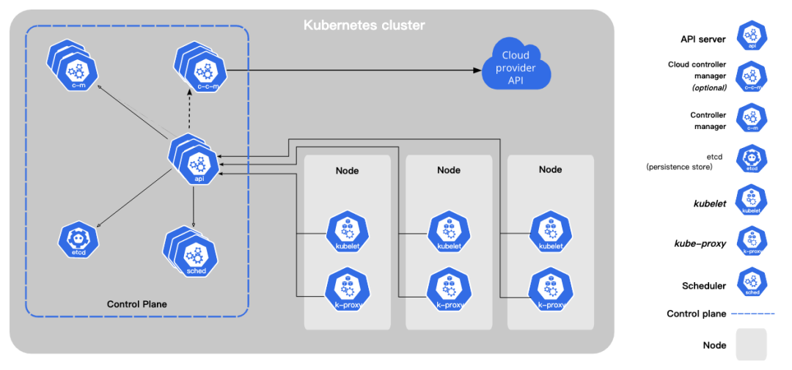

`kubernetes:kube-apiserver` 系列文章：
- [Kubernetes:kube-apiserver 之 scheme(一)](https://www.cnblogs.com/xingzheanan/p/17771090.html)
- [Kubernetes:kube-apiserver 之 scheme(二)](https://www.cnblogs.com/xingzheanan/p/17774196.html)
- [Kubernetes:kube-apiserver 之启动流程(一)](https://www.cnblogs.com/xingzheanan/p/17787066.html)
- [Kubernetes:kube-apiserver 之启动流程(二)](https://www.cnblogs.com/xingzheanan/p/17810006.html)

# 0. 前言

上几篇文章介绍了 `kubernetes` 的核心数据结构 `scheme` 和 `Kubernetes:kube-apiserver` 的启动流程。在启动流程篇中重点关注的是启动的核心逻辑，并没有关注 `kube-apiserver` 和外部组件的交互。

而，交互是非常必要的，其定义了边界和依赖。



从 `Kubernetes` 架构图可以看出，`kube-apiserver` 是唯一和 `etcd` 交互的组件。因此，这里将 `kube-apiserver` 和 `etcd` 交互的部分单独拿出来加以介绍，做到知其然，知其所以然。

# 1. 使用 etcd

既然是交互，首先需要了解的是怎么用交互的组件。这里同 `kube-apiserver` 交互的是大名鼎鼎的 `etcd`，不需要多介绍它。

仅给出示例：
```
package main

import (
	"context"
	"fmt"
	"log"
	"time"

	"go.etcd.io/etcd/clientv3"
)

func main() {
	cli, err := clientv3.New(clientv3.Config{
		Endpoints:   []string{"127.0.0.1:2379"},
		DialTimeout: time.Second * 5,
	})
	if err != nil {
		log.Fatal(err)
	}
	fmt.Println("connect to etcd success.")
	defer cli.Close()

	// lease with 5 second
	resp, err := cli.Grant(context.TODO(), 5)
	if err != nil {
		log.Fatal(err)
	}

	// delete key:name after expire of lease
	_, err = cli.Put(context.TODO(), "name", "hxia", clientv3.WithLease(resp.ID))
	if err != nil {
		log.Fatal(err)
	}
}
```

详细内容可参考 [go-by-example: etcd](https://github.com/hxia043/go-by-example/blob/main/etcd/etcd.go) 和 [Quickstart](https://etcd.io/docs/v3.5/quickstart/)。


# 2. kube-apiserver 和 etcd

顺序看 `kube-apiserver` 和 `etcd` 的交互是非常复杂的，容易头晕。这里，逆序的看 `kube-apiserver` 和 `etcd` 的交互。首先，找到它们在哪里交互的，接着从这一点开始发散，摸清整体脉络。

那么，它们在哪里交互的呢？这个问题不难回答，在 `handler`。作为 `RESTful API` 的处理单元，`handler` 内定义了 `kube-apiserver` 和 `etcd` 的交互。

以处理 `GET` 的 `handler` 为例：
```
# kubernetes/vendor/k8s.io/apiserver/pkg/endpoints/installer.go
func (a *APIInstaller) registerResourceHandlers(path string, storage rest.Storage, ws *restful.WebService) (*metav1.APIResource, *storageversion.ResourceInfo, error) {
    switch action.Verb {
    case "GET": // Get a resource.
        var handler restful.RouteFunction
        if isGetterWithOptions {
            handler = restfulGetResourceWithOptions(getterWithOptions, reqScope, isSubresource)
        } else {
            handler = restfulGetResource(getter, reqScope)
        }

        route := ws.GET(action.Path).To(handler).
            Doc(doc).
            Param(ws.QueryParameter("pretty", "If 'true', then the output is pretty printed.")).
            Operation("read"+namespaced+kind+strings.Title(subresource)+operationSuffix).
            Produces(append(storageMeta.ProducesMIMETypes(action.Verb), mediaTypes...)...).
            Returns(http.StatusOK, "OK", producedObject).
            Writes(producedObject)

        addParams(route, action.Params)
        routes = append(routes, route)
    }
}
```

进入 `restfulGetResource` 看 `handler` 是怎么创建的。
```
func restfulGetResource(r rest.Getter, scope handlers.RequestScope) restful.RouteFunction {
	return func(req *restful.Request, res *restful.Response) {
		handlers.GetResource(r, &scope)(res.ResponseWriter, req.Request)
	}
}

// GetResource returns a function that handles retrieving a single resource from a rest.Storage object.
func GetResource(r rest.Getter, scope *RequestScope) http.HandlerFunc {
	return getResourceHandler(scope,
		func(ctx context.Context, name string, req *http.Request) (runtime.Object, error) {
			...
			return r.Get(ctx, name, &options)
		})
}

// Getter is an object that can retrieve a named RESTful resource.
type Getter interface {
	// Get finds a resource in the storage by name and returns it.
	// Although it can return an arbitrary error value, IsNotFound(err) is true for the
	// returned error value err when the specified resource is not found.
	Get(ctx context.Context, name string, options *metav1.GetOptions) (runtime.Object, error)
}
```

可以看到：
1. `restfulGetResource` 返回一个路由函数，路由函数内包含传递给 `restfulGetResource` 的 `getter` 对象。
2. 返回的路由函数内，调用的是 `getter` 的 `Get` 方法获取资源对象 `runtime.Object`。这里的 `getter` 是实现 `Getter` 接口的对象。

基于上述分析，现在重点就变成 `getter` 调用的 `Get` 具体做了什么。通过逐级向上追溯，找到了 `Getter` 接口的实例对象 `customResourceDefinitionStorage`。
```
# kubernetes/vendor/k8s.io/apiextensions-apiserver/pkg/apiserver/apiserver.go
func (c completedConfig) New(delegationTarget genericapiserver.DelegationTarget) (*CustomResourceDefinitions, error) {
    if resource := "customresourcedefinitions"; apiResourceConfig.ResourceEnabled(v1.SchemeGroupVersion.WithResource(resource)) {
        // 调用 NetREST 创建资源实体 customResourceDefinitionStorage
        customResourceDefinitionStorage, err := customresourcedefinition.NewREST(Scheme, c.GenericConfig.RESTOptionsGetter)
        if err != nil {
            return nil, err
        }
        storage[resource] = customResourceDefinitionStorage
        storage[resource+"/status"] = customresourcedefinition.NewStatusREST(Scheme, customResourceDefinitionStorage)
    }
}

func NewREST(scheme *runtime.Scheme, optsGetter generic.RESTOptionsGetter) (*REST, error) {
	strategy := NewStrategy(scheme)

	store := &genericregistry.Store{
		...
	}
	options := &generic.StoreOptions{RESTOptions: optsGetter, AttrFunc: GetAttrs}
	if err := store.CompleteWithOptions(options); err != nil {
		return nil, err
	}
	return &REST{store}, nil
}

```

接口的实例对象找到了，继续看实例对象的 `Get` 做了什么。
```
# kubernetes/vendor/k8s.io/apiextensions-apiserver/pkg/registry/customresourcedefinition/etcd.go
// rest implements a RESTStorage for API services against etcd
type REST struct {
	*genericregistry.Store
}

# kubernetes/vendor/k8s.io/apiserver/pkg/registry/generic/registry/store.go
type Store struct {
    Storage DryRunnableStorage
}

# kubernetes/vendor/k8s.io/apiserver/pkg/registry/generic/registry/dryrun.go
type DryRunnableStorage struct {
	Storage storage.Interface
	Codec   runtime.Codec
}

# kubernetes/vendor/k8s.io/apiserver/pkg/registry/generic/registry/store.go
// Get retrieves the item from storage.
func (e *Store) Get(ctx context.Context, name string, options *metav1.GetOptions) (runtime.Object, error) {
	obj := e.NewFunc()
	key, err := e.KeyFunc(ctx, name)
	if err != nil {
		return nil, err
	}
	if err := e.Storage.Get(ctx, key, storage.GetOptions{ResourceVersion: options.ResourceVersion}, obj); err != nil {
		return nil, storeerr.InterpretGetError(err, e.qualifiedResourceFromContext(ctx), name)
	}
	if e.Decorator != nil {
		e.Decorator(obj)
	}
	return obj, nil
}

# kubernetes/vendor/k8s.io/apiserver/pkg/registry/generic/registry/dryrun.go
func (s *DryRunnableStorage) Get(ctx context.Context, key string, opts storage.GetOptions, objPtr runtime.Object) error {
	return s.Storage.Get(ctx, key, opts, objPtr)
}

```

`REST` 对象包含 `*genericregistry.Store`，其继承了 `Store` 的 `Get` 方法。在 `Store.Get` 方法内，通过 `e.Storage.Get` 调用 `DryRunnableStorage` 的 `Get` 方法。实际是通过 `DryRunnableStorage` 内的 `Storage` 存储接口调用 `Get` 方法，从而访问 `etcd`。

`DryRunnableStorage.Storage` 是一个接口，它的实体对象是什么呢？

还是从资源实体入手，看 `REST{store}` 是如何实例化的。
```
// NewREST returns a RESTStorage object that will work against API services.
func NewREST(scheme *runtime.Scheme, optsGetter generic.RESTOptionsGetter) (*REST, error) {
	strategy := NewStrategy(scheme)

	store := &genericregistry.Store{
		...
	}
	options := &generic.StoreOptions{RESTOptions: optsGetter, AttrFunc: GetAttrs}
    // 进入 CompleteWithOptions
	if err := store.CompleteWithOptions(options); err != nil {
		return nil, err
	}
	return &REST{store}, nil
}

func (e *Store) CompleteWithOptions(options *generic.StoreOptions) error {
    if e.Storage.Storage == nil {
        e.Storage.Storage, e.DestroyFunc, err = opts.Decorator(
            opts.StorageConfig,
            prefix,
            keyFunc,
            e.NewFunc,
            e.NewListFunc,
            attrFunc,
            options.TriggerFunc,
            options.Indexers,
        )
    }
}
```

看到这里，已经知道哪里实例化的 `storage.Interface` 对象了。这里的 `opts.Decorator` 是一个装饰函数。接着，继续探案，看这个装饰函数干了什么，知道它干了什么就能挖出来最关键的一环，存储接口是怎么访问 `etcd` 的。
```
# kubernetes/vendor/k8s.io/apiserver/pkg/registry/generic/registry/store.go
func (e *Store) CompleteWithOptions(options *generic.StoreOptions) error {
	// 通过 options.RESTOptions.GetRESTOptions 实例化 opts
	// options.RESTOptions 是满足 RESTOptionsGetter 接口的实例
	opts, err := options.RESTOptions.GetRESTOptions(e.DefaultQualifiedResource)
	if err != nil {
		return err
	}
}

# kubernetes/vendor/k8s.io/apiserver/pkg/registry/generic/options.go
type RESTOptionsGetter interface {
	GetRESTOptions(resource schema.GroupResource) (RESTOptions, error)
}

func NewREST(scheme *runtime.Scheme, optsGetter generic.RESTOptionsGetter) (*REST, error) {
	strategy := NewStrategy(scheme)

	store := &genericregistry.Store{
		...
	}
	// 创建 options
	options := &generic.StoreOptions{RESTOptions: optsGetter, AttrFunc: GetAttrs}
	// 将 options 作为参数传递给 Store.CompleteWithOptions
	if err := store.CompleteWithOptions(options); err != nil {
		return nil, err
	}
	return &REST{store}, nil
}

func (c completedConfig) New(delegationTarget genericapiserver.DelegationTarget) (*CustomResourceDefinitions, error) {
	if resource := "customresourcedefinitions"; apiResourceConfig.ResourceEnabled(v1.SchemeGroupVersion.WithResource(resource)) {
		customResourceDefinitionStorage, err := customresourcedefinition.NewREST(Scheme, c.GenericConfig.RESTOptionsGetter)
		if err != nil {
			return nil, err
		}
		storage[resource] = customResourceDefinitionStorage
		storage[resource+"/status"] = customresourcedefinition.NewStatusREST(Scheme, customResourceDefinitionStorage)
	}
}
```

可以看到，`c.GenericConfig.RESTOptionsGetter` 即为 `optsGetter`，调用 `c.GenericConfig.RESTOptionsGetter` 的 `GetRESTOptions` 得到 `RESTOptions`。

`c.GenericConfig.RESTOptionsGetter` 在哪里实例化的呢？

还记得前面创建通用配置的 `BuildGenericConfig` 吗？在该函数内，实例化了 `c.GenericConfig.RESTOptionsGetter`。
```
# kubernetes/pkg/controlplane/apiserver/config.go
func BuildGenericConfig(
	s controlplaneapiserver.CompletedOptions,
	schemes []*runtime.Scheme,
	getOpenAPIDefinitions func(ref openapicommon.ReferenceCallback) map[string]openapicommon.OpenAPIDefinition,
){
	storageFactoryConfig := kubeapiserver.NewStorageFactoryConfig()
	storageFactoryConfig.APIResourceConfig = genericConfig.MergedResourceConfig
	storageFactory, lastErr = storageFactoryConfig.Complete(s.Etcd).New()
	if lastErr != nil {
		return
	}
	if lastErr = s.Etcd.ApplyWithStorageFactoryTo(storageFactory, genericConfig); lastErr != nil {
		return
	}
}

func (s *EtcdOptions) ApplyWithStorageFactoryTo(factory serverstorage.StorageFactory, c *server.Config) error {
	c.RESTOptionsGetter = s.CreateRESTOptionsGetter(factory, c.ResourceTransformers)
	return nil
}

func (s *EtcdOptions) CreateRESTOptionsGetter(factory serverstorage.StorageFactory, resourceTransformers storagevalue.ResourceTransformers) generic.RESTOptionsGetter {
	if resourceTransformers != nil {
		factory = &transformerStorageFactory{
			delegate:             factory,
			resourceTransformers: resourceTransformers,
		}
	}
	return &StorageFactoryRestOptionsFactory{Options: *s, StorageFactory: factory}
}
```

过程也不复杂，可以看到，`RESTOptionsGetter` 接口的实例化对象是 `&StorageFactoryRestOptionsFactory`。

调用 `c.GenericConfig.RESTOptionsGetter` 的 `GetRESTOptions` 实际调用的是 `StorageFactoryRestOptionsFactory.GetRESTOptions`。
```
func (f *StorageFactoryRestOptionsFactory) GetRESTOptions(resource schema.GroupResource) (generic.RESTOptions, error) {
	ret := generic.RESTOptions{
		StorageConfig:             storageConfig,
		Decorator:                 generic.UndecoratedStorage,
		DeleteCollectionWorkers:   f.Options.DeleteCollectionWorkers,
		EnableGarbageCollection:   f.Options.EnableGarbageCollection,
		ResourcePrefix:            f.StorageFactory.ResourcePrefix(resource),
		CountMetricPollPeriod:     f.Options.StorageConfig.CountMetricPollPeriod,
		StorageObjectCountTracker: f.Options.StorageConfig.StorageObjectCountTracker,
	}

	return ret, nil
}
```

`RESTOptions` 中包含了 `Decorator` 的创建，这里我们的重点是 `Decorator`，进入 `generic.UndecoratedStorage` 看它是怎么一个函数。
```
# kubernetes/vendor/k8s.io/apiserver/pkg/registry/generic/storage_decorator.go
func UndecoratedStorage(
	config *storagebackend.ConfigForResource,
	resourcePrefix string,
	keyFunc func(obj runtime.Object) (string, error),
	newFunc func() runtime.Object,
	newListFunc func() runtime.Object,
	getAttrsFunc storage.AttrFunc,
	trigger storage.IndexerFuncs,
	indexers *cache.Indexers) (storage.Interface, factory.DestroyFunc, error) {
	return NewRawStorage(config, newFunc, newListFunc, resourcePrefix)
}

func NewRawStorage(config *storagebackend.ConfigForResource, newFunc, newListFunc func() runtime.Object, resourcePrefix string) (storage.Interface, factory.DestroyFunc, error) {
	return factory.Create(*config, newFunc, newListFunc, resourcePrefix)
}

# kubernetes/vendor/k8s.io/apiserver/pkg/storage/storagebackend/factory/factory.go
func Create(c storagebackend.ConfigForResource, newFunc, newListFunc func() runtime.Object, resourcePrefix string) (storage.Interface, DestroyFunc, error) {
	switch c.Type {
	case storagebackend.StorageTypeETCD2:
		return nil, nil, fmt.Errorf("%s is no longer a supported storage backend", c.Type)
	case storagebackend.StorageTypeUnset, storagebackend.StorageTypeETCD3:
		return newETCD3Storage(c, newFunc, newListFunc, resourcePrefix)
	default:
		return nil, nil, fmt.Errorf("unknown storage type: %s", c.Type)
	}
}

# kubernetes/vendor/k8s.io/apiserver/pkg/storage/storagebackend/factory/etcd3.go
func newETCD3Storage(c storagebackend.ConfigForResource, newFunc, newListFunc func() runtime.Object, resourcePrefix string) (storage.Interface, DestroyFunc, error) {
	client, err := newETCD3Client(c.Transport)
	if err != nil {
		stopCompactor()
		return nil, nil, err
	}

	client.KV = etcd3.NewETCDLatencyTracker(client.KV)

	return etcd3.New(client, c.Codec, newFunc, newListFunc, c.Prefix, resourcePrefix, c.GroupResource, transformer, c.Paging, c.LeaseManagerConfig), destroyFunc, nil
}

// New returns an etcd3 implementation of storage.Interface.
func New(c *clientv3.Client, codec runtime.Codec, newFunc, newListFunc func() runtime.Object, prefix, resourcePrefix string, groupResource schema.GroupResource, transformer value.Transformer, pagingEnabled bool, leaseManagerConfig LeaseManagerConfig) storage.Interface {
	return newStore(c, codec, newFunc, newListFunc, prefix, resourcePrefix, groupResource, transformer, pagingEnabled, leaseManagerConfig)
}

func newStore(c *clientv3.Client, codec runtime.Codec, newFunc, newListFunc func() runtime.Object, prefix, resourcePrefix string, groupResource schema.GroupResource, transformer value.Transformer, pagingEnabled bool, leaseManagerConfig LeaseManagerConfig) *store {
	s := &store{
		client:              c,
		codec:               codec,
		versioner:           versioner,
		transformer:         transformer,
		pagingEnabled:       pagingEnabled,
		pathPrefix:          pathPrefix,
		groupResource:       groupResource,
		groupResourceString: groupResource.String(),
		watcher:             w,
		leaseManager:        newDefaultLeaseManager(c, leaseManagerConfig),
	}
	return s
}
```

上述代码基本都是函数的顺序调用，不用介绍太多。  
可以看到 `opts.Decorator` 做的事情是实例化了一个访问 `etcd` 的接口实例 `store`。`store` 中存储了访问 `etcd` 的 `client`，`client` 是通过 `newETCD3Client(c.Transport)` 创建的。

到这里，基本破案了。访问 `etcd` 实际是通过 `store` 和 `etcd` 进行交互。这里的 `store` 只是存储了 `client` 并没有实际访问，实际访问在 `handler`。

再回头看 `DryRunnableStorage.Get` 方法内的 `s.Storage.Get` 即可知道其调用的是 `store` 的 `Get` 方法。
```
# kubernetes/vendor/k8s.io/apiserver/pkg/registry/generic/registry/dryrun.go
func (s *DryRunnableStorage) Get(ctx context.Context, key string, opts storage.GetOptions, objPtr runtime.Object) error {
	return s.Storage.Get(ctx, key, opts, objPtr)
}

# kubernetes/vendor/k8s.io/apiserver/pkg/storage/etcd3/store.go
// Get implements storage.Interface.Get.
func (s *store) Get(ctx context.Context, key string, opts storage.GetOptions, out runtime.Object) error {
	preparedKey, err := s.prepareKey(key)
	if err != nil {
		return err
	}
	startTime := time.Now()
	// 通过 client 访问 key 对应的 value
	getResp, err := s.client.KV.Get(ctx, preparedKey)

	kv := getResp.Kvs[0]

	data, _, err := s.transformer.TransformFromStorage(ctx, kv.Value, authenticatedDataString(preparedKey))
	if err != nil {
		return storage.NewInternalError(err.Error())
	}

	err = decode(s.codec, s.versioner, data, out, kv.ModRevision)
	if err != nil {
		recordDecodeError(s.groupResourceString, preparedKey)
		return err
	}
	return nil
}
```

最后，通过本文介绍了 `kube-apiserver` 和 `etcd` 的交互。下一步将重点介绍 `kube-apiserver` 是怎么做鉴权，认证和准入机制的。

