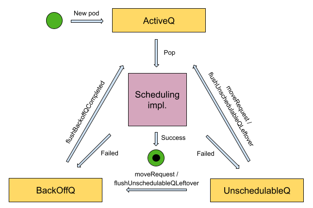
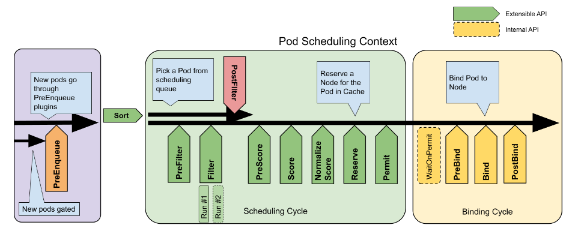

# 0. 前言

[[译] kubernetes:kube-scheduler 调度器代码结构概述](https://www.cnblogs.com/xingzheanan/p/17976793) 介绍了 `kube-scheduler` 的代码结构。本文围绕代码结构，从源码角度出发，分析 `kube-scheduler` 的调度逻辑。

# 1. 启动 kube-scheduler

`kube-scheduler` 使用 `Cobra` 框架初始化参数，配置和应用。

```
// kubernetes/cmd/kube-scheduler/scheduler.go
func main() {
    // 启动 kube-scheduler 入口
	command := app.NewSchedulerCommand()
	...
}

// kubernetes/cmd/kube-scheduler/app/server.go
func NewSchedulerCommand(registryOptions ...Option) *cobra.Command {
    // 创建 kube-scheduler 选项
	opts := options.NewOptions()

    cmd := &cobra.Command{
		Use: "kube-scheduler",
		...
		RunE: func(cmd *cobra.Command, args []string) error {
			return runCommand(cmd, opts, registryOptions...)
		},
        ...
    }
    ...
}

// 运行 kube-scheduler
func runCommand(cmd *cobra.Command, opts *options.Options, registryOptions ...Option) error {
	...
    // 创建 kube-scheduler 配置 cc
    // 创建 kube-scheduler 实例 sched
	cc, sched, err := Setup(ctx, opts, registryOptions...)
	if err != nil {
		return err
	}
	...
	return Run(ctx, cc, sched)
}
```

从启动命令来看，这里重点关注的是 `Setup` 函数。在该函数内，创建 `kube-scheduler` 配置 `cc` 和调度器实例 `sched`。
```
func Setup(ctx context.Context, opts *options.Options, outOfTreeRegistryOptions ...Option) (*schedulerserverconfig.CompletedConfig, *scheduler.Scheduler, error) {
    ...
    // 验证选项
	if errs := opts.Validate(); len(errs) > 0 {
		return nil, nil, utilerrors.NewAggregate(errs)
	}

    // 根据选项创建配置 c
	c, err := opts.Config(ctx)
	if err != nil {
		return nil, nil, err
	}

    // 补充配置为完整配置
    cc := c.Complete()

    // 外部注册插件
    outOfTreeRegistry := make(runtime.Registry)
	for _, option := range outOfTreeRegistryOptions {
		if err := option(outOfTreeRegistry); err != nil {
			return nil, nil, err
		}
	}

    ...
	// 创建调度器实例 sched
    sched, err := scheduler.New(ctx,
		cc.Client,
		cc.InformerFactory,
		cc.DynInformerFactory,
		recorderFactory,
		scheduler.WithComponentConfigVersion(cc.ComponentConfig.TypeMeta.APIVersion),
		scheduler.WithKubeConfig(cc.KubeConfig),
		scheduler.WithProfiles(cc.ComponentConfig.Profiles...),
		scheduler.WithPercentageOfNodesToScore(cc.ComponentConfig.PercentageOfNodesToScore),
		scheduler.WithFrameworkOutOfTreeRegistry(outOfTreeRegistry),
		scheduler.WithPodMaxBackoffSeconds(cc.ComponentConfig.PodMaxBackoffSeconds),
		scheduler.WithPodInitialBackoffSeconds(cc.ComponentConfig.PodInitialBackoffSeconds),
		scheduler.WithPodMaxInUnschedulablePodsDuration(cc.PodMaxInUnschedulablePodsDuration),
		scheduler.WithExtenders(cc.ComponentConfig.Extenders...),
		scheduler.WithParallelism(cc.ComponentConfig.Parallelism),
		scheduler.WithBuildFrameworkCapturer(func(profile kubeschedulerconfig.KubeSchedulerProfile) {
			// Profiles are processed during Framework instantiation to set default plugins and configurations. Capturing them for logging
			completedProfiles = append(completedProfiles, profile)
		}),
	)

    ...
    return &cc, sched, nil
}
```

函数 `scheduler.New` 创建调度器实例 `sched`，进入函数内查看实例是如何创建的。

```
func New(ctx context.Context,
	client clientset.Interface,
	informerFactory informers.SharedInformerFactory,
	dynInformerFactory dynamicinformer.DynamicSharedInformerFactory,
	recorderFactory profile.RecorderFactory,
	opts ...Option) (*Scheduler, error) {
    ...
    // 注册内置插件
    registry := frameworkplugins.NewInTreeRegistry()

    // merge 内置插件和外部注册插件
	if err := registry.Merge(options.frameworkOutOfTreeRegistry); err != nil {
		return nil, err
	}

    // 注册指标
    metrics.Register()

    // 注册外部扩展器
	extenders, err := buildExtenders(logger, options.extenders, options.profiles)
	if err != nil {
		return nil, fmt.Errorf("couldn't build extenders: %w", err)
	}

    // 实例化 podLister 负责监控 pod 变化
    podLister := informerFactory.Core().V1().Pods().Lister()
    // 实例化 nodeLister 负责监控 node 变化
	nodeLister := informerFactory.Core().V1().Nodes().Lister()

    // 创建 snapshot，snapshot 作为缓存存在
	snapshot := internalcache.NewEmptySnapshot()

    ...
    // 创建 profiles，profiles 中存储的是调度器框架
	profiles, err := profile.NewMap(ctx, options.profiles, registry, recorderFactory,
		frameworkruntime.WithComponentConfigVersion(options.componentConfigVersion),
		frameworkruntime.WithClientSet(client),
		frameworkruntime.WithKubeConfig(options.kubeConfig),
		frameworkruntime.WithInformerFactory(informerFactory),
		frameworkruntime.WithSnapshotSharedLister(snapshot),
		frameworkruntime.WithCaptureProfile(frameworkruntime.CaptureProfile(options.frameworkCapturer)),
		frameworkruntime.WithParallelism(int(options.parallelism)),
		frameworkruntime.WithExtenders(extenders),
		frameworkruntime.WithMetricsRecorder(metricsRecorder),
	)

    // 创建 preEnqueuePlugin 插件
    preEnqueuePluginMap := make(map[string][]framework.PreEnqueuePlugin)
    ...

    // 创建优先级队列 podQueue
    podQueue := internalqueue.NewSchedulingQueue(
		profiles[options.profiles[0].SchedulerName].QueueSortFunc(),
		informerFactory,
		internalqueue.WithPodInitialBackoffDuration(time.Duration(options.podInitialBackoffSeconds)*time.Second),
		internalqueue.WithPodMaxBackoffDuration(time.Duration(options.podMaxBackoffSeconds)*time.Second),
		internalqueue.WithPodLister(podLister),
		internalqueue.WithPodMaxInUnschedulablePodsDuration(options.podMaxInUnschedulablePodsDuration),
		internalqueue.WithPreEnqueuePluginMap(preEnqueuePluginMap),
		internalqueue.WithQueueingHintMapPerProfile(queueingHintsPerProfile),
		internalqueue.WithPluginMetricsSamplePercent(pluginMetricsSamplePercent),
		internalqueue.WithMetricsRecorder(*metricsRecorder),
	)

    ...
    // 创建调度器缓存
    schedulerCache := internalcache.New(ctx, durationToExpireAssumedPod)
    ...

    // 实例化调度器
    sched := &Scheduler{
		Cache:                    schedulerCache,
		client:                   client,
		nodeInfoSnapshot:         snapshot,
		percentageOfNodesToScore: options.percentageOfNodesToScore,
		Extenders:                extenders,
		StopEverything:           stopEverything,
		SchedulingQueue:          podQueue,
		Profiles:                 profiles,
		logger:                   logger,
	}

    // 将队列的 Pop 方法赋值给 sched.NextPod
	sched.NextPod = podQueue.Pop
	...

    // 添加 Event 回调 handler
	if err = addAllEventHandlers(sched, informerFactory, dynInformerFactory, unionedGVKs(queueingHintsPerProfile)); err != nil {
		return nil, fmt.Errorf("adding event handlers: %w", err)
	}

	return sched, nil
}
```

`scheduler.New` 创建了 `snapshot`, `eventHandler`, `profiles(framework)` 和 `cache` 等对象，结合着调度框架将它们关联起来会更清晰。


# 2. 运行 kube-scheduler

创建完各个对象之后，接下来运行 `kube-scheduler` 将各个对象关联起来运行。

```
func Run(ctx context.Context, cc *schedulerserverconfig.CompletedConfig, sched *scheduler.Scheduler) error {
    ...
    // 选举 leader
    waitingForLeader := make(chan struct{})
	isLeader := func() bool {
		select {
		case _, ok := <-waitingForLeader:
			// if channel is closed, we are leading
			return !ok
		default:
			// channel is open, we are waiting for a leader
			return false
		}
	}

    ...
    // 运行 informer
    startInformersAndWaitForSync := func(ctx context.Context) {
		// Start all informers.
		cc.InformerFactory.Start(ctx.Done())
		// DynInformerFactory can be nil in tests.
		if cc.DynInformerFactory != nil {
			cc.DynInformerFactory.Start(ctx.Done())
		}

		// Wait for all caches to sync before scheduling.
		cc.InformerFactory.WaitForCacheSync(ctx.Done())
		// DynInformerFactory can be nil in tests.
		if cc.DynInformerFactory != nil {
			cc.DynInformerFactory.WaitForCacheSync(ctx.Done())
		}

		// Wait for all handlers to sync (all items in the initial list delivered) before scheduling.
		if err := sched.WaitForHandlersSync(ctx); err != nil {
			logger.Error(err, "waiting for handlers to sync")
		}

		logger.V(3).Info("Handlers synced")
	}
	if !cc.ComponentConfig.DelayCacheUntilActive || cc.LeaderElection == nil {
		startInformersAndWaitForSync(ctx)
	}

    // leader 节点运行调度逻辑，暂略
    if cc.LeaderElection != nil {
        ...
    }

    close(waitingForLeader)
	sched.Run(ctx)
	return fmt.Errorf("finished without leader elect")
}
```

`Run` 函数内包含三部分处理：
- 选举 leader 节点。如果是单节点，则跳过选举。
- 运行 informer，负责监控 pod 和 node 变化。
- 运行调度器

进入 `sched.Run` 查看调度器是如何运行的。
```
func (sched *Scheduler) Run(ctx context.Context) {
	...
    // 从队列中去需要调度的 pod
	sched.SchedulingQueue.Run(logger)

	// 调度 pod
	go wait.UntilWithContext(ctx, sched.scheduleOne, 0)

	<-ctx.Done()
	...
}
```

`sched.Run` 主要做了两件事。从优先级队列中取用于调度的 pod，然后通过 `sched.scheduleOne` 调度该 pod。

首先，看取调度 pod 的过程，如下。
```
func (p *PriorityQueue) Run(logger klog.Logger) {
	go wait.Until(func() {
		p.flushBackoffQCompleted(logger)
	}, 1.0*time.Second, p.stop)
	go wait.Until(func() {
		p.flushUnschedulablePodsLeftover(logger)
	}, 30*time.Second, p.stop)
}
```

优先级队列由 `ActiveQ`，`BackoffQ` 和 `UnschedulableQ` 组成，其逻辑关系如下。  



在 `PriorityQueue.Run` 中启动两个 `goroutine` 分别运行 `p.flushBackoffQCompleted` 和 `p.flushUnschedulablePodsLeftover` 方法。`p.flushBackoffQCompleted` 将处于 `BackOffQ` 的 pod 移到 `ActiveQ`。`p.flushUnschedulablePodsLeftover` 将 `UnschedulableQ` 的 pod 移到 `ActiveQ` 或者 `BackOffQ`。详细取调度 pod 的逻辑可查看 [kube-scheduler 调度队列](https://github.com/kubernetes/community/blob/master/contributors/devel/sig-scheduling/scheduler_queues.md)。


接着，进入 `sched.scheduleOne` 查看 pod 是怎么调度的。

```
func (sched *Scheduler) scheduleOne(ctx context.Context) {
	...
	// 获取需要调度的 pod
	podInfo, err := sched.NextPod(logger)

	...
	// 进入调度循环调度 pod
	scheduleResult, assumedPodInfo, status := sched.schedulingCycle(schedulingCycleCtx, state, fwk, podInfo, start, podsToActivate)
	if !status.IsSuccess() {
		sched.FailureHandler(schedulingCycleCtx, fwk, assumedPodInfo, status, scheduleResult.nominatingInfo, start)
		return
	}

	// 进入绑定循环绑定 pod
	go func() {
		...
		status := sched.bindingCycle(bindingCycleCtx, state, fwk, scheduleResult, assumedPodInfo, start, podsToActivate)
		...
	}()
}
```

`sched.scheduleOne` 主要包括三部分：获取需要调度的 pod，进入调度循环调度 pod 和进入绑定循环绑定 pod。其逻辑结构如下。



进一步，查看每一部分的源码。

## 2.1 `sched.NextPod` 获取需要调度的 pod  
```
func (p *PriorityQueue) Pop(logger klog.Logger) (*framework.QueuedPodInfo, error) {
	...
	for p.activeQ.Len() == 0 {
		if p.closed {
			logger.V(2).Info("Scheduling queue is closed")
			return nil, nil
		}

		// 如果 activeQ 没有 pod 的话，阻塞等待
		p.cond.Wait()
	}

	// 从 activeQ 中取 pod
	obj, err := p.activeQ.Pop()
	if err != nil {
		return nil, err
	}
	pInfo := obj.(*framework.QueuedPodInfo)
	...

	return pInfo, nil
}
```

`sched.NextPod` 的逻辑主要是看 `activeQ` 队列中有没有 pod，如果有的话，取 pod 调度。如果没有的话，阻塞等待，直到 `activeQ` 中有 pod。

## 2.2 `sched.schedulingCycle` 调度 pod

```
func (sched *Scheduler) schedulingCycle(
	ctx context.Context,
	state *framework.CycleState,
	fwk framework.Framework,
	podInfo *framework.QueuedPodInfo,
	start time.Time,
	podsToActivate *framework.PodsToActivate,
) (ScheduleResult, *framework.QueuedPodInfo, *framework.Status) {
	...
	// 调度 Pod
	scheduleResult, err := sched.SchedulePod(ctx, fwk, state, pod)
	...

	assumedPodInfo := podInfo.DeepCopy()
	assumedPod := assumedPodInfo.Pod
	err = sched.assume(logger, assumedPod, scheduleResult.SuggestedHost)
	...

	// 运行 Reserve 插件的 Reserve 方法
	if sts := fwk.RunReservePluginsReserve(ctx, state, assumedPod, scheduleResult.SuggestedHost); !sts.IsSuccess() {
		...
	}

	// 运行 Permit 插件
	runPermitStatus := fwk.RunPermitPlugins(ctx, state, assumedPod, scheduleResult.SuggestedHost)
	if !runPermitStatus.IsWait() && !runPermitStatus.IsSuccess() {
		...
	}

	...
	return scheduleResult, assumedPodInfo, nil
}
```

`sched.schedulingCycle` 包含几个步骤：`sched.SchedulePod` 调度 Pod，将调度的还未绑定的 Pod 作为 assumedPod 添加到缓存，运行 `Reserve` 插件和 `Permit` 插件。

首先，看 `sched.SchedulePod` 是怎么调度 Pod 的。

```
func (sched *Scheduler) schedulePod(ctx context.Context, fwk framework.Framework, state *framework.CycleState, pod *v1.Pod) (result ScheduleResult, err error) {
	feasibleNodes, diagnosis, err := sched.findNodesThatFitPod(ctx, fwk, state, pod)
	if err != nil {
		return result, err
	}
	...
}
```

在 `sched.SchedulePod` 中，`sched.findNodesThatFitPod` 为 Pod 寻找合适的节点。

```
// kubernetes/pkg/scheduler/schedule_one.go
func (sched *Scheduler) findNodesThatFitPod(ctx context.Context, fwk framework.Framework, state *framework.CycleState, pod *v1.Pod) ([]*framework.NodeInfo, framework.Diagnosis, error) {
	...
	// 从 snapshot 中取所有节点
	allNodes, err := sched.nodeInfoSnapshot.NodeInfos().List()
	if err != nil {
		return nil, diagnosis, err
	}

	preRes, s := fwk.RunPreFilterPlugins(ctx, state, pod)
	if !s.IsSuccess() {
		...
	}

	...
	// 寻找 pod 可调用的节点
	feasibleNodes, err := sched.findNodesThatPassFilters(ctx, fwk, state, pod, &diagnosis, nodes)
	...
}

// kubernetes/pkg/scheduler/schedule_one.go
func (sched *Scheduler) findNodesThatPassFilters(
	ctx context.Context,
	fwk framework.Framework,
	state *framework.CycleState,
	pod *v1.Pod,
	diagnosis *framework.Diagnosis,
	nodes []*framework.NodeInfo) ([]*framework.NodeInfo, error) {
	...
	checkNode := func(i int) {
		...
		status := fwk.RunFilterPluginsWithNominatedPods(ctx, state, pod, nodeInfo)
	}
	...
}

// kubernetes/pkg/scheduler/framework/runtime/framework.go
func (f *frameworkImpl) RunFilterPluginsWithNominatedPods(ctx context.Context, state *framework.CycleState, pod *v1.Pod, info *framework.NodeInfo) *framework.Status {
	...
	for i := 0; i < 2; i++ {
		...
		// 运行 Filter 插件
		status = f.RunFilterPlugins(ctx, stateToUse, pod, nodeInfoToUse)
		if !status.IsSuccess() && !status.IsRejected() {
			return status
		}
	}

	return status
}
```

`sched.findNodesThatFitPod` 运行 `Filter` 插件获取可用的节点 `feasibleNodes`。接着，如果可用的节点只有一个，则返回调度结果。如果有多个节点则运行 priority 插件寻找最合适的节点作为调度节点。逻辑如下。  
```
func (sched *Scheduler) schedulePod(ctx context.Context, fwk framework.Framework, state *framework.CycleState, pod *v1.Pod) (result ScheduleResult, err error) {
	...
	feasibleNodes, diagnosis, err := sched.findNodesThatFitPod(ctx, fwk, state, pod)
	if err != nil {
		return result, err
	}

	...
	if len(feasibleNodes) == 1 {
		return ScheduleResult{
			SuggestedHost:  feasibleNodes[0].Node().Name,
			EvaluatedNodes: 1 + len(diagnosis.NodeToStatusMap),
			FeasibleNodes:  1,
		}, nil
	}

	priorityList, err := sched.prioritizeNodes(ctx, fwk, state, pod, feasibleNodes)
	if err != nil {
		return result, err
	}

	host, _, err := selectHost(priorityList, numberOfHighestScoredNodesToReport)
	...

	return ScheduleResult{
		SuggestedHost:  host,
		EvaluatedNodes: len(feasibleNodes) + len(diagnosis.NodeToStatusMap),
		FeasibleNodes:  len(feasibleNodes),
	}, err
```

获得调度结果 `scheduleResult` 后，在 `sched.schedulingCycle` 中的 `sched.assume` 将 assumePod 的 NodeName 更新为调度的节点 `host`，并且将 assumePod 添加到缓存中。缓存允许运行假定的操作，该操作将 Pod 临时存储在缓存中，使得 Pod 看起来像已经在快照的所有消费者的指定节点上运行那样。假定操作忽视了 `kube-apiserver` 和 Pod 实际更新的时间，从而增加调度器的吞吐量。
```
func (sched *Scheduler) assume(logger klog.Logger, assumed *v1.Pod, host string) error {
	assumed.Spec.NodeName = host

	if err := sched.Cache.AssumePod(logger, assumed); err != nil {
		logger.Error(err, "Scheduler cache AssumePod failed")
		return err
	}
	...
	return nil
}

// kubernetes/pkg/scheduler/internal/cache/cache.go
func (cache *cacheImpl) AssumePod(logger klog.Logger, pod *v1.Pod) error {
	...
	return cache.addPod(logger, pod, true)
}
```

继续如 [调度框架](https://kubernetes.io/zh-cn/docs/concepts/scheduling-eviction/scheduling-framework/) 所示，在 `sched.schedulingCycle` 中执行 `Reserve` 和 `Permit` 插件，插件执行通过后调度周期返回 Pod 的调度结果。

接着，进入绑定周期。

## 2.3 绑定周期

绑定周期是一个异步的 `goroutine`，负责将调度到节点的 Pod 发送给 `kube-apiserver`。进入绑定周期查看绑定逻辑的实现。
```
// kubernetes/pkg/scheduler/schedule_one.go
func (sched *Scheduler) scheduleOne(ctx context.Context) {
	...
	// 调度周期返回调度结果
	scheduleResult, assumedPodInfo, status := sched.schedulingCycle(schedulingCycleCtx, state, fwk, podInfo, start, podsToActivate)
	if !status.IsSuccess() {
		sched.FailureHandler(schedulingCycleCtx, fwk, assumedPodInfo, status, scheduleResult.nominatingInfo, start)
		return
	}

	// 绑定周期绑定调度结果
	go func() {
		...
		status := sched.bindingCycle(bindingCycleCtx, state, fwk, scheduleResult, assumedPodInfo, start, podsToActivate)
		if !status.IsSuccess() {
			sched.handleBindingCycleError(bindingCycleCtx, state, fwk, assumedPodInfo, start, scheduleResult, status)
			return
		}
		...
	}()
}

func (sched *Scheduler) bindingCycle(
	ctx context.Context,
	state *framework.CycleState,
	fwk framework.Framework,
	scheduleResult ScheduleResult,
	assumedPodInfo *framework.QueuedPodInfo,
	start time.Time,
	podsToActivate *framework.PodsToActivate) *framework.Status {
	...
	// 运行 Permit 插件
	if status := fwk.WaitOnPermit(ctx, assumedPod); !status.IsSuccess() {
		...
	}

	// 运行 PreBind 插件
	if status := fwk.RunPreBindPlugins(ctx, state, assumedPod, scheduleResult.SuggestedHost); !status.IsSuccess() {
		...
	}

	// 运行 Bind 插件
	if status := sched.bind(ctx, fwk, assumedPod, scheduleResult.SuggestedHost, state); !status.IsSuccess() {
		return status
	}

	// 运行 PostBind 插件
	fwk.RunPostBindPlugins(ctx, state, assumedPod, scheduleResult.SuggestedHost)
	...
}
```

可以看到，绑定周期运行一系列插件进行绑定，进入 Bind 插件查看绑定的行为。  
```
func (sched *Scheduler) bind(ctx context.Context, fwk framework.Framework, assumed *v1.Pod, targetNode string, state *framework.CycleState) (status *framework.Status) {
	...
	return fwk.RunBindPlugins(ctx, state, assumed, targetNode)
}

// kubernetes/pkg/scheduler/framework/runtime/framework.go
func (f *frameworkImpl) RunBindPlugins(ctx context.Context, state *framework.CycleState, pod *v1.Pod, nodeName string) (status *framework.Status) {
	...
	for _, pl := range f.bindPlugins {
		status = f.runBindPlugin(ctx, pl, state, pod, nodeName)
		if status.IsSkip() {
			continue
		}
		...
	}
	...
}

func (f *frameworkImpl) runBindPlugin(ctx context.Context, bp framework.BindPlugin, state *framework.CycleState, pod *v1.Pod, nodeName string) *framework.Status {
	...
	status := bp.Bind(ctx, state, pod, nodeName)
	...
	return status
}

// kubernetes/pkg/scheduler/plugins/defaultbinder/default_binder.go
func (b DefaultBinder) Bind(ctx context.Context, state *framework.CycleState, p *v1.Pod, nodeName string) *framework.Status {
	...
	logger.V(3).Info("Attempting to bind pod to node", "pod", klog.KObj(p), "node", klog.KRef("", nodeName))
	binding := &v1.Binding{
		ObjectMeta: metav1.ObjectMeta{Namespace: p.Namespace, Name: p.Name, UID: p.UID},
		Target:     v1.ObjectReference{Kind: "Node", Name: nodeName},
	}
	err := b.handle.ClientSet().CoreV1().Pods(binding.Namespace).Bind(ctx, binding, metav1.CreateOptions{})
	if err != nil {
		return framework.AsStatus(err)
	}
	return nil
}
```

在 Bind 插件中调用 `ClientSet` 的 Bind 方法将 Pod 和 node 绑定的结果发给 kube-apiserver，实现绑定操作。

# 3. 总结

本文从源码角度分析了 `kube-scheduler` 的调度流程，力图做到知其然知其所以然。
