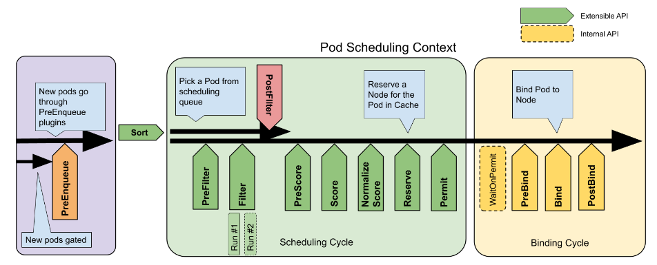

```
本文翻译自 https://github.com/kubernetes/community/blob/master/contributors/devel/sig-scheduling/scheduling_code_hierarchy_overview.md
译者：胡云 Troy
```

# 调度器代码层次结构概述

## 介绍

调度器监视新创建的还没有分配节点的 Pod。当发现这样的 Pod 后，调度器将 Pod 调度到最适合它的节点。一般来说，调度是计算机科学中一个相当广泛的领域，它考虑了各种各样的约束和限制。调度器的每个工作负载可能需要不同的方法来实现最佳调度结果。Kubernetes 项目提供的 kube-scheduler 调度器的目标是以简单为代价提供高吞吐量。为了帮助构建调度器（默认或者定制化）和共享调度逻辑，kube-scheduler 实现了 [调度框架](https://kubernetes.io/docs/concepts/scheduling-eviction/scheduling-framework/)。该框架没有提供构建新调度器的所有部分。组装一个功能齐全的单元仍然需要队列、缓存、调度算法和其他构建元素。本文档旨在描述所有单独的部分是如何组合在一起，以及它们在整个体系结构中的作用，以便开发人员能够快速了解调度器代码。

## 调度 Pod

默认的调度器实例运行无限期的循环，该循环（每次有 Pod 时）负责调用调度逻辑，确保 Pod 分配或重新排队以供后续处理。每个循环由一个阻塞调度周期和一个非阻塞绑定周期组成。调度周期负责运行调度算法，选择最合适的节点分配给 Pod。绑定周期确保 kube-apiserver 及时接收分配给 Pod 的节点。一个 Pod 可以立即绑定，或者在群调度中，等所有同级 Pod 分配节点之后再绑定。

  
*图片来源 [调度框架](https://kubernetes.io/zh-cn/docs/concepts/scheduling-eviction/scheduling-framework/)*

### 调度周期

每个周期遵循以下步骤：
1. 获取下一个调度的 Pod
2. 根据提供的调度算法调度 Pod
3. 如果调度 Pod 时出现 `FitError` 错误，调度器将运行 `PostFilterPlugin` 抢占插件（如果该插件已注册），该插件将指定一个可以运行 Pod 的节点。如果抢占成功，让当前 Pod 知道分配的节点。调度器将处理错误，获取下一个 Pod 并重新开始调度。
4. 如果调度算法找到了合适的节点，则将 Pod 存储到调度器缓存中（`AssumePod` 操作），然后按顺序运行 `Reserve` 和 `Permit` 扩展点插件。任何插件运行失败将结束当前调度周期，增加相关的指标，调度器的 `Error handler` 将处理调度错误。
5. 成功运行所有扩展点后，继续绑定循环。在执行绑定循环的同时，调度周期开始处理下一个调度的 Pod（如果有的话）。

### 绑定周期

按相同顺序运行以下四个步骤：
- 从 `Permit` 扩展点调用插件的 [WaitOnPermit](https://github.com/kubernetes/kubernetes/blob/a651804427dd9a15bb91e1c4fb7a79994e4817a2/pkg/scheduler/scheduler.go#L560) (内部 API)。扩展点的一些插件会发送操作请求去等待相应的条件（例如，等待额外的可用资源或者一组中的所有 Pod 被分配）。`WaitOnPermit` 等待条件满足直到超时。
- 调用 [PreBind](https://github.com/kubernetes/kubernetes/blob/a651804427dd9a15bb91e1c4fb7a79994e4817a2/pkg/scheduler/scheduler.go#L580) 扩展点的插件
- 调用 [Bind](https://github.com/kubernetes/kubernetes/blob/a651804427dd9a15bb91e1c4fb7a79994e4817a2/pkg/scheduler/scheduler.go#L592) 扩展点的插件
- 调用 [PostBind](https://github.com/kubernetes/kubernetes/blob/a651804427dd9a15bb91e1c4fb7a79994e4817a2/pkg/scheduler/scheduler.go#L611) 扩展点的插件

任何扩展点执行失败将调用所有 `Reserve` 插件的 `Unreserve` 操作（例如，为一群 Pod 分配空闲资源）。

## 配置和组装调度器

调度器代码库分散在不同的地方：
- [cmd/kube-scheduler/app](https://github.com/kubernetes/kubernetes/tree/a651804427dd9a15bb91e1c4fb7a79994e4817a2/cmd/kube-scheduler/app)：控制器代码的位置以及 CLI 参数的定义（遵守所有 Kubernetes 控制器的标准设定）
- [pkg/scheduler](https://github.com/kubernetes/kubernetes/tree/a651804427dd9a15bb91e1c4fb7a79994e4817a2/pkg/scheduler)：默认调度器代码库的根目录
- [pkg/scheduler/core](https://github.com/kubernetes/kubernetes/tree/a651804427dd9a15bb91e1c4fb7a79994e4817a2/pkg/scheduler/core)：默认调度算法的位置
- [pkg/scheduler/framework](https://github.com/kubernetes/kubernetes/tree/a651804427dd9a15bb91e1c4fb7a79994e4817a2/pkg/scheduler/framework)：调度框架和插件
- [pkg/scheduler/internal](https://github.com/kubernetes/kubernetes/tree/a651804427dd9a15bb91e1c4fb7a79994e4817a2/pkg/scheduler/internal)：缓存，队列和其它元素的实现
- [staging/src/k8s.io/kube-scheduler](https://github.com/kubernetes/kubernetes/tree/a651804427dd9a15bb91e1c4fb7a79994e4817a2/staging/src/k8s.io/kube-scheduler)：ComponentConfig API 类型的位置
- [test/e2e/scheduling](https://github.com/kubernetes/kubernetes/tree/a651804427dd9a15bb91e1c4fb7a79994e4817a2/test/e2e/scheduling)：调度 e2e
- [test/integration/scheduler](https://github.com/kubernetes/kubernetes/tree/a651804427dd9a15bb91e1c4fb7a79994e4817a2/test/integration/scheduler)：调度集成测试
- [test/integration/scheduler_perf](https://github.com/kubernetes/kubernetes/tree/a651804427dd9a15bb91e1c4fb7a79994e4817a2/test/integration/scheduler_perf)：调度性能基准

### 初始启动配置

`cmd/kube-scheduler/app` 下的代码负责收集调度器配置和调度器初始化逻辑，它是 kube-scheduler 作为 Kubernetes 控制面运行的一部分。代码包括：
- 初始化 [命令行选项](https://github.com/kubernetes/kubernetes/blob/a651804427dd9a15bb91e1c4fb7a79994e4817a2/cmd/kube-scheduler/app/server.go#L96)（以及默认的 `ComponentConfig`） 和 [验证](https://github.com/kubernetes/kubernetes/blob/a651804427dd9a15bb91e1c4fb7a79994e4817a2/cmd/kube-scheduler/app/server.go#L300)
- 初始化 [指标](https://github.com/kubernetes/kubernetes/blob/a651804427dd9a15bb91e1c4fb7a79994e4817a2/cmd/kube-scheduler/app/server.go#L238)，[健康检查](https://github.com/kubernetes/kubernetes/blob/a651804427dd9a15bb91e1c4fb7a79994e4817a2/cmd/kube-scheduler/app/server.go#L268) 和 [其它 handlers](https://github.com/kubernetes/kubernetes/blob/a651804427dd9a15bb91e1c4fb7a79994e4817a2/cmd/kube-scheduler/app/server.go#L225-L236)
- [KubeSchedulerConfiguration](https://github.com/kubernetes/kubernetes/blob/4740173f3378ef9d0dc59b0aa9299444a97d0818/pkg/scheduler/apis/config/types.go#L49-L106) 的读取和默认配置
- 通过插件构建 `registry`（in-tree, [out-of-tree](https://github.com/kubernetes/kubernetes/blob/a651804427dd9a15bb91e1c4fb7a79994e4817a2/cmd/kube-scheduler/app/server.go#L312-L317)）
- 多种选项初始化调度器，例如 [profiles，算法源，pod back off](https://github.com/kubernetes/kubernetes/blob/a651804427dd9a15bb91e1c4fb7a79994e4817a2/cmd/kube-scheduler/app/server.go#L326-L337)，等等。
- 调用 [LogOrWriteConfig](https://github.com/kubernetes/kubernetes/blob/a651804427dd9a15bb91e1c4fb7a79994e4817a2/cmd/kube-scheduler/app/server.go#L342)，用于记录最终调度程序配置以进行调试
- 运行之前，`/configz` [已注册](https://github.com/kubernetes/kubernetes/blob/a651804427dd9a15bb91e1c4fb7a79994e4817a2/cmd/kube-scheduler/app/server.go#L141)，[事件广播程序已启动](https://github.com/kubernetes/kubernetes/blob/a651804427dd9a15bb91e1c4fb7a79994e4817a2/cmd/kube-scheduler/app/server.go#L148)，[领导人选举已启动](https://github.com/kubernetes/kubernetes/blob/a651804427dd9a15bb91e1c4fb7a79994e4817a2/cmd/kube-scheduler/app/server.go#L198-L216)，[server](https://github.com/kubernetes/kubernetes/blob/a651804427dd9a15bb91e1c4fb7a79994e4817a2/cmd/kube-scheduler/app/server.go#L185)（包含所有配置的 handlers 和 [informers](https://github.com/kubernetes/kubernetes/blob/a651804427dd9a15bb91e1c4fb7a79994e4817a2/cmd/kube-scheduler/app/server.go#L192)）已启动。

初始化之后，调度器开始运行。

更详细地说，[Setup](https://github.com/kubernetes/kubernetes/blob/a651804427dd9a15bb91e1c4fb7a79994e4817a2/cmd/kube-scheduler/app/server.go#L299) 函数完成了调度器核心流程的初始化。首先，`Setup` 验证传递的选项（`NewSchedulerCommand()` 中添加的 flags 直接设置在此选项结构的字段上）。如果传递的选项没有引发任何错误，那么它将调用 `opts.Config()`，用于设置最终的内部配置，包括安全服务、领导人选举、客户端，并开始解析与算法源相关的选项（比如，加载配置文件和初始化空 profiles，以及处理不推荐使用的选项像策略配置）。接下来，调用 `c.Complete()` 填充配置 `Config` 中的空值。此时，创建一个空 registry 注册 out-of-tree 插件，在 registry 中为每个插件的 New 函数添加条目。`Registry` 只是插件名称到插件工厂函数的映射。对于默认调度器，注册 registry 这一步什么都不做（因为 `cmd/kube-chuler/scheduler.go` 中的 main 函数不向 `NewSchedulerCommand()` 传递任何信息）。这意味着默认的插件在 `scheduler.New()` 中初始化。

初始化是在调度框架之外执行的，使用框架的用户可以以不同的方式初始化环境来满足自身的需求。例如，模拟器可以通过 informer 注入自身需要的对象。或者自定义的插件可以替换默认的插件。调度框架的已知使用者：
- [cluster-autoscaler](https://github.com/kubernetes/autoscaler/blob/master/cluster-autoscaler/simulator/scheduler_based_predicates_checker.go#L48-L79)
- [cluster-capacity](https://github.com/kubernetes-sigs/cluster-capacity/blob/8e9c2dcf3644cb5f73fca3d35d4e22899c265ad5/pkg/framework/simulator.go#L370-L383)

### 组装调度器

默认调度器实现的目录在 `pkg/scheduler`，调度器的各种元素在这里初始化并组合在一起：
- 默认调度选项，例如 `node percentage`, 初始化和最大 `backoff`, `profiles`
- 调度器缓存和队列
- 实例化调度的 `profiles` 以定制框架，每个 `profile` 可以更好的安置 Pod（每个 profile 定义自身使用的插件集合）
- `Handler` 函数用于获取下一个调度的 Pod（`NextPod`）和处理错误（`Error`）

在创建调度器实例的过程中，将执行以下步骤：
- 初始化调度器 [缓存](https://github.com/kubernetes/kubernetes/blob/a651804427dd9a15bb91e1c4fb7a79994e4817a2/pkg/scheduler/scheduler.go#L206)
- [合并](https://github.com/kubernetes/kubernetes/blob/a651804427dd9a15bb91e1c4fb7a79994e4817a2/pkg/scheduler/scheduler.go#L208-L211) 带插件的 `in-tree` 和 `out-of-tree` 注册表
- `Metrics` [已注册](https://github.com/kubernetes/kubernetes/blob/a651804427dd9a15bb91e1c4fb7a79994e4817a2/pkg/scheduler/scheduler.go#L232)
- [配置器](https://github.com/kubernetes/kubernetes/blob/a651804427dd9a15bb91e1c4fb7a79994e4817a2/pkg/scheduler/scheduler.go#L215-L230) 构建调度器实例（连接缓存，插件注册表，调度算法和其它元素）
- [注册](https://github.com/kubernetes/kubernetes/blob/a651804427dd9a15bb91e1c4fb7a79994e4817a2/pkg/scheduler/scheduler.go#L273) `Event handlers` 以允许调度器对 PV、PVC、服务和其它与调度相关的资源的更新做出反应（最终，每个插件都将定义一组事件，并对其作出反应，更详细的可参考 [kubernetes/kubernetes#100347](https://github.com/kubernetes/kubernetes/issues/100347)）。

下图表明了初始化后各个元素是如何连接在一起的。`Event handlers` 确保 Pod 在 [调度队列中排队](https://github.com/kubernetes/community/blob/master/contributors/devel/sig-scheduling/scheduler_queues.md)，缓存随 Pod 和节点的更新而更新（提供最新的快照 snapshot）。调度框架有对应的调度算法和绑定周期（每个框架实例有自己的 `profile`）。


#### 调度框架

调度器的框架代码目前位于 `pkg/scheduler/framework` 下。它包含 [各种插件](https://github.com/kubernetes/kubernetes/tree/a651804427dd9a15bb91e1c4fb7a79994e4817a2/pkg/scheduler/framework/plugins)，负责过滤和评分节点（以及其他）。常常用作调度算法的构建模块。

当 [插件初始化](https://github.com/kubernetes/kubernetes/blob/4740173f3378ef9d0dc59b0aa9299444a97d0818/pkg/scheduler/framework/runtime/framework.go#L310) 后，它会传递一个 [框架 handler](https://github.com/kubernetes/kubernetes/blob/4740173f3378ef9d0dc59b0aa9299444a97d0818/pkg/scheduler/framework/runtime/framework.go#L251-L264)，该框架 handler 提供访问和/或操作 pod、节点、clientset、事件记录器和每个插件实现其功能所需的其他 handler 的接口。

#### 调度缓存

缓存负责记录集群的最新状态。保存节点和 assumed Pod 以及 Pod 和 images 的状态。缓存提供了协调 Pod 和节点对象（调用 event handlers）的方法，使集群的状态保持最新。允许在每个调度周期开始时使用最新状态（在运行调度算法时固定集群状态）更新集群的快照。

缓存还允许运行假定的操作，该操作将 Pod 临时存储在缓存中，使得 Pod 看起来像已经在快照的所有消费者的指定节点上运行那样。假定操作忽视了 kube-apiserver 和 Pod 实际更新的时间，从而增加调度器的吞吐量。

以下操作使用假定的 Pod 进行操作：
- `AssumePod`：用于通知调度算法找到可行的节点，以便在当前 Pod 进入绑定周期时可以调度下一个 Pod
- `FinishBinding`：用于发出绑定完成的信号，以便可以将 Pod 从假定 Pod 列表中删除
- `ForgetPod`：从假定的 Pod 列表中删除 Pod，用于绑定周期中未能成功处理 Pod 的情况（例如，`Reserve`，`Permit`，`PreBind` 或者 `Bind` 评估）

缓存跟踪以下三个指标：
- `scheduler_cache_size_assumed_pods`：在假定 Pod 列表中的 Pod 数量
- `scheduler_cache_size_pods`：在缓存中的 Pod 数量
- `scheduler_cache_size_nodes`：在缓存中的节点数量

#### 快照

[快照](https://github.com/kubernetes/kubernetes/blob/a651804427dd9a15bb91e1c4fb7a79994e4817a2/pkg/scheduler/internal/cache/snapshot.go) 捕获集群的状态，其中包含集群中所有节点和每个节点上对象的信息。即节点对象、分配在每个节点上的 Pod、每个节点上所有 Pod 的请求资源、节点的可分配资源、拉取的镜像以及做出调度决策所需的其他信息。每次调度 Pod 时，都会捕获集群当前状态的快照。这样是为了避免在处理插件时更改 Pod 或节点时导致的数据不一致，因为一些插件可能会获得不同的集群状态。

#### 配置器

[配置器](https://github.com/kubernetes/kubernetes/blob/a651804427dd9a15bb91e1c4fb7a79994e4817a2/pkg/scheduler/factory.go#L90) 通过将插件、缓存、队列、handlers 和其他元素连接在一起来构建调度器实例。每个 profile 都使用自己的框架（所有框架共享 informers，event recorders 等）进行 [初始化](https://github.com/kubernetes/kubernetes/blob/a651804427dd9a15bb91e1c4fb7a79994e4817a2/pkg/scheduler/factory.go#L138-L147)。

也可以让配置器根据 [策略文件](https://github.com/kubernetes/kubernetes/blob/a651804427dd9a15bb91e1c4fb7a79994e4817a2/pkg/scheduler/factory.go#L213) 创建实例。不过，这种方法已被弃用，最终将从配置中删除。只保留调度器配置作为提供给配置器配置的唯一方式。

#### 默认调度算法

代码库定义了 [ScheduleAlgorithm](https://github.com/kubernetes/kubernetes/blob/a651804427dd9a15bb91e1c4fb7a79994e4817a2/pkg/scheduler/core/generic_scheduler.go#L61-L66) 接口。任何该接口的实现都可以用作调度算法。这里有两种方法：
- `Schedule`：负责使用从 `PreFilter` 到 `NormalizeScore` 扩展点的插件来调度 Pod，提供包含调度决策（最合适的节点）和附带信息的 [ScheduleResult](https://github.com/kubernetes/kubernetes/blob/a651804427dd9a15bb91e1c4fb7a79994e4817a2/pkg/scheduler/core/generic_scheduler.go#L70-L77)，其中附带信息包括评估了多少节点以及发现有多少节点可用于调度。
- `Extenders`: 当前仅用于测试

默认算法实现的每个周期包括：
1. 从调度缓存中获取 [当前快照](https://github.com/kubernetes/kubernetes/blob/a651804427dd9a15bb91e1c4fb7a79994e4817a2/pkg/scheduler/core/generic_scheduler.go#L101)
2. [过滤掉所有无法调度 Pod 的节点](https://github.com/kubernetes/kubernetes/blob/a651804427dd9a15bb91e1c4fb7a79994e4817a2/pkg/scheduler/core/generic_scheduler.go#L110)
   - 运行 [PreFilter 插件](https://github.com/kubernetes/kubernetes/blob/a651804427dd9a15bb91e1c4fb7a79994e4817a2/pkg/scheduler/core/generic_scheduler.go#L230)（预处理阶段，例如计算 Pod 亲和性关系）
   - 并行运算 `Filter 插件`：过滤掉不满足 Pod 限制条件（例如资源，节点亲和性等）的节点，包括运行 `Filter 扩展器`
   - 运行 `PostFilter 插件` 如果没有节点满足要调度的 Pod
3. 在 Pod 至少有两个可行节点可以调度的情况下，运行 [scoring 插件](https://github.com/kubernetes/kubernetes/blob/a651804427dd9a15bb91e1c4fb7a79994e4817a2/pkg/scheduler/core/generic_scheduler.go#L133)：
   - 运行 [PreScore 插件](https://github.com/kubernetes/kubernetes/blob/a651804427dd9a15bb91e1c4fb7a79994e4817a2/pkg/scheduler/core/generic_scheduler.go#L427)（预处理阶段）
   - 并行运行 [Score 插件](https://github.com/kubernetes/kubernetes/blob/a651804427dd9a15bb91e1c4fb7a79994e4817a2/pkg/scheduler/core/generic_scheduler.go#L433)：每个节点都有一个分数向量（每个坐标对应一个插件）
   - 运行 [NormalizeScore 插件](https://github.com/kubernetes/kubernetes/blob/a651804427dd9a15bb91e1c4fb7a79994e4817a2/pkg/scheduler/framework/runtime/framework.go#L798)：给所有插件打分，间隔为 [0, 100]
   - 计算每个节点的 [权重分数](https://github.com/kubernetes/kubernetes/blob/a651804427dd9a15bb91e1c4fb7a79994e4817a2/pkg/scheduler/framework/runtime/framework.go#L810-L828) (每个分数插件都可以分配一个权重，指示其分数在多大程度上优于其他插件)
   - 运行 [打分扩展器](https://github.com/kubernetes/kubernetes/blob/a651804427dd9a15bb91e1c4fb7a79994e4817a2/pkg/scheduler/core/generic_scheduler.go#L456)，并且将分数计入每个节点的总分
4. [选择](https://github.com/kubernetes/kubernetes/blob/a651804427dd9a15bb91e1c4fb7a79994e4817a2/pkg/scheduler/core/generic_scheduler.go#L138) 并 [返回](https://github.com/kubernetes/kubernetes/blob/a651804427dd9a15bb91e1c4fb7a79994e4817a2/pkg/scheduler/core/generic_scheduler.go#L141-L145) 得分最高的节点。如果只有一个可供调度的节点则跳过 `Prescore`，`Score` 和 `NormalizeScore` 扩展点，并且立即返回调度的节点。如果没有可供调度的节点，将结果返回给调度器。

值得注意的是：
- 如果插件提供 `score normalization`，当调用 [ScoreExtensions()](https://github.com/kubernetes/kubernetes/blob/a651804427dd9a15bb91e1c4fb7a79994e4817a2/pkg/scheduler/framework/plugins/podtopologyspread/scoring.go#L254-L256) 时，插件需要返回非 nil 

