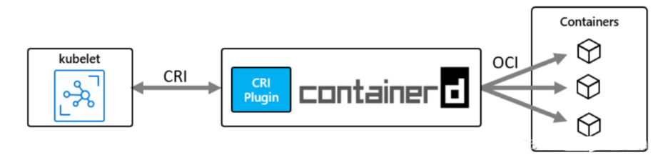

# 0. 前言

[Kubernetes:kubelet 源码分析之 pod 创建流程 ](https://www.cnblogs.com/xingzheanan/p/18202067) 介绍了 `kubelet` 创建 pod 的流程，[containerd 源码分析：kubelet 和 containerd 交互 
](https://www.cnblogs.com/xingzheanan/p/18206781) 介绍了 `kubelet` 通过 cri 接口和 `containerd` 交互的过程，[containerd 源码分析：启动注册流程 ](https://www.cnblogs.com/xingzheanan/p/18204637) 介绍了 `containerd` 作为高级容器运行时的启动流程。通过这三篇文章熟悉了 `kubelet` 和 `containerd` 的行为，对于 `containerd` 如何通过 OCI 接口创建容器 `container` 并没有涉及。



本文将继续介绍 `containerd` 是如何创建容器 `container` 的。

# 1. ctr

在介绍创建容器前，首先简单介绍下 `ctr`。`ctr` 是 `containerd` 的命令行客户端，本文会通过 `ctr` 进行调试和分析。

## 1.1 ctr CLI

作为命令行工具 ctr 包括一系列和 `containerd` 交互的命令。主要命令如下：
```
COMMANDS:
   plugins, plugin            provides information about containerd plugins
   containers, c, container   manage containers
   images, image, i           manage images
   run                        run a container
   snapshots, snapshot        manage snapshots
   tasks, t, task             manage tasks
   install                    install a new package
   oci                        OCI tools
   shim                       interact with a shim directly
```

**containers|c|container**

不同与 Kubernetes 层面的 `container`，这里 `ctr` 命令管理的 `containers` 实际是管理存储在 [boltDB](https://github.com/boltdb/bolt) 中的 container metadata。 

创建 `container`：
```
# ctr c create docker.io/library/nginx:alpine nginx1
# ctr c ls
CONTAINER    IMAGE                             RUNTIME
nginx1       docker.io/library/nginx:alpine    io.containerd.runc.v2
```

通过 `boltbrowser` 查看 `boltDB` 存储的 container metadata，container metadata 存储在目录 `/var/lib/containerd/io.containerd.metadata.v1.bolt`。


**tasks|t|task**

task 是实际启动容器进程的命令，`ctr task start` 根据创建的 container 启动容器：
```
# ctr t start nginx1
/docker-entrypoint.sh: /docker-entrypoint.d/ is not empty, will attempt to perform configuration
/docker-entrypoint.sh: Looking for shell scripts in /docker-entrypoint.d/
...
```

**run**

ctr 的 run 命令，实际是 `ctr c create` 和 `ctr t start` 命令的组合。

接下来，使用 `ctr run` 命令做为调试参数分析完整的创建 container 容器的流程。

## 1.2 ctr 调试

`ctr` 代码集中在 `containerd` 项目中，配置 `ctr` 的调试参数：
```
{
   "version": "0.2.0",
   "configurations": [
      {
         "name": "ctr",
         "type": "go",
         "request": "launch",
         "mode": "auto",
         "program": "${fileDirname}",
         "args": ["run", "docker.io/library/nginx:alpine", "nginx1"]
      }
   ]
}
```

调试 `ctr`：  


进入 `run.Command` 看其中做了什么。  
```
// containerd/cmd/ctr/commands/run/run.go
// Command runs a container
var Command = &cli.Command{
	Name:      "run",
	Usage:     "Run a container",
   ...
   Action: func(context *cli.Context) error {
      ...
      // step1: 创建访问 containerd 的 client
      client, ctx, cancel, err := commands.NewClient(context)
		if err != nil {
			return err
		}
		defer cancel()

      // step2: 创建 container
      container, err := NewContainer(ctx, client, context)
		if err != nil {
			return err
		}
      ...

      opts := tasks.GetNewTaskOpts(context)
		ioOpts := []cio.Opt{cio.WithFIFODir(context.String("fifo-dir"))}
      // step3: 创建 task
		task, err := tasks.NewTask(ctx, client, container, context.String("checkpoint"), con, context.Bool("null-io"), context.String("log-uri"), ioOpts, opts...)
		if err != nil {
			return err
		}

      ...
      // step4: 启动 task
      if err := task.Start(ctx); err != nil {
			return err
		}
      ...
   }
}
```

在 `NewContainer` 中根据 `client` 创建 container。接着根据 container 创建 task，然后启动该 task 来启动容器。

### 1.2.1 创建 container

进入 `NewContainer`：  
```
// containerd/cmd/ctr/commands/run/run_unix.go
func NewContainer(ctx gocontext.Context, client *containerd.Client, context *cli.Context) (containerd.Container, error) {
   ...
   return client.NewContainer(ctx, id, cOpts...)
}

// containerd/client/client.go
func (c *Client) NewContainer(ctx context.Context, id string, opts ...NewContainerOpts) (Container, error) {
   ...
   container := containers.Container{
		ID: id,
		Runtime: containers.RuntimeInfo{
			Name: c.runtime,
		},
	}
   ...
   // 调用 containerd 接口创建 container
   r, err := c.ContainerService().Create(ctx, container)
	if err != nil {
		return nil, err
	}
	return containerFromRecord(c, r), nil
}
```

重点在 `Client.ContainerService().Create`：  
```
// containerd/client/containerstore.go
func (r *remoteContainers) Create(ctx context.Context, container containers.Container) (containers.Container, error) {
	created, err := r.client.Create(ctx, &containersapi.CreateContainerRequest{
		Container: containerToProto(&container),
	})
	if err != nil {
		return containers.Container{}, errdefs.FromGRPC(err)
	}

	return containerFromProto(created.Container), nil
}

// containerd/api/services/containers/v1/containers_grpc.pb.go
func (c *containersClient) Create(ctx context.Context, in *CreateContainerRequest, opts ...grpc.CallOption) (*CreateContainerResponse, error) {
	out := new(CreateContainerResponse)
	err := c.cc.Invoke(ctx, "/containerd.services.containers.v1.Containers/Create", in, out, opts...)
	if err != nil {
		return nil, err
	}
	return out, nil
}
```

调用 `/containerd.services.containers.v1.Containers/Create` grpc 接口创建 container。container 并不是容器进程，而是存储在数据库中的 container metadata。

`/containerd.services.containers.v1.Containers/Create` 是由 `containerd` 的 `io.containerd.grpc.v1.containers` 插件提供的服务： 
```
// containerd/plugins/services/service.go
func (s *service) Create(ctx context.Context, req *api.CreateContainerRequest) (*api.CreateContainerResponse, error) {
	return s.local.Create(ctx, req)
}
```

插件实例调用 `local` 对象的 `Create` 方法创建 container。查看 `local` 对象具体指的什么。
```
// containerd/plugins/services/service.go
func init() {
	registry.Register(&plugin.Registration{
		Type: plugins.GRPCPlugin,
		ID:   "containers",
		Requires: []plugin.Type{
			plugins.ServicePlugin,
		},
		InitFn: func(ic *plugin.InitContext) (interface{}, error) {
         // plugins.ServicePlugin：io.containerd.service.v1
         // services.ContainersService：containers-service
			i, err := ic.GetByID(plugins.ServicePlugin, services.ContainersService)
			if err != nil {
				return nil, err
			}
			return &service{local: i.(api.ContainersClient)}, nil
		},
	})
}
```

`local` 对象是 `containerd` 的 `io.containerd.service.v1.containers-service` 插件的实例。查看该实例的 `Create` 方法。  
```
// containerd/plugins/services/containers/local.go
func (l *local) Create(ctx context.Context, req *api.CreateContainerRequest, _ ...grpc.CallOption) (*api.CreateContainerResponse, error) {
	var resp api.CreateContainerResponse

	if err := l.withStoreUpdate(ctx, func(ctx context.Context) error {
		container := containerFromProto(req.Container)

		created, err := l.Store.Create(ctx, container)
		if err != nil {
			return err
		}

		resp.Container = containerToProto(&created)

		return nil
	}); err != nil {
		return &resp, errdefs.ToGRPC(err)
	}
	...

	return &resp, nil
}
```

`local.Create` 调用 `local.withStoreUpdate` 方法创建 container。
```
// containerd/plugins/services/containers/local.go
func (l *local) withStoreUpdate(ctx context.Context, fn func(ctx context.Context) error) error {
	return l.db.Update(l.withStore(ctx, fn))
}
```

`local.withStoreUpdate` 调用 `db` 对象的 `Update` 方法创建 container。
```
// containerd/plugins/services/containers/local.go
func init() {
	registry.Register(&plugin.Registration{
		...
		InitFn: func(ic *plugin.InitContext) (interface{}, error) {
			m, err := ic.GetSingle(plugins.MetadataPlugin)
			if err != nil {
				return nil, err
			}
			ep, err := ic.GetSingle(plugins.EventPlugin)
			if err != nil {
				return nil, err
			}

			db := m.(*metadata.DB)
			return &local{
				Store:     metadata.NewContainerStore(db),
				db:        db,
				publisher: ep.(events.Publisher),
			}, nil
		},
	})
}
```

`db` 对象是 `io.containerd.metadata.v1` 插件的实例，该插件通过 `boltDB` 提供 metadata 存储服务。

metadata 插件实际调用的是匿名函数 fn 的内容，在 fn 中通过 `l.Store.Create(ctx, container)` 将 container 的 metadata 信息注册到 `boltDB` 数据库中。

创建 container 的过程实际是将 container 信息注册到 boltDB 的过程。

### 1.2.2 创建容器进程

创建 container 成功后，接着创建 task, task 将根据 container metadata 创建容器进程。

#### 1.2.2.1 创建 task

进入 `tasks.Newtask` 创建 task：  
```
// containerd/cmd/ctr/commands/tasks/tasks_unix.go
func NewTask(ctx gocontext.Context, client *containerd.Client, container containerd.Container, checkpoint string, con console.Console, nullIO bool, logURI string, ioOpts []cio.Opt, opts ...containerd.NewTaskOpts) (containerd.Task, error) {
   ...
   t, err := container.NewTask(ctx, ioCreator, opts...)
	if err != nil {
		return nil, err
	}
   ...
}

// containerd/client/container.go
func (c *container) NewTask(ctx context.Context, ioCreate cio.Creator, opts ...NewTaskOpts) (_ Task, err error) {
   ...
   t := &task{
		client: c.client,
		io:     i,
		id:     c.id,
		c:      c,
	}
	...
	response, err := c.client.TaskService().Create(ctx, request)
	if err != nil {
		return nil, errdefs.FromGRPC(err)
	}
	t.pid = response.Pid
	return t, nil
}
```

类似创建 container，这里调用 `container.client.TaskService().Create` 创建 task：  
```
// containerd/api/services/tasks/v1/tasks_grpc.pg.go
func (c *tasksClient) Create(ctx context.Context, in *CreateTaskRequest, opts ...grpc.CallOption) (*CreateTaskResponse, error) {
	out := new(CreateTaskResponse)
	err := c.cc.Invoke(ctx, "/containerd.services.tasks.v1.Tasks/Create", in, out, opts...)
	if err != nil {
		return nil, err
	}
	return out, nil
}
```

调用 `/containerd.services.tasks.v1.Tasks/Create` grpc 接口创建 task。查看 containerd 中提供该服务的插件。  
```
// containerd/plugins/services/tasks/service.go
func init() {
	registry.Register(&plugin.Registration{
		Type: plugins.GRPCPlugin,
		ID:   "tasks",
		Requires: []plugin.Type{
			plugins.ServicePlugin,
		},
		InitFn: func(ic *plugin.InitContext) (interface{}, error) {
			// plugins.ServicePlugin: io.containerd.service.v1
			// services.TasksService: tasks-service
			i, err := ic.GetByID(plugins.ServicePlugin, services.TasksService)
			if err != nil {
				return nil, err
			}
			return &service{local: i.(api.TasksClient)}, nil
		},
	})
}
```

containerd 中提供该服务的是 `io.containerd.grpc.v1.tasks` 插件。调用插件对象 `service` 的 `Create` 方法创建 task：
```
// containerd/plugins/services/tasks/service.go
func (s *service) Create(ctx context.Context, r *api.CreateTaskRequest) (*api.CreateTaskResponse, error) {
	return s.local.Create(ctx, r)
}
```

`service` 调用 `local` 对象的 `Create` 方法创建 task。`local` 是 `io.containerd.service.v1.tasks-service` 插件的实例化对象：
```
// containerd/plugins/services/tasks/local.go
func init() {
	registry.Register(&plugin.Registration{
		Type:     plugins.ServicePlugin,
		ID:       services.TasksService,
		Requires: tasksServiceRequires,
		Config:   &Config{},
		InitFn:   initFunc,
	})

	timeout.Set(stateTimeout, 2*time.Second)
}

func initFunc(ic *plugin.InitContext) (interface{}, error) {
	config := ic.Config.(*Config)

	// plugins.RuntimePluginV2: io.containerd.runtime.v2
	v2r, err := ic.GetByID(plugins.RuntimePluginV2, "task")
	if err != nil {
		return nil, err
	}

	// plugins.MetadataPlugin: io.containerd.metadata.v1
	m, err := ic.GetSingle(plugins.MetadataPlugin)
	if err != nil {
		return nil, err
	}
	...
	db := m.(*metadata.DB)
	l := &local{
		containers: metadata.NewContainerStore(db),
		store:      db.ContentStore(),
		publisher:  ep.(events.Publisher),
		monitor:    monitor.(runtime.TaskMonitor),
		v2Runtime:  v2r.(runtime.PlatformRuntime),
	}
	...
}
```

进入 `local.Create`：
```
// containerd/plugins/services/tasks/local.go
func (l *local) Create(ctx context.Context, r *api.CreateTaskRequest, _ ...grpc.CallOption) (*api.CreateTaskResponse, error) {
	// 从 boltDB 中获取 container metadata
	container, err := l.getContainer(ctx, r.ContainerID)
	if err != nil {
		return nil, errdefs.ToGRPC(err)
	}
	...
	rtime := l.v2Runtime
	...
	c, err := rtime.Create(ctx, r.ContainerID, opts)
	if err != nil {
		return nil, errdefs.ToGRPC(err)
	}
	...
}
```

`local.Create` 首先获取 `boltDB` 中的 container 信息， 接着调用 `local.v2Runtime.Create` 创建 task。v2Runtime 是 `io.containerd.runtime.v2.task` 插件的实例：
```
// containerd/core/runtime/v2/manager.go
func init() {
	registry.Register(&plugin.Registration{
		Type: plugins.RuntimePluginV2,
		ID:   "task",
		...
		InitFn: func(ic *plugin.InitContext) (interface{}, error) {
			...
			// 获取 metadata 插件的实例
			m, err := ic.GetSingle(plugins.MetadataPlugin)
			if err != nil {
				return nil, err
			}
			...
			cs := metadata.NewContainerStore(m.(*metadata.DB))
			ss := metadata.NewSandboxStore(m.(*metadata.DB))
			events := ep.(*exchange.Exchange)

			shimManager, err := NewShimManager(ic.Context, &ManagerConfig{
				Root:         ic.Properties[plugins.PropertyRootDir],
				State:        ic.Properties[plugins.PropertyStateDir],
				Address:      ic.Properties[plugins.PropertyGRPCAddress],
				TTRPCAddress: ic.Properties[plugins.PropertyTTRPCAddress],
				Events:       events,
				Store:        cs,
				SchedCore:    config.SchedCore,
				SandboxStore: ss,
			})
			if err != nil {
				return nil, err
			}

			return NewTaskManager(shimManager), nil
		},
		...
	})
}

func NewShimManager(ctx context.Context, config *ManagerConfig) (*ShimManager, error) {
	...
	m := &ShimManager{
		root:                   config.Root,
		state:                  config.State,
		containerdAddress:      config.Address,
		containerdTTRPCAddress: config.TTRPCAddress,
		shims:                  runtime.NewNSMap[ShimInstance](),
		events:                 config.Events,
		containers:             config.Store,
		schedCore:              config.SchedCore,
		sandboxStore:           config.SandboxStore,
	}
	...
	return m, nil
}

func NewTaskManager(shims *ShimManager) *TaskManager {
	return &TaskManager{
		manager: shims,
	}
}
```

`io.containerd.runtime.v2.task` 插件的实例是 `TaskManger`，其中包括 shims（垫片）。调用 `local.v2Runtime.Create` 实际调用的是 `TaskManager.Create`：
```
// containerd/core/runtime/v2/manager.go
func (m *TaskManager) Create(ctx context.Context, taskID string, opts runtime.CreateOpts) (runtime.Task, error) {
	// step1: 创建 shim
	shim, err := m.manager.Start(ctx, taskID, opts)
	if err != nil {
		return nil, fmt.Errorf("failed to start shim: %w", err)
	}

	// step2：new shim task
	shimTask, err := newShimTask(shim)
	if err != nil {
		return nil, err
	}

	// step3: 创建 task
	t, err := shimTask.Create(ctx, opts)
	if err != nil {
		...
	}

	return t, nil
}
```

首先，调用 `TaskManager.manager.Start` 启动 shim：
```
// containerd/core/runtime/v2/manager.go
func (m *ShimManager) Start(ctx context.Context, id string, opts runtime.CreateOpts) (_ ShimInstance, retErr error) {
	// 创建 bundle，bundle 是包含 shim 信息的对象
	bundle, err := NewBundle(ctx, m.root, m.state, id, opts.Spec)
	if err != nil {
		return nil, err
	}
	...
	// 启动 shim
	shim, err := m.startShim(ctx, bundle, id, opts)
	if err != nil {
		return nil, err
	}
	...
	// 将启动的 shim 添加到 TaskManager 的 shims 中
	if err := m.shims.Add(ctx, shim); err != nil {
		return nil, fmt.Errorf("failed to add task: %w", err)
	}
	...
}
```

进入 `ShimManager.startShim` 查看启动 shim 的逻辑：
```
// containerd/core/runtime/v2/manager.go
func (m *ShimManager) startShim(ctx context.Context, bundle *Bundle, id string, opts runtime.CreateOpts) (*shim, error) {
	...
	// 启动 shim 的 binary 对象
	b := shimBinary(bundle, shimBinaryConfig{
		runtime:      runtimePath,
		address:      m.containerdAddress,
		ttrpcAddress: m.containerdTTRPCAddress,
		schedCore:    m.schedCore,
	})
	// binary 对象启动 shim
	shim, err := b.Start(ctx, protobuf.FromAny(topts), func() {
		...
	})
	...
}

// containerd/core/runtime/v2/binary.go
func (b *binary) Start(ctx context.Context, opts *types.Any, onClose func()) (_ *shim, err error) {
	...
	cmd, err := client.Command(
		ctx,
		&client.CommandConfig{
			// runtime: /usr/bin/containerd-shim-runc-v2
			Runtime:      b.runtime,
			Address:      b.containerdAddress,
			TTRPCAddress: b.containerdTTRPCAddress,
			Path:         b.bundle.Path,
			Opts:         opts,
			Args:         args,
			SchedCore:    b.schedCore,
		})
	if err != nil {
		return nil, err
	}
	...
	out, err := cmd.CombinedOutput()
	if err != nil {
		return nil, fmt.Errorf("%s: %w", out, err)
	}
	...
}
```

shim 通过命令行执行二进制文件的方式，启动 container 对应的 runtime `/usr/bin/containerd-shim-runc-v2`。查看启动的 shim：
```
# ps -ef | grep nginx1
root     4144414 4144319  0 10:20 ?        00:00:00 /root/go/src/containerd/cmd/ctr/__debug_bin3399182742 run docker.io/library/nginx:alpine nginx1
root     4147233       1  0 10:49 ?        00:00:00 /usr/bin/containerd-shim-runc-v2 -namespace default -id nginx1 -address /run/containerd/containerd.sock
```

启动的 shim 进程为 4147233，其父进程是 root（1）进程。

shim 提供 ttrpc 服务，负责和 containerd 进行通信：


`TaskManager.manager.Start` 启动了 shim。接着在 `TaskManager.Create` 中调用 `newShimTask` 实例化 task。
```
// containerd/core/runtime/v2/shim.go
func newShimTask(shim ShimInstance) (*shimTask, error) {
	taskClient, err := NewTaskClient(shim.Client(), shim.Version())
	if err != nil {
		return nil, err
	}

	return &shimTask{
		ShimInstance: shim,
		task:         taskClient,
	}, nil
}

// containerd/core/runtime/v2/bridge.go
func NewTaskClient(client interface{}, version int) (TaskServiceClient, error) {
	switch c := client.(type) {
	case *ttrpc.Client:
		switch version {
		case 2:
			return &ttrpcV2Bridge{client: v2.NewTaskClient(c)}, nil
		case 3:
			return v3.NewTTRPCTaskClient(c), nil
		default:
			return nil, fmt.Errorf("containerd client supports only v2 and v3 TTRPC task client (got %d)", version)
		}

	...
	}
}
```

task 包括和 shim 连接的 client `ttrpcV2Bridge`，它们通过 ttrpc 建立连接。

继续在 `TaskManager.Create` 中调用 `shimTask.Create` ：
```
// containerd/core/runtime/v2/shim.go
func (s *shimTask) Create(ctx context.Context, opts runtime.CreateOpts) (runtime.Task, error) {
	...
	request := &task.CreateTaskRequest{
		ID:         s.ID(),
		Bundle:     s.Bundle(),
		Stdin:      opts.IO.Stdin,
		Stdout:     opts.IO.Stdout,
		Stderr:     opts.IO.Stderr,
		Terminal:   opts.IO.Terminal,
		Checkpoint: opts.Checkpoint,
		Options:    protobuf.FromAny(topts),
	}
	...
	_, err := s.task.Create(ctx, request)
	if err != nil {
		return nil, errdefs.FromGRPC(err)
	}

	return s, nil
}
```

进入 `shimTask.task.Create`：
```
// containerd/core/runtime/v2/bridge.go
func (b *ttrpcV2Bridge) Create(ctx context.Context, request *api.CreateTaskRequest) (*api.CreateTaskResponse, error) {
	resp, err := b.client.Create(ctx, &v2.CreateTaskRequest{
		ID:               request.GetID(),
		Bundle:           request.GetBundle(),
		Rootfs:           request.GetRootfs(),
		Terminal:         request.GetTerminal(),
		Stdin:            request.GetStdin(),
		Stdout:           request.GetStdout(),
		Stderr:           request.GetStderr(),
		Checkpoint:       request.GetCheckpoint(),
		ParentCheckpoint: request.GetParentCheckpoint(),
		Options:          request.GetOptions(),
	})

	return &api.CreateTaskResponse{Pid: resp.GetPid()}, err
}

// containerd/api/runtime/task/v2/shim_ttrpc.pb.go
func (c *taskClient) Create(ctx context.Context, req *CreateTaskRequest) (*CreateTaskResponse, error) {
	var resp CreateTaskResponse
	if err := c.client.Call(ctx, "containerd.task.v2.Task", "Create", req, &resp); err != nil {
		return nil, err
	}
	return &resp, nil
}
```

`taskClient.Create` 调用 shim 的 `containerd.task.v2.Task.Create` ttrpc 创建 task。

##### 1.2.2.1.1 containerd-shim-runc-v2 和 Runc

`containerd.task.v2.Task.Create` 是由 `containerd-shim-runc-v2` 提供的 ttrpc 服务。其服务实例是 `containerd-shim-runc-v2` 下的 `service` 对象：
```
// containerd/cmd/containerd-shim-runc-v2/task/service.go
// Create a new initial process and container with the underlying OCI runtime
func (s *service) Create(ctx context.Context, r *taskAPI.CreateTaskRequest) (_ *taskAPI.CreateTaskResponse, err error) {
	...
	container, err := runc.NewContainer(ctx, s.platform, r)
	if err != nil {
		return nil, err
	}
	...
}
```

`service.Create` 调用 `runc.NewContainer` 实例化容器。`runc` 是实际创建容器的低级运行时。进入 `runc.NewContainer`：  
```
// containerd/cmd/containerd-shim-runc-v2/runc/container.go
// NewContainer returns a new runc container
func NewContainer(ctx context.Context, platform stdio.Platform, r *task.CreateTaskRequest) (_ *Container, retErr error) {
	...
	// runc init 进程，runc init 进程负责启动容器进程
	p, err := newInit(
		ctx,
		r.Bundle,
		filepath.Join(r.Bundle, "work"),
		ns,
		platform,
		config,
		opts,
		rootfs,
	)

	...
	// 创建容器
	if err := p.Create(ctx, config); err != nil {
		return nil, errdefs.ToGRPC(err)
	}
	container := &Container{
		ID:              r.ID,
		Bundle:          r.Bundle,
		process:         p,
		processes:       make(map[string]process.Process),
		reservedProcess: make(map[string]struct{}),
	}
	...
}
```

在 `Init.Create` 中调用低级运行时 `runc` 创建启动容器的 init 进程。  
```
// containerd/cmd/containerd-shim-runc-v2/process/init.go
func (p *Init) Create(ctx context.Context, r *CreateConfig) error {
	...
	if err := p.runtime.Create(ctx, r.ID, r.Bundle, opts); err != nil {
		return p.runtimeError(err, "OCI runtime create failed")
	}
	...
}

// containerd/vendor/github.com/containerd/go-runc/runc.go
// Create creates a new container and returns its pid if it was created successfully
func (r *Runc) Create(context context.Context, id, bundle string, opts *CreateOpts) error {
	...
	cmd := r.command(context, append(args, id)...)
	if opts.IO != nil {
		opts.Set(cmd)
	}
	...
	// Runc.startCommand 执行 runc 命令创建容器
	ec, err := r.startCommand(cmd)
	...
}
```

在 `Runc.startCommand` 中执行 `runc init` 命令创建启动容器的 init 进程：
```
# ps -ef | grep 120376
root      120376       1  0 14:25 ?        00:00:00 /usr/bin/containerd-shim-runc-v2 -namespace default -id nginx1 -address /run/containerd/containerd.sock
root      120396  120376  0 14:25 ?        00:00:00 runc init
```

#### 1.2.2.2 启动 task

上节介绍了创建 task，task 创建之后将返回 response 给 ctr。接着，ctr 调用 `task.Start` 启动容器。 
```
// containerd/client/task.go
func (t *task) Start(ctx context.Context) error {
	r, err := t.client.TaskService().Start(ctx, &tasks.StartRequest{
		ContainerID: t.id,
	})
	if err != nil {
		...
	}
	t.pid = r.Pid
	return nil
}

// containerd/api/services/tasks/v1/tasks_grpc.pb.go
func (c *tasksClient) Start(ctx context.Context, in *StartRequest, opts ...grpc.CallOption) (*StartResponse, error) {
	out := new(StartResponse)
	err := c.cc.Invoke(ctx, "/containerd.services.tasks.v1.Tasks/Start", in, out, opts...)
	if err != nil {
		return nil, err
	}
	return out, nil
}
```

`ctr` 调用 `contaienrd` 的 `/containerd.services.tasks.v1.Tasks/Start` 接口创建 task。进入 containerd 查看提供该服务的插件：
```
// containerd/plugins/services/tasks/service.go
func (s *service) Start(ctx context.Context, r *api.StartRequest) (*api.StartResponse, error) {
	return s.local.Start(ctx, r)
}

// containerd/plugins/services/tasks/local.go
func (l *local) Start(ctx context.Context, r *api.StartRequest, _ ...grpc.CallOption) (*api.StartResponse, error) {
	t, err := l.getTask(ctx, r.ContainerID)
	if err != nil {
		return nil, err
	}
	p := runtime.Process(t)
	if r.ExecID != "" {
		if p, err = t.Process(ctx, r.ExecID); err != nil {
			return nil, errdefs.ToGRPC(err)
		}
	}
	// 启动 task: shimTask.Start
	if err := p.Start(ctx); err != nil {
		return nil, errdefs.ToGRPC(err)
	}
	state, err := p.State(ctx)
	if err != nil {
		return nil, errdefs.ToGRPC(err)
	}
	return &api.StartResponse{
		Pid: state.Pid,
	}, nil
}

// containerd/core/runtime/v2/shim.go
func (s *shimTask) Start(ctx context.Context) error {
	_, err := s.task.Start(ctx, &task.StartRequest{
		ID: s.ID(),
	})
	if err != nil {
		return errdefs.FromGRPC(err)
	}
	return nil
}

// containerd/api/runtime/task/v2/shim_ttrpc.pb.go
func (c *taskClient) Start(ctx context.Context, req *StartRequest) (*StartResponse, error) {
	var resp StartResponse
	if err := c.client.Call(ctx, "containerd.task.v2.Task", "Start", req, &resp); err != nil {
		return nil, err
	}
	return &resp, nil
}
```

经过 `containerd` 各个插件的层层调用，最终走到 `containerd.task.v2.Task.Start` ttrpc 服务。提供 `containerd.task.v2.Task.Start` 服务的是 `containerd-shim-runc-v2`：
```
// containerd/cmd/containerd-shim-runc-v2/task/service.go
// Start a process
func (s *service) Start(ctx context.Context, r *taskAPI.StartRequest) (*taskAPI.StartResponse, error) {
	// 根据 task 的 StartRequest 获得 container 的 metadata
	container, err := s.getContainer(r.ID)
	if err != nil {
		return nil, err
	}

	...
	p, err := container.Start(ctx, r)
	if err != nil {
		handleStarted(container, p)
		return nil, errdefs.ToGRPC(err)
	}
	...
}
```

调用 `Container.Start` 启动容器进程：
```
// containerd/cmd/containerd-shim-runc-v2/runc/container.go
// Start a container process
func (c *Container) Start(ctx context.Context, r *task.StartRequest) (process.Process, error) {
	p, err := c.Process(r.ExecID)
	if err != nil {
		return nil, err
	}
	if err := p.Start(ctx); err != nil {
		return p, err
	}
	...
}
```

`Container.Start` 调用 `Process.Start` 启动容器进程。启动容器后 `runc init` 将退出，将容器的主进程交由 `runc init` 的父进程 shim：
```
# ps -ef | grep 138915
root      138915       1  0 15:52 ?        00:00:00 /usr/bin/containerd-shim-runc-v2 -namespace default -id nginx1 -address /run/containerd/containerd.sock
root      138934  138915  0 15:52 ?        00:00:00 nginx: master process nginx -g daemon off;
```

通过这样的处理，容器进程就和 containerd 没关系了，容器不再受 containerd 的影响，仅和它的 shim 有关系，被 shim 管理，这也是为什么要引入 shim 的原因。

## 1.3 containerd

从上述 `containerd` 创建 `container` 的分析可以看出，`containerd` 中插件之间的调用是分层的。`contianerd` 架构如下：


`containerd` 创建 `container` 的示意图如下：


ctr 创建的 container 的交互流程图如下：


# 2. 小结

`containerd` 源码分析系列文章介绍了 `contianerd` 是如何创建 `container` 的，完整了从 `kubernetes` 到容器创建这一条线。
